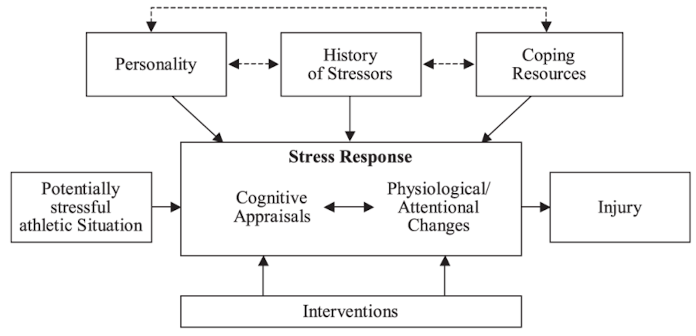
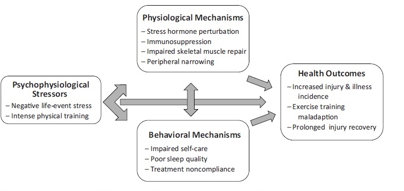
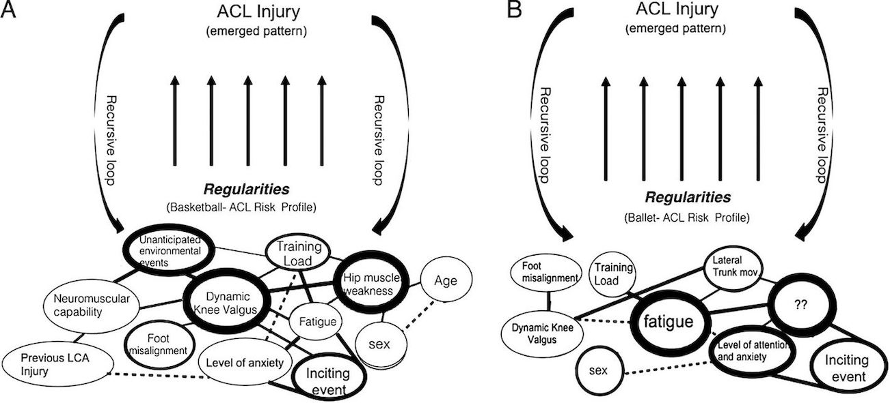

# Literature review

```{r include=FALSE}
knitr::opts_chunk$set(echo = FALSE, fig.align = "center")
library(knitr)
```

Injury remains an unfortunate bi-product of participation in sport and despite efforts to reduce injury rates through the identification and modification of risk factors associated with injury, 
the incidence of sport related injuries remains high [@Bueno2018; @Aman2016]. 
For example, @Sheu2016 reported an age-adjusted injury rate of 31.1 per 1000 people with individuals between five and 24 years of age the most likely to sustain an injury. 
@Rosa2014 found almost half (49.91%) of university level athletes sustained at least one injury during their career, and @Palmer-Green2014 observed 39% of the British team at the 2014 Sochi winter Olympics sustained at least one injury. 
The detrimental effects of sustaining an injury for individual include lowered self-esteem, increased depression and an increased risk of sustaining subsequent injuries [@Leddy1994; @Brewer2012]. 

In an attempt to mitigate against the undesirable consequences of injury, Van Mechelen, Hlobil, & Kemper (1992) proposed a four-step model for the sequence of injury prevention, which described the necessary steps to address the growing injury problem. 
Steps one and two of the model involve identifying the nature of the problem through incidence rates and identifying the factors and mechanisms through which injuries may occur. 
Indeed, a large body of research has identified several risk factors, both internal (e.g. anatomical, biomechanical, psychological) and external (e.g., equipment, playing surface, playing conditions), which are thought to contribute to injury occurrence [@Bahr2005; @Wiese-Bjornstal2009].
Based on these factors, several models of injury causation have been proposed in an attempt to understand the multifaceted nature of injury.
For example, @Bahr2005 proposed a model of injury causation that identified how both internal and external factors contribute to an athlete's susceptibility to sustaining an injury. 
The model was criticised however, for being too linear and not reflecting the true nature of exposure to risk factors and injury occurrence [@Meeuwisse2007].
Consequently, @Meeuwisse2007 proposed a dynamic, recursive model of sport injury that improved Bahr and Krosshaug’s (2005) model, by including a cyclical element, whereby an athlete could be exposed to risk factors and go through a period of adaptation. 
A recovery phase was also included in the model that linked back to characteristics of the predisposed athlete; demonstrating how an athlete's injury history can contribute to their set of risk factors, and how the injury cycle can start over again following recovery from injury.
While both @Bahr2005 and @Meeuwisse2007 provided useful frameworks to inform sport injury research, their use has been limited within the literature.
In contrast, one of the most influential models in sport injury research over the last three decades has been Williams and Andersen's (1998) model of stress and injury (Figure \@ref(fig:wamodel)).

```{r wamodel, fig.cap= 'Stress and injury model (Williams \\& Andersen, 1998).', fig.pos='H'}

```
 
Williams and Andersen's (1998) model proposed that when faced with a potentially demanding athletic situation, the athlete’s personality traits (e.g., hardiness, locus of control, sense of coherence, competitive trait anxiety, achievement motivation and sensation seeking), history of stressors (e.g., daily hassles, major life events, previous injuries), and coping resources (e.g., general coping behaviours, social support, psychological skills) contribute to their stress response, either interactively or in isolation. 
The stress response is the central core of the model and reflects a bi-directional relationship between the athlete’s cognitive appraisal of, and physiological response to, a potentially demanding athletic situation. 
The model predicts that an athlete who faces a potentially demanding athletic situation may perceive the situation as stressful if they have a history of many stressors, personality traits that intensify the stress response and few coping resources to deal with the situation. 
Consequently, a heightened stress response causing the athlete to exhibit increased physiological activation (e.g., increased muscle tension) or attentional disruption (e.g., peripheral narrowing), is thought to be the mechanism through which injuries occur. 
Despite the stress response being the central core of the model, personality traits, history of stressors and coping resources have received the most attention in the research literature [@Johnson2014]. 
Further, of the psychosocial variables in the model, major life events appears to most consistently predict injury occurrence [@Williams2007; @Passer1983a; @Maddison2005; @Gunnoe2001; @Ivarsson2010; @Ivarsson2017]. 

## Psychosocial variables

### History of stressors

Research into the relationship between the history of stressors and injury has largely focused on major life events.
The early research in life event stress evolved from the work of @Holmes1967 who developed the Social Readjustment Rating Scale, which was used to identify and rank the magnitude of life events.
The first evidence of a relationship between major life events and sports injury was reported by @Holmes1970, 
who found that 50% of the athletes that experienced high life stress sustained an injury over the preceding 12 months, compared to 9% and 25% of athletes with low and moderate life stress respectively. 
This initial evidence of a relationship between life event stress and injury has been largely supported in subsequent research across a range of different sports [@Maddison2005; @Gunnoe2001; @Ivarsson2010; @Rogers2005; @Petrie1992].
Indeed, in their review of the sport injury literature, Williams and Andersen (2007) reported that of the 40 studies that had examined the relationship between major life events and injury, approximately 85 % had found some correlation between life event stress and injury [@Williams2007].  

While the early research in life event stress did not differentiate between the type of stress being experienced (i.e., whether the source of the stress was perceived as positive or negative), @Sarason1978 
contended that the effects of life events perceived as negative may differ from those events viewed positively. 
Consequently, @Sarason1978 
developed the Life Experience Survey (LES) which asked participants to indicate whether they perceived each life event as negative or positive, and whether the life event had no effect (score of 0), little effect, (-1 or +1 score depending on whether the event was negative or positive), moderate effect (-2 or +2) or a great effect (-3 or +3). 
Negative, positive and total life events (absolute sum of negative and positive event) could then be determined. As expected, @Sarason1978 found negative life events to have a greater effect on health-related dependent variables compared to positive or total life events. 
Using a modified version of the LES, @Passer1983a were subsequently able to identify that in a sample of university football players, those who reported high negative life events were at the greatest risk of sustaining an injury. 
Indeed, in the research that followed, life events with _negative_ valance were found to most frequently predict injury occurrence [@Ivarsson2017; @Ivarsson2010; @Andersen1999; @Williams2007]. 
However, both positive and total life event stress have also been found to be related to injury.
For example, @Petrie1993 reported that positive life events were the only life event stressor to predict injury. 
To explain this finding, @Petrie1993 suggested that events such as being promoted to captain of the team or receiving an athletic scholarship may be initially perceived as positive, however such events may put more pressure on the individual causing them to perceive athletic situations as more stressful, and thus be at greater risk of injury. 
Despite these suggestions, negative life events have received the most attention in the literature and remain one of the factors most strongly related to sport injury.

In addition to major life events, previous injury was also identified as a contributing factor to the history of stressors in Williams and Andersen's (1998) model.
Like major life events, research has consistently found previous injury to increase the risk of future injuries [@Hagglund2006; @Kucera2005; @Williams2007].
These findings can be partly explained by the physical effects of sustaining an injury; with athletes not completing the full rehabilitation programme before returning to sport, or the rehabilitation programme not preparing them fully for return to sport [@Clement2013; @Kraemer2009]. 
Without a comprehensive rehabilitation programme that fully prepares an athlete for their return to sport, significant deficits in strength, muscular activation, power, postural stability, lower extremity mechanics, and psychological preparedness may exist, and the risk of re-injury is greatly increased [@Bien2015].
However, sustaining an injury is also likely to be a major life event in itself, and the psychological issues an athlete may face when returning from a serious injury are well documented [@Brewer2012].
For example, fear of re-injury may result in the athlete not performing the movement or skill at the required level and/or in the required way [@Hsu2017]. 
An athlete who is fearful of re-injury may also try to "protect" the injured limb by favouring the uninjured limb.
The result is that the previously healthy limb is now at greater risk of injury due to increased load [@Fulton2014]. 
Taken together, it is clear to see how the physical and psychological effects of an injury may increase the risk of subsequent injuries, particularly if a full recovery is not made before returning to sport.

### Personality characteristics

In addition to history of stressors, personality traits have been identified as factors that moderate the stress-injury relationship. 
For example, both high trait anxiety and high competitive trait anxiety have been reported to increase the risk of injury [@Petrie1993; @Lavallee1996]. 
Ivarsson and Johnson (2010) reported that somatic trait anxiety (\emph{p} = 0.025), psychic trait anxiety (\emph{p} = 0.044), stress susceptibility (\emph{p} = 0.016), and trait irritability (\emph{p} = 0.023) were significant predictors of injury within a group of male soccer players (\emph{n} = 48). 
A particular strength of this study was the prospective design; however, the use of a single sport and small sample size limit the generalizability of the findings.
Other personality characteristics identified in Williams and Andersen's (1998) model have received less attention in the literature, and findings are inconclusive with regard to predicting injury occurrence [@Junge2000].
For example, @Pargman1989 reported that external locus of control was associated with increased injury rate in American football players. 
In contrast, @Kolt1996 found that internal locus of control predicted injury in elite, but not non-elite, gymnasts.
In their recent meta review, @Ivarsson2017 found that personality characteristics generally have a limited direct relationship with injury prediction; however, research indicates that the presence of personality characteristics in combination with other factors such as a major life event is likely to increase the risk of injury in athletes [@Petrie1993].

### Coping resources

The final psychosocial variable proposed in Williams and Andersen’s (1998) model is coping resources. 
The model predicts that athletes with well-developed psychological coping skills and a strong social support network will appraise situations as less stressful, reducing their likelihood of injury. 
As a result, coping resources are proposed to moderate the effect of major life events on sports injury, with high levels of coping resources potentially buffering the effect of negative life events. 
Several studies have supported the proposed relationship between life event stress, coping and injury.
Several studies have found support for the proposed relationship between life event stress, coping and injury. For example, both @Hardy1992 and @Petrie1993 found social support to have a buffering effect on the relationship between negative life events and injury.
In contrast, @Rider1995 found no significant relationship between coping skills and sports injury (\emph{r} = -0.11).

While several of the psychosocial characteristics proposed in Williams and Andersen’s (1998) model have received significant attention in the literature, there remains a number of unanswered questions surrounding the contribution of characteristics that have received less consideration (e.g., hardiness, sense of coherence and achievement motivation). 
To elaborate, inconclusive findings for certain personality characteristics suggests these characteristics interact with injury occurrence is likely to be complex, and dependent on a number of other factors associated with the individual athlete [@Junge2000]. For example, a number of physical and/or environmental factors are also likely to influence injury occurrence and may moderate the effects of various psychosocial factors. 
Examining how psychosocial characteristics contribute to injury when considered in a wider context that includes training-related factors and physiological characteristics may therefore help to address some of the inconsistencies within the literature.
 
## The stress response

Central to Williams and Andersen's (1998) model is the "stress response", which reflects a bi-directional relationship between an athlete’s cognitive appraisal of, and physiological response to, a potentially demanding athletic situation. 
For example, an athlete will make an appraisal of the demands of a particular training session or competition, evaluate their ability to meet those demands, and the potential consequences of success or failure.
The model predicts that athlete's with a history of many stressors, personality traits that intensify the stress response and few coping resources to deal with the situation are at risk of sustaining an injury due to the "increased physiological arousal and/or attentional deficits" caused by the stress response (Williams and Andersen, 1998, p. 7). 
Specifically, Williams and Andersen (1998) suggested several mechanisms through which an elevated stress response might exert its effect, for example, increased muscle tension, attentional narrowing and increased distractibility. Compared to the psychological factors outlined in the previous section, few researchers have investigated these proposed mechanisms and the research that has been conducted has mainly focused on the attentional stress response mechanisms proposed by Williams and Andersen.
For example, @Andersen1999 
measured injury occurrence, negative life event stress and performance on a perception task under both normal and stressful conditions and found that individuals with high negative life events and who experienced greater peripheral narrowing under stress sustained more injuries than individuals with the opposite profile 
The findings were later supported by @Rogers2005 
who reported that peripheral narrowing during stress mediated 8.1% of the relationship between major life events and injury.
The remaining studies examined attentional deficits using the ImPACT (ImPACT Applications, Inc., Pittsburgh, PA) test battery to examine the relationship between verbal memory, visual memory, processing speed, reaction time and injury. @Wilkerson2012a 
reported that increased reaction time at the start of the season predicted injury in a sample of 76 football players, whereas @Swanik2007 
employing a retrospective design found individuals who had reported a previous anterior cruciate ligament injury demonstrated increased reaction time compared to healthy matched controls. 

Although these studies provide support for a relationship between attentional deficits and injury as proposed by Williams and Andersen (1998), the ecological validity of the studies can be questioned. 
All of the studies identified by @Ivarsson2017 used a laboratory-based design that is unlikely to be reflective of the environment that an athlete will be training and competing in. 
Furthermore, @Swanik2007 used a retrospective design that has limited value for assessing the predictive power of attentional deficits.
Wider criticisms can also be made about the particular mechanism of peripheral narrowing that is proposed to increase the risk of injury.
Indeed, the peripheral narrowing mechanism fails to account for overuse injuries, which represent approximately 30% of the total number of injuries that are sustained annually [@Yang2012].
To elaborate the mechanisms for overuse injuries are typically caused by maladaptation to, or inadequate recovery from, high intensity training,
and are more likely to be explained by the physiological changes proposed in the model such as increased muscle stiffness [@Bahr2005]. 
However, these mechanisms have received little attention in the literature to date. 
Furthermore, other research has found some degree of peripheral narrowing to be beneficial to performance [@Eysenck2007; @Hanoch2004; @Hertwig2005].
For example, under stressful conditions, peripheral narrowing may limit the amount of information perceived, which may facilitate improved decision making and physiological mobilisation of the body to react to task relevant cues.
Consequently, an athlete may be able to avoid potentially harmful situations under stress by using peripheral narrowing to focus on only the most relevant information and respond quickly to information they perceive [@Ohman2001; @Hanoch2004].
As a result, mechanisms, particularly those that are related to the physiological changes proposed in Williams and Andersen's (1998) model merit further attention.

## Model critique

While Williams and Andersen's (1998) model has been the most widely cited model of injury in the literature, it has a number of limitations. 
A major criticism of the model is the narrow focus on cognitive aspects of stress and the stress response [@Ivarsson2017]. 
The model does not include any physiological or environmental factors that are also likely to contribute to injury occurrence that are central to other models of injury such as those proposed by @Bahr2005 and @Meeuwisse2007.
A more complete model of injury occurrence needs to acknowledge the contribution of both psychosocial variables and other physiological or environmental factors known to relate to injury. 
An example of such a model, which included a combination of biomechanical factors such as; mechanical load, on field behaviour and skill, load tolerance, and various psychological factors including competitive motivation, cognition, risk assessment and perception of load, was proposed by @McIntosh2005a.
Unfortunately, the model has not been adopted as a framework for research, possibly due to the emphasis on biomechanics, which makes it less accessible for researchers from other sports science disciplines.

In addition to the limitations of Williams and Andersen's (1998) model itself, there has been some wider criticism of the literature that has investigated the different parts of the model; specifically, with regard to the populations studied and methodologies employed.
Much of the research that has supported Williams and Andersen's (1998) model has used athletes from team sports, such as American football [@Cryan1983; @Gunnoe2001], soccer [@Ivarsson2010; @Steffen2009] and rugby [@Maddison2005].
Furthermore, many of these studies have only included male athletes, with relatively few studies including female athletes [@Ivarsson2017].
Support for the model would undoubtedly be strengthened if samples were more representative of the sporting population at large.
A further criticism that relates to methodology is the use of one time point for data collection purposes [@Johnson2014].
An athlete's injury risk is likely to be dynamic and will vary over the course of a season depending on a number of different factors, such as the stage of the season (e.g., early, middle or late), number of competitions and the amount of recovery between training sessions/competitions.
By only measuring risk factors at one point in time, important information is missed regarding how _changes_ in those risk factors may relate to injury occurrence. 
A further issue with a single measurement is that the time interval between the measurement and actual injury occurrence is not considered.
For example, if risk factors are measured in pre-season, but an injury does not occur until much later into that season, the predictive value of the risk factor may be limited, given that the impact of the risk factor may have changed significantly over time.
To highlight this point, @Sibold2012 found that a number of psychological variables including negative life events, worry and concentration disruption were associated with the number of days until injury occurrence.
To clarify, higher negative life event scores resulted in injury sooner than lower scores.
These findings support the need for repeated measures designs that assess risk factors as close to injury occurrence as possible to increase their predictive validity.

In order to address the limitations highlighted in the original Williams and Andersen (1998) model, @Appaneal2014 
proposed the Biopsychosocial Model of Stress, Athletic Injury and Health (BMSAIH) to serve as an independent extension (Figure \@ref(fig:pernamodel)).
Based on the earlier work of @Perna2004, the BMSAIH aimed to: 
(i) clarify the mediating pathways between the stress response and injury; 
(ii) consider other health outcomes and behavioural factors that impact on sports injury and; 
(iii) integrate the impact of exercise and training on athletes' health and injury occurrence [@Appaneal2014].
The central tenet of the BMSAIH is that psychosocial distress may act synergistically with high intensity training to "widen the window of susceptibility" to injury and other undesirable health outcomes such as illness, physical complaints or maladaptation to training [@Appaneal2014, p. 4]. 
Therefore, the BMSAIH provides a framework for future research to examine the relationship between psychosocial factors and injury occurrence proposed in Williams and Andersen's (1998) model, by including other physiological stress-related markers, that collectively may provide greater insight into the injury process.

```{r pernamodel, fig.cap = 'Biopsychosocial model of stress athletic injury and health (Appaneal \\& Perna, 2014, p. 4).', out.width='100%'}

```

Although offering several potential avenues for research, support for the BMSAIH remains sparse, and research has mainly focused on the hormonal response to high intensity training and injury.
For example, @Perna1995 provided promising evidence in a study that examined life event stress and cortisol response in athletes following an exhaustive graded exercise test.
Participants were split into high and low life event stress (LES) groups, and the high LES group were found to have both higher cortisol in response to the graded exercise test, and increased symptomatology (e.g., muscle complaints and viral illness) over the 30 days following the graded exercise test.
The study by @Perna1995 did not, however, explicitly examine the relationship between cortisol response to high intensity training and sports injury, and very few studies have explored the relationship further. 

In addition to hormonal changes, there are several other physiological stress-related markers that could be included in research using the BMSAIH model.
For example, measures of heart rate variability [@Djaoui2017; Williams -@Williams2017], 
postural stability [@Romero-Franco2014; @Coco2015] and skeletal muscle characteristics such as stiffness [@Butler2003; @PickeringRodriguez2017] have been of found to be related to psychological distress and are often used as markers of the physiological effects of high intensity training. 
Furthermore, these markers have also been linked to injury occurrence in athletes [@Williams2017; @Plews2012; @PickeringRodriguez2017; @Trojian2006], and including them alongside the psychological factors from Williams and Andersen's (1998) model may provide greater insight into the relationship between stress and injury. 
However, despite offering a potential framework to build upon the research stemming from William and Andersen's (1998) model, there remains a lack of research exploring the synergistic action of both psychosocial and physiological stress-related markers proposed by the BMSAIH. 

One possible explanation for why sports injury research has made limited attempts to examine different sources of stress may be due to the traditional mono-disciplinary approach researchers often employ. 
Mono-disciplinary approaches continue to be prevalent within sports injury research despite repeated call to move towards an interdisciplinary approach [@Burwitz1994; @Piggott2018]. 
To gain a better understanding of the holistic nature of the stress-injury relationship, an interdisciplinary approach is necessary, and would allow different elements of both Williams and Andersen's (1998) model and Appaneal and Perna's (2014) model to be examined in more detail. 
For example, how psychological stress interacts with physiological markers of stress and synergistically contribute to an increased risk of injury. 
To further highlight the importance of an interdisciplinary approach, @Bittencourt2016 recently proposed a contemporary view of the sports injury problem, moving away from a mono-disciplinary perspective and drawing on elements from complex systems theory [@Hulme2015; @Holland1995].
Such an approach requires an interdisciplinary perspective, combining elements from different disciplines within the sport injury literature [@Buekers2017]. 
In particular, @Bittencourt2016 suggested that sports injury is an emergent phenomenon and is dependent on a multitude of factors at any one time, termed the "web of determinants" [@Philippe1998, p. 1]. 
Figure \@ref(fig:web) shows an example of different webs that might result in an ACL injury for a basketball player and a ballet dancer [@Bittencourt2016]. 
Although the injury is the same, different combinations of factors contributed to the injury, highlighting the emergent properties of sport injury. 
While the example mainly focuses on biomechanical properties associated with injury, additional psychological factors could easily be incorporated.
As such, the complex system approach proposed by @Bittencourt2016 provides a suitable backdrop for the current programme of research to explore the relationship between psychological distress, physiological stress-related markers and injury occurrence.

```{r web, fig.cap="Two examples of complex systems approach to injury. Pattern A shows the factors that may contributed to an ACL injury for a basketball player, and pattern B shows the same injury but from a ballet dancer's perspective. Thick lines indicate a stronger relationship between variables, whereas dashed lines indicate weaker relationships. Adapted from Bittencourt et al. (2016).", out.width='100%'}

```

## Summary and recommendations for future research

While sport injury rates are continuing to rise, a large body of research has identified a multitude of factors that are related to injury occurrence.
In particular, stress, from both a psychological and physiological perspective, plays a major role in injury occurrence.
However, stress-related factors have often been studied in isolation, and their contribution to a more holistic view of injury occurrence has not been as well established.
Recently, both @Appaneal2014 and @Bittencourt2016 have provided frameworks to further sport injury research.
@Appaneal2014 offered an extension to the widely cited Williams and Andersen (1998) model of stress and injury that included additional physiological stress-related markers that may act synergistically with the psychological characteristics from Williams and Andersen's (1988) model.
In addition, @Bittencourt2016 proposed a contemporary view of injury based on complex systems theory and highlighted the need for appropriate research designs and analysis techniques that can address the dynamic nature of injury occurrence.
Together, these studies have formed the foundation for the current body of research of which the purpose was to explore the relationships between psychological sources of stress, physiological stress-related markers and injury occurrence.
Specifically, the aims of this thesis were threefold:
(a) to identify and evaluate the relationships between psychological and physiological markers of stress in the prediction of injury occurrence; 
(b) to examine the relationships between the markers of stress and injury in a prospective, repeated measures study with a large cohort of athletes; and 
(c) to evaluate the relationships between the markers of stress and injury using an analysis method that captures the complex nature of injury occurrence.

