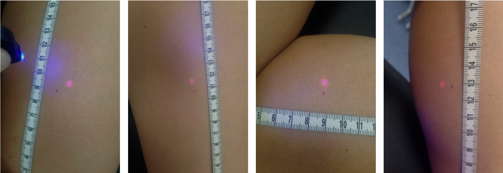
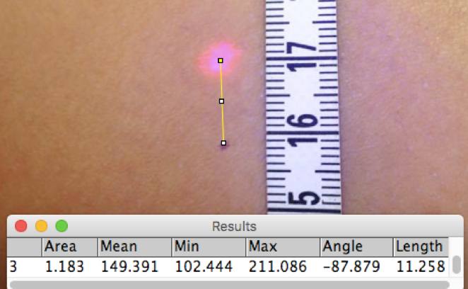
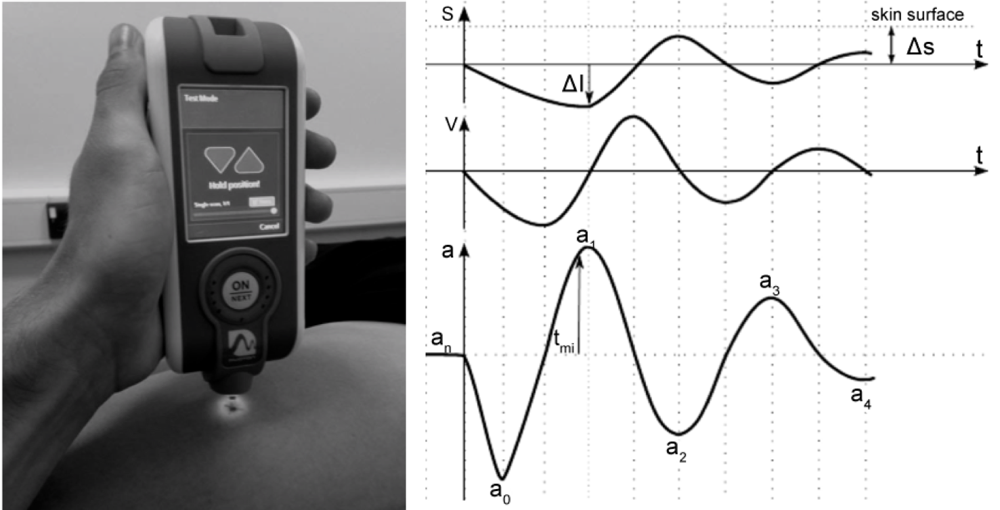
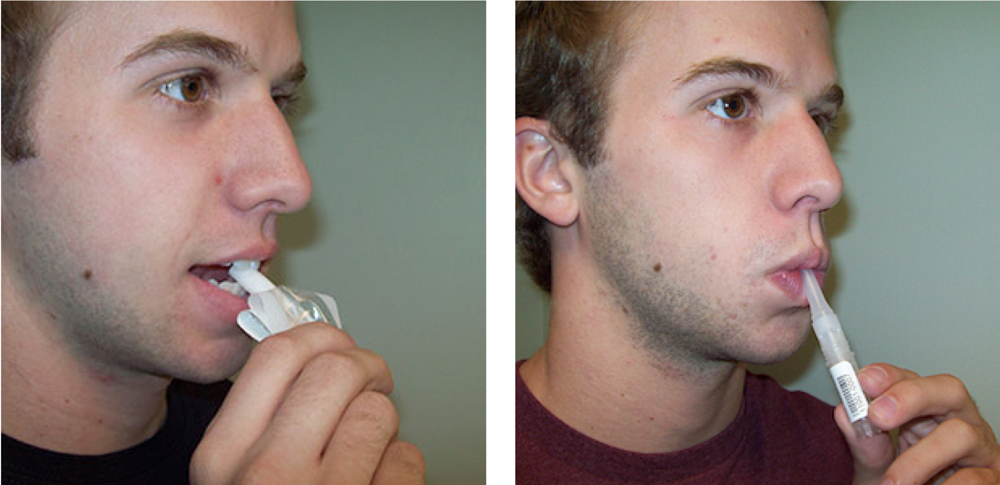

```{r measures-setup, include=FALSE}
knitr::opts_chunk$set(echo = FALSE, fig.align = "center")
pacman::p_load(tidyverse, knitr, papaja, kableExtra, qwraps2, DiagrammeR)

```

# Measures

The purpose of this chapter is to provide a rationale for the inclusion of the variables and the measures employed in the present research programme. 
This includes discription of the pilot testing, and the reliability and validity of the selected measures. 
As highlighted earlier, one of the major criticisms of Williams and Andersen's (1998) model is that it only includes psychological predictors of sports injury, despite evidence that factors associated with an athlete's physical status and response to training are also associated with athletic injury [@Perna2004; @Appaneal2014].
To address this limitation, @Appaneal2014 proposed the Biopsychosocial model of stress, athletic injury and health (BMSAIH) to serve as an independent extension to Williams and Andersen’s (1998) model. 
The BMSAIH illustrates how psychological distress and physiological stress-related markers may interact and exacerbate the stress response, increasing the risk of injury. 
Although research supporting the BMASIH has largely focused on the hormonal response to high intensity training, there is a growing body of literature that has identified several physical markers that can indicate an athlete’s physiological status [@Djaoui2017; @Lee2017].
These markers provide a means by which athletes and coaches can detect when the balance between the training stress required for physiological adaptation, and recovery, is not appropriate [@Borresen2009]. 
For example, with reduced capacity to recover, high intensity and high volume training can have negative outcomes for an athlete’s health, including over-training syndrome, increased susceptibility to illness and increased risk of athletic injury [@Appaneal2014]. 
Indeed, when measured in conjunction with psychological factors known to predict injury occurrence, these markers of physiological stress may contribute important insights into athletes’ susceptibility to injury.
However, research examining the relationships between physiological stress-related markers and sports injury remains sparse.

The purpose of the current research programme was to address the limitations of the current body of injury prediction research by employing an interdisciplinary approach to examine the synergistic action of psychological sources of stress and physiological stress metrics on injury occurrence [cf. @Appaneal2014].
The current research programme planned to use a large sample and a repeated measures design to capture changes in both psychological predictors of injury and stress-related physiological markers. 
In order to collect data on the large sample of participants in a timely manner, safeguarding both the rigour and viability of the study, participants needed to be able to complete the series of measures in a realistic and acceptable timeframe, over repeated administrations.
This was essential, not least for participant retention in the study.
In the remainder of the chapter, the specific measures used in the current research are discussed based on these considerations, and where appropriate, additional pilot studies specific to the current research are outlined.

## Major life events (Appendix A)

Of the main psychological factors proposed in Williams and Andersen’s (1998) model, major life events, and specifically events with a _negative_ valence,  have been found to consistently predict injury occurrence in athletes [@Williams2007; @Passer1983a; @Maddison2005; @Gunnoe2001; @Ivarsson2010; @Ivarsson2017].
The most widely used measure of life event stress in the sports injury literature is the Life Event Survey for Collegiate Athletes [LESCA; @Petrie1992]. 
The LESCA comprises 69 items reflecting possible life events that participants may have experienced. 
Participants are asked to rate the perceived impact of each life event they have experienced within the last 12 months on an 8-point Likert scale anchored at -4 (extremely negative) and +4 (extremely positive). 
Negative and positive life event scores are calculated by summing the negative and positives score respectively. 
A score for total life events is calculated by summing the absolute values for both negative and positive life events.
Prior to the development of the LESCA, sports injury research had been limited to general scales of life event stress such as the Social Readjustment Rating Scale [SRRS; @Holmes1967] and Life Experience Survey [LES; @Sarason1978].
However, a review by @Andersen1988 indicated the SRRS and LES scales were inappropriate for sport specific research and needed to be refined to better establish the link between major life events and sports injury. 
Consequently, @Petrie1992 developed the LESCA to address the need for a measure of life event stress suitable for an athletic collegiate population. 
Indeed, the LESCA has frequently been used in research investigating psychological characteristics associated with athletic injury [e.g., @Maddison2005; @Gunnoe2001; @Ivarsson2010; @Rogers2005], and remains the most comprehensive scale available to assess major life events in a population of athletes to date [@Ivarsson2017]. 

### Modifications

Although the LESCA was initially developed with collegiate athletes, several authors have used modified versions of the LESCA for younger participants [@Steffen2009; @Gunnoe2001] and non-collegiate athletes [@Maddison2005].
In the current research, both university aged athletes and adult members of local sports clubs who were not enrolled at university, were recruited to participate in the study.
Consequently, several modifications were made to the original LESCA to ensure the suitability of the items for the study population. 
For university students, the wording of items was adjusted to reflect cultural norms for British university students (e.g., _Beginning a new school experience [beginning college, transferring college etc]_ was changed to _Beginning a new university experience [beginning university, transferring university etc]_ ).
For non-students, items associated with college activities/behaviours were either modified to include comparable non-student events (e.g., _Being dismissed from dorm or other residence_ was changed to _Being asked to vacate house/home_) or if no suitable alternative was available, the item was removed.
Table \@ref(tab:lesca-modifications) provides a summary of the modifications made to items in the original measure.
Two Professors at the university where the research was conducted who were experienced in sports injury research scrutinized the modifications for face and content validity.
In addition, the repeated measures design of the current research required a modification to the participant instructions for the LESCA. 
To elaborate, during the first data collection in the current research, participants were asked to report life events in the preceding 12 months, as per standard LESCA instructions.
For each subsequent data point, the instructions were modified to ask participants to report all life events that had occurred _since the previous data collection_. 
This modification ensured that only ‘new’ life events would be recorded at each time point, and that participants would not report the same life events more than once, unless there was some significant change.

```{r lesca-modifications, results='asis'}
 tab <- data.frame(stringsAsFactors=FALSE,
 Question = c(19, 21, 22, 27, 29, 36, 49, 61, 62),
 original = c("Beginning a new school experience  (beginning college, transferring college etc)",
                "Academic probation / ineligibility",
                "Being dismissed from dorm or other residence",
                "Financial problems concerning school",
                "Conflict with room-mate",
                "Suspended from team for non-academic reasons",
                "Being absent from school (classes) because of participation in sport",
                "Major change in level of academic performance (doing better or worse)",
                "Making career decisions (applying to graduate school,interviewing for jobs, etc)"),
 "Sportsstudents" = c("Beginning a new school experience (beginning university, transferring university etc)",
                       NA,
                       "Being dismissed from halls or other residence", 
                       NA, 
                       NA, 
                       NA,
                       "Being absent from university (classes) because of participation in sport",
                     NA,
                     "Making career decisions (applying for Masters degree, interviewing for jobs, etc)"),
 "non-student" = c("Beginning a new work experience",
                   "Removed",
                   "Being asked to vacate house/home",
                   "Financial problems",
                   "Conflict within household",
                   "Removed",
                   "Being absent from work because of participation in sport",
                   "Major change in level of performance at work (doing better or worse)",
                   "Making career decisions (applying for Masters degree, interviewing for jobs, etc)")) 

tab[is.na(tab)] <- ""

kable(tab %>% 
  mutate(Sportsstudents = ifelse(str_detect(Sportsstudents, "-"), text_spec(Sportsstudents, align = "c"), Sportsstudents)),
       "latex",
       booktabs = T,
       col.names = c("Q", "Original", "Students", "Non-students"),
       align = c("clll"),
      escape = F,
      caption = "Summary of modifications to LESCA items.") %>% 
   kable_styling(latex_options = "HOLD_position") %>% 
   column_spec(1, width = c("0.3cm")) %>% 
   column_spec(2:4, width = ("4.8cm"))

```

##### Scoring

Traditionally, the LESCA has been scored as the sum of negative and positive life event responses over a 12-month period.
However, due to the repeated measures design used in the current research, several considerations were necessary regarding the most appropriate way to score participants' responses.
Specifically, deriving LESCA scores at the first time point that reflect life events over a 12-month period, but for subsequent time points, reflect life events over a reduced four-month period was clearly going to be problematic comparatively; with participants likely to have experienced fewer events during the reduced time interval. 
This situation was further exacerbated by the potential for the effects of the life events experienced during preceding time points to still be present during subsequent data collections. 
Therefore, to account for the potential continuing and confounding effect of life events, a cumulative sum of life events over the study period was used as the main outcome measure.
For example, if a participant reported a score of 10 life events at the first time point and 4 at the second time point, their score at the second time point would be 14.
Scoring the LESCA in this way meant that the effects of previous events from preceding time points were still accounted for, while still including the new events that were reported.

## Personality (Appdendix B)

Williams and Anderson (1998) proposed several personality characteristics that may exacerbate the response to a stressful athletic situation and contributed to the increased the risk of athletic injury. 
For example, both high trait and state anxiety have been reported to increase the risk of injury in athletes [@Petrie1993; @Lavallee1996; @Ivarsson2010]. 
However, the evidence for a relationship between other personality traits (e.g., emotional state and locus of control) and injury has been less conclusive, with some research finding no support or contradictory results [@Junge2000].
One aspect of personality theory that has not yet been examined in relation to athletic injury is Reinforcement Sensitivity Theory [RST; @Gray2000]. 
RST is a neuropsychological theory of personality conceptualised in terms of motivation, learning and emotion that posits that all major personality traits are basic systems of approach and avoidance [@Corr2013].

First proposed by @Gray1982a, RST outlined two systems of behavioural activation and behavioural inhibition (BAS and BIS, respectively). 
The BAS and BIS were proposed to govern approach behaviour towards appetitive stimuli and avoidance from aversive stimuli [@Reuter2015].
However, the original RST theory was updated by @Gray2000 who made a distinction between BIS and the Fight Flight Freeze System [FFFS; @McNaughton2004]. 
In the revised RST (rRST), the FFFS is proposed to be responsive to all punishing and threatening stimuli (e.g., physical pain from training or competition) and the BAS is proposed to be responsive to all rewarding and appetitive stimuli (e.g., prize money from winning a major competition).
In contrast to the original theory, the BIS is thought to be activated during instances of goal conflict, for example when a threatening stimulus must be approached [@Corr2008].
Specifically, BIS is involved in the processes that will generate anxiety, which will result in more cautious approach behaviour [@Corr2008].
Indeed, rRST holds particular relevance for sports injury research due to challenges faced by an athlete in a competitive environment. 
For example, an athlete may be under physical pain nearing the end of a race (FFFS activated), but motivated by the thought of winning (BAS activated). 
In such a scenario, the BIS would be activated in an attempt to resolve the conflict between the FFFS and BAS [@Hardy2014].
The types of behaviour exhibited by an athlete under these conditions may expose an athlete to increased risk of injury, however, to date no research has examined the relationship between rRST and sports injury.
The rRST may therefore provide a novel approach to understanding the personality characteristics associated with sports injury.

Several questionnaires have been developed to reflect the rRST model [Jackson 5, @Jackson2009; Reinforcement Sensitivity Questionnaire (RSQ) @Smederevac2014; Reuter and Montag’s rRST-Q, @Reuter2015]; however, when reviewed by @Corr2016a, the revised questionnaires were found to have significant theoretical and operational limitations.
For example, the Jackson 5 scale [@Jackson2009] only had one BAS factor, which is inconsistent with theoretical models of the BAS [@Corr2008].
To address the lack of a comprehensive psychometric measures of the rRST, Corr and Cooper
(2016) proposed the Reinforcement Sensitivity Theory of Personality Questionnaire (RST-PQ).
The RST-PQ comprises 65 statements that measure three major systems: FFFS (e.g., _"I am the sort of person who easily freezes-up when scared"_), BIS (e.g., _"When trying to make a decision, I find myself constantly chewing it over"_) and four BAS factors; Reward Interest (e.g., _“I regularly try new activities just to see if I enjoy them”_), Goal Drive Persistence (e.g., _“I am very persistent in achieving my goals”_), Reward Reactivity (e.g., _“I get a special thrill when I am praised for something I've done well”_) and Impulsivity (e.g., _“I find myself doing things on the spur of the moment”_).
Corr and Cooper (2016) used both exploratory factor analysis (EFA) and confirmatory factor analysis (CFA) to assess the validity of the RST-PQ and reported a robust six factor structure with a clear a differentiation between FFFS, BIS and separate BAS factors. 
The model fit indicies for the single order CFA model were: $X^2$(2,000, \emph{N} = 831) = 6,563.46, \emph{p} < .0001; CFI = 0.87; RMSEA = 0.052, which indicated an acceptable model fit (Corr and Cooper, 2016). 


#### Validation of RST

The validation of the RST-PQ was examined in a separate programme of PhD research [@Young2019]. 
The present author was involved in the validation process as the participants from this study were used to validate the RST-PQ. 
Details of validation process are included here for detail but are not strictly part of this programme of research.

To establish the factorial validity of the 65-item model of the RST-PQ, Bayesian Structural Equation Modelling [BSEM; @Muthen2012] was used with responses from a sample of 419 university-level athletes [@Young2019]. 
BSEM was used for the validation as it had several advantages over the maximal likelihood procedures used in traditional confirmatory factor analysis (CFA). 
In particular, BSEM allows informative variance priors to be specified on cross-loadings, which in traditional CFA, are held at zero and can lead to a blocked or miss-specified model [@Marsh2009].
By recognising that some small cross-loadings and correlated residuals could be present within the items, BSEM can reduce the possibility of model miss-specification [@Gucci2016].
To perform the validation, three models were specified following the recommendations of @Muthen2012.
Model one specified non-informative priors on the factor loadings and exact zeros on the cross-loadings and correlated residuals.
Model two specified non-informative priors on the factor loadings, informative approximate zeros on the cross-loadings and exact zeros on the correlated residuals.
Lastly, model three specified non-informative priors on the factor loadings, and informative approximate zeros on the cross-loadings and correlated residuals.
The variance of the informative priors was set at $\pm$ 0.10, which equates to loadings with a 95% limit of $\pm$ .20 and implies weak cross loading and correlated residuals.
Loadings that were outside of the range were identified as being highly correlated or having a large source of residual variance [@Muthen2012]. 
Estimation of the BSEM models was performed in MPLUS where a Markov chain Monte Carlo (MCMC) algorithm was used with a Gibbs sampler, in which 100,000 iterations were drawn to examine the parameter estimates and model convergence.

Model convergence was assessed using potential scale reduction factor (PSRF), where values between 1.0 and 1.1 indicated good model convergence [@Gelman1998; @Gelman2013].
Model fit was assessed by Posterior Predictive P (PPP) values and 95 % credibility intervals, where PPP values $\geqslant$ 0.50 and 95 % confidence interval balanced around approximately zero indicated good model fit [@Muthen2012]
To compare the different BSEM models, the deviance information criterion (DIC) was used, where lower values indicated a better model-fit. 

##### Results

The analysis revealed the 65-item RST-PQ to have both good model convergence and model fit. In addition, all the main factor loadings were statistically significant.
However, several problematic items were identified based on weak factor loadings and substantial cross-loadings and correlated residuals.
Consequently, the model was re-specified following an item deletion process [@Young2019] and a 51-item RST-PQ emerged with acceptable model-fit (PPP = 0.739, 95% posterior predictive confidence intervals = -199.220, 101.356). 
The findings from the BSEM were replicated with a sample of 350 participants from the current research programme (PPP = 0.787, 95% posterior predictive confidence intervals = -208.405, 90.785).
Consequently, the 51-item questionnaire was adopted as the chosen measure of RST in the current research.


## Heart rate variability (HRV)

Heart rate variability (HRV) is a popular approach for monitoring training adaptation in athletes [@Bellenger2016]. 
Traditionally, resting heart rate was used as a marker to reflect the recovery status of an athlete, however the beat to beat variation within the cardiac cycle has provided greater insight [@Plews2012]. 
The variability in the time period between consecutive heart beats is the result of cardiac modulation through sympathetic and vagal components of the autonomic nervous system (ANS). 
The degree of variability in the cardiac cycle can provide insight into the ANS, which is altered during training due to homoeostatic perturbation caused by the response to stress [@Dong2016a]. 
The ANS plays a dynamic role in both the response to, and recovery from, intense exercise, and is involved in the regulation of pain, inflammation and tissue repair [@AckermannPaul2016].
Consequently, some authors have suggested that HRV can be used as an indirect measure of ANS homeostasis to indicate early signs of fatigue and somatic tissue overload [@Gisselman2016; @Bellenger2016; @Kim2018].
There are, however, several important considerations to be made when designing a study using HRV as a marker of ANS homeostasis specifically regarding the measurement, calculation and interpretation of HRV data.

Over 70 variables quantifying HRV have been published in the literature that fall under three broad categories; time domain, frequency domain and non-linear methods [@Quintana2016a].
Time domain methods provide numerical indices summarising the variability of a heart rate signal and are calculated from the time between successive RR intervals [@Malik1996]. 
Two of the most commonly used time domain measures in the sports injury and psycho-physiological literature are the Standard Deviation of the Normal-to-Normal intervals (SDNN) and the Root Mean Square of Successive Differences (RMSSD).
The SDNN reflects all the cyclic components responsible for the variability in the recoding period [@Malik1996]. 
The RMSSD reflects vagal tone and is highly correlated with high frequency HRV. 
Both SDNN and RMSSD are easily calculated from inter-beat interval (IBI) data, and provide reliable estimates of HRV [@AlHaddad2011; @Laborde2017].
In contrast to time-based measures, frequency domain indices estimate the distribution of absolute or relative power across four frequency bands; ultra-low-frequency (ULF, < 0.0033 Hz), very low-frequency (VLF, 0.0033 – 0.04 Hz), low-frequency (LF, 0.04 – 0.15 Hz) and high-frequency bands [HF, 0.15 – 0.40 Hz; @Shaffer2017]. 
Clinical interpretation of the ULF and VLF bands remain contested [@Heathers2014], whereas the LF and HF bands are more commonly used to quantify different spectral components of HRV in the psycho-physiological literature [@Laborde2017].
The LF band is thought to represent a mix of sympathetic, vagal and baroreflex influences and is affected by breathing rates from 3-9 breaths per minute (BPM). In contrast, The HF band reflects vagal tone and is influenced by breathing rates from 9-24 BPM. 
The LF/HF ratio has been characterised as representing sympatho-vagal balance between the parasympathetic and sympathetic nervous system [@Shaffer2017]. 
However, use of LF/HF ratio has been heavily criticised in the literature [@Heathers2014], due to the uncertain relationship between LF power and sympathetic nerve activation and the non-reciprocal relationship between sympathetic and parasympathetic activity [@Billman2013; @Laborde2017]. 
Consequently, Laborde et al. (2017) recommended that researchers use HRV indices that are underpinned by clearly defined and theoretically sound physiological systems.
In addition to time and frequency domain analysis, non-linear analysis has been proposed as a method to capture the complex and erratic fluctuations of the heart rate signal more adequately than traditional linear approaches [@Laborde2017]. 
However, these methods are computationally complex, and their utility has yet to be established in the literature [@Sassi2015].

Both time and frequency domain indices of HRV have been used in the sports injury literature.
In particular, reductions in markers such as RMSSD and HF HRV have associated with illness, burnout and increased injury incidence. 
For example, @Williams2017 measured HRV and acute-to-chronic workload ratio (ACWR) over a 16-week period in competitive cross-fit athletes. 
For the analysis, the rolling 7-day average of the natural logarithm of the square root of the mean sum of the squared differences between R–R intervals (Ln RMSSD) and ACWR measures were parsed into tertiles ("low", "moderate/normal", and "high") based on within-individual \emph{z}-scores. 
When athletes demonstrated a "low" HRV and "high" ACRW, the risk of overuse injuries substantially increased compared to when "moderate" and "high" HRV was observed.
@Plews2012 used a case study approach to assess HRV in two elite triathletes. 
HRV data were collected over a 77-day period where each athlete was training approximately 24 hours per week. 
During the observation period, one of the athletes performed poorly in a key triathlon event and was diagnosed as non-functionally over-reached and subsequently reactivated the dormant virus herpes zoster (shingles). 
The athlete's data revealed large linear reductions in the 7-day rolling average Ln RMSSD leading up to the period when the athlete was diagnosed as non-functionally over-reached.
In contrast, the control athlete's data remained stable throughout the observation period, showing the potential value for repeatedly monitoring HRV through periods of high intensity training. 
@Lima-Borges2018 assessed stress, recovery and several indices of HRV including LF, HF and RMSSD in sprint and endurance-based competitive swimmers during general training, specific training, and competitive stages of a 20-week season. 
Reductions in both HF HRV and RMSSD were associated with increased injury incidence in the sprint group, which @Lima-Borges2018 attributed to the progressive activation of the sympathetic nervous system as a result of the higher intensity training in the sprint group compared to the endurance group. 
These studies highlight the potential predictive value of using HRV as a marker of training-related stress. 

In addition to training related stress, reduced HRV indices have also been found to be associated with increased life event stress. 
For example, @Pieper2007 
found that both worry episodes and stressful events were independently associated with elevated heart rate and decreased levels of RMSSD. 
@Dishman2000 
assessed perceived stress, and LF and HF power in 92 healthy participants with above average cardiovascular fitness and found a negative relationship between stress and normalized HF HRV (\emph{p} = 0.038).
Dishman et al.'s (2000) findings were supported by @Sin2016 
who observed that greater perceived stressor reactivity was associated with reduced HRV indices including RMSSD, SDNN and HF in a large sample of 909 participants. 
The combined evidence that reduced HRV is a marker of training and life event stress make HRV a suitable measure to investigate the synergistic action of both psychological and physiological sources of stress that can 
contribute to injury occurrence. 
Specifically, RMSSD has commonly been used as an index of HRV and has consistently shown a negative relationship with fatigue, overtraining, worry and stressful events [@Pieper2007; @Plews2012].
Reductions in RMSSD are thought to represent reduced parasympathetic activation, implying impared recovery of the ANS resulting in a greater risk of negative health consequences including illness and injury [@Kim2018]. 
However, few studies have assessed psychological predictors of injury in conjunction with a marker such as HRV and examining the link between these variables will provide greater insight into the injury process.
There are, however, several methodological factors that need to be considered when designing a study measuring HRV. 

### Measurement issues

As outlined above, a range of different techniques have been developed for both the recording and analysis of HRV data [@Quintana2016a].
In an attempt to standardise measurement techniques across different studies, @Malik1996 published a set of recommendations to guide HRV research however inconsistencies in the standards of HRV measurements and reporting remain [@Kim2018]. 
One criticism of Malik et al.'s (1996) guidelines is that they are now over two decades old, and do not reflect the advances in technology that make the measurement of HRV available to a wide variety of researchers with different backgrounds [@Quintana2016a]. 
Consequently, authors from psychiatry [@Quintana2016a] and psychophysiology [@Laborde2017] have recently provided guidelines for their specific fields of research to advance both the interpretation and reproducibility of HRV research.
The recommendations from @Quintana2016a and @Laborde2017 were relevant to the current study given the measurement of psychological characteristics in combination with markers of training related stress.
Therefore, the recommendations from @Malik1996, @Quintana2016a and @Laborde2017 were used to guide the collection and analysis of HRV in the current study.

#### HRV indices

Although the HF band has been established as a suitable marker of vagal tone, recording and calculating HF power presents several additional problems compared to using time-domain methods [@Esco2018]. 
For example, respiration rate has been shown to greatly influence the HF component of the inter-beat interval signal, and the HF band only reflects vagal tone when respiration rate is above nine and below 24 cycles per minute [@Berntson1997]. 
Athletes who have respiration rates near 9 BPM are at the lower end of the HF spectrum (0.15Hz) and inconsistencies in HF results have been reported in athletes with breathing rates near 9 BPM [@Saboul2014].
Furthermore, in a repeated measures study design, breathing rate would need to be similar across all measurement occasions to allow comparison across multiple time points.
In the current study, assessment of breathing rate would have added additional time to the data collection process potentially reducing participant retention.
Additionally, the calculation of HF requires complex algorithms that can be greatly influenced both by the number of artefacts in, and the cleaning process used for, the IBI data [@Quintana2016a].

In contrast to HF, time domain measures such as RMSSD are less affected by breathing rate and provide a more stable measure of HRV under spontaneous breathing conditions across repeated measurements [@Hill2009].
Furthermore, time domain methods require less sophisticated calculations, and artefacts in the IBI recording can be removed proportionally [@Quintana2016a].
Given that time-domain measures such as RMSSD are highly correlated with HF measurements [@Laborde2017], and that calculation of time-domain indices minimise the potential issues with frequency-domain calculations [@Quintana2016a], the current research used RMSSD to quantify HRV [@Munoz2015]. 

#### Equipment

Electrocardiogram (ECG) traces are the recommended gold standard for recording the IBI needed to calculate HRV [@Malik1996]. 
However, access to ECG recording equipment may be limited due to the high cost and high level of expertise needed to operate the equipment. 
Consequently, several alternative methods for recording IBI data have been developed.
The recent popularity of HRV in sports science has been largely driven by advances in technology that have provided athletes, coaches and researchers with affordable, robust and reliable means of recording inter-beat interval data in the form of heart rate monitors (HRMs) with wireless chest strap electrodes [@Giles2016].
HRMs have an advantage over traditional methods of assessing HRV due to the portability and relatively lower cost in comparison with ECG equipment meaning HRV can be collected in a variety of different settings. 
One such device that has been validated in the literature is the PolarV800 (Polar OY, Finland). 
IBI data collected using PolarV800 has been found to be highly comparable to data obtained from ECG recordings [@Giles2016].
In addition, HRV parameters calculated from inter-beat interval and ECG data have shown a strong correlation (\emph{r} = 0.99) under spontaneous breathing conditions [@Plews2017].
Based on this information, a PolarV800 was used in the current study to collect IBI data.

#### Recording duration
The length of recording necessary to establish reliable indices of HRV has been widely addressed in the literature [@Malik1996; @Berntson1997].
A minimum of 5 min is recommended for short-term recordings to ensure comparability of results across studies [@Malik1996]. 
However, research has shown durations as short as 60 s have good reliability compared to 5 min recordings [@Esco2014]. 
@Munoz2015 found it was unnecessary to use recordings longer than 120 s to obtain accurate time-domain measurements of both SDNN and RMSSD. 
Short duration recordings are particularly desirable in an applied sport setting as they place minimal burden on the participant and can be collected under standardised conditions [@Munoz2015].
Despite the evidence of reliable short term HRV recordings, @Laborde2017 recommended that researchers use the standard 5 min recording period where possible to allow comparison with clinical studies. 
Therefore, in-line with the recommendations of both @Malik1996 and @Laborde2017, 5 min recordings were used in the current study. 

#### Confounding variables

Several factors have been reported to influence the results of IBI recordings including; age, gender, habitual levels of alcohol consumption and cardioactive medication [@Laborde2017]. 
In addition, transient variables prior to the data collection need to be considered [@Laborde2017; @Quintana2016a]. 
For example, the amount of intense physical training 24-hours before the recording, caffeine and food consumption in the 2-hours prior to the collection and alcohol consumption 24-hours prior to collection can all influence HRV recordings. 
To control for potential confounding variables in the current study, the lead researcher communicated with participants to establish the most suitable time to collect data. 
For example, data collections were scheduled on days following a day of rest and before any physical activity on the day of testing. 
The day of the week and time of day were recorded for each participant and subsequent data collections were scheduled at similar times to maintain consistency across time points.  

### Methods to calculate HRV indices

There are a several software packages available that can be used to calculate HRV indices. 
For example, Kubios HRV [@Tarvainen2014] is a widely used software package capable of calculating commonly cited HRV indices in both the time and frequency domain, such as RMSSD and HF band.
Kubios HRV software is not open source, meaning it is impossible to ascertain exactly how each parameter is calculated. 
Replication of results in HRV studies by other researchers can therefore be difficult when the Kubios HRV software is used to calculate HRV indices.

In contrast to Kubios HRV, R [@RCoreTeam2019] is a freely available, open source programming language where users can create packages that can be used for a wide range of data analysis tasks.
The RHRV package [@GarciaMartinez2017] provides a comprehensive set of functions to calculate many of the widely used HRV indices in both the time and frequency domain. In addition, the R language allows the user to define functions that can loop over many data files with ease. 
Given the flexibility provided by the R language and RHRV package, a custom script  (Appendix C) was written by the author to enable fast computation of IBI files, minimising the potential for user error.  

## Muscle stiffness

Musculoskeletal characteristics such as tone, and mechanical properties including stiffness and elasticity have been identified as important factors for sports performance [@Lee2017].
Objective measurement of these characteristics can greatly enhance the ability to detect abnormal changes in the muscle that commonly precede muscular injury [@Mullix2012].
Indeed, the link between muscle stiffness and injury was proposed as a possible mechanism for injury in Williams and Andersen's (1998) model, with a heightened stress response predicted to result in increased physiological activation causing increased muscle stiffness. 
The increased stiffness was proposed to cause decreased flexibility and reduced motor coordination, potentially increasing the risk of athletic injury [@Williams1998].
However, few studies have provided evidence for the relationship between acute changes in muscle stiffness as a result of the stress response in relation to athletic injury.

In their extension to Williams and Andersen's (1998) model, @Appaneal2014 suggested that athletic injury was the result of the synergistic action between psychological stressors and training related stress from high intensity exercise.
Muscle stiffness is often increased in response to high intensity exercise as a result of eccentric muscle contractions that occur in a variety of movements [@Hedayatpour2015]. 
When an athlete is exposed to prolonged periods of high intensity training cellular changes within the muscle structure can cause increased muscle stiffness in the resting muscle [@Hedayatpour2015].
Therefore, measurement of muscle stiffness provides a marker of training related stress that may precede injury occurrence.  

Traditionally, clinical assessment of muscle stiffness has been quantified with subjective measurement scales. 
For example, the Modified Ashworth Scale (MAS) is a six-category ordinal scale used to assess the resistance encountered during passive muscle stretching performed by a trained physical therapist; however, the reliability of the MAS has been found to be poor, and more objective methods of quantifying muscle tension are preferred [@Craven2010].
In contrast to the MAS, shear wave elastography (SWE) is an objective technique to measure muscle properties such as stiffness and is considered the current gold standard in objective assessment of skeletal muscle [@Kelly2018].
SWE uses focused ultrasound radiation forces to generate a wave that travels horizontally though the tissue to the point of application to estimate properties of the tissue [@Gennisson2010], 
and has been found to be highly reliable across several muscle groups [@Lacourpaille2012].
However, researchers have limited access to SWE due to the high cost per unit and specialist expertise needed to use the equipment.

Recently @Kelly2018 reported a significant correlation between SWE measures of stiffness and a novel handheld device (MyotonPRO, Myoton AS, Tallinn, Estonia) capable of measuring skeletal muscle properties. 
The relative cost of the MyotonPRO is significantly lower than SWE and may offer a suitable alternative for assessing skeletal muscle characteristics.
Unlike SWE, which uses ultrasound to estimate properties in the muscle tissue, the MyotonPRO generates an oscillation in soft tissues by exerting a brief mechanical tap on the surface of the skin. 
The oscillation is recorded by a three-axis digital accelerometer in the device, and several skeletal muscle characteristics are calculated simultaneously by the device using the oscillation signal including;
natural oscillation frequency (Hz) characterising muscle tone,
logarithmic decrement of natural oscillation frequency (D) characterising muscle elasticity, dynamic stiffness (N/m)
creep and
mechanical stress relaxation time (ms). 
The reliability of the MyotonPRO has been well established within the literature, with studies reporting good to excellent inter-rater [@Agyapong-Badu2013], intra-rater [@Aird2012] and between day reliability [@Agyapong-Badu2016]. 
Consequently, the MyotonPRO has been used as a tool to examine skeletal muscle properties in both clinical and applied settings. 

In a clinical setting, the MyotonPRO has been used to distinguish between participants with symptomatic and asymptomatic Achilles tendons [@Morgan2018], to identify changes in stiffness and elasticity levels in shoulder muscles following treatment for chronic shoulder pain [@Gordon2016] and quantify musculoskeletal characteristics in stroke patients [@Chuang2012; @Chuang2013].
In the sports science literature, the MyotonPRO has often been used alongside markers of dynamic stiffness [e.g., vertical hopping, @Pruyn2014] to investigate the relationship between stiffness and athletic performance [@Kalkhoven2018; @Pruyn2015]. 
Considerably fewer studies have used the MyotonPRO to examine the relationship between muscle properties and athletic injury.
One study that did examine this relationship was conducted by @PickeringRodriguez2017, who measured stiffness at four sites on the lower body (lateral gastrocnemius [LG], medial gastrocnemius [MG], soleus [SOL] and Achilles aponeurosis [ACH]) in a group of 29 netballers. 
Injury occurrence was monitored prospectively over one season, and a total of 12 injuries sustained by 10 players were recorded.
@PickeringRodriguez2017 reported that injured players had increased SOL (\emph{p} = 0.037) and ACH (\emph{p} = 0.004) stiffness compared to healthy players, thus providing evidence of a relationship between increased muscle stiffness as measured by the MyotonPRO and athletic injury.
However, the study was limited by a small sample size and is not generalisable to a wider sporting populating given that all the participants were female netball players. 
The present research aimed to address this limitation and examine the relationship between muscle characteristics such as stiffness in a large group of participants from a variety of different sports and ability levels. 
Given the findings from @PickeringRodriguez2017 and the established reliability and validity of the device, the MyotonPRO was used in the current research to quantify musculoskeletal properties as markers of stress including tone, stiffness and elasticity. 

### Pilot study 

Due to the repeated measures design of the current research, a reliable method of determining the testing sites was necessary to allow for measurements to be compared across different time points in the study.
One commonly used method for identifying testing sites involves finding the midpoint of the muscle by measuring the distance between two anatomical landmarks [@Bailey2013]. 
For example, to identify the belly of the biceps brachii @Bailey2013 measured the halfway point between the anterior aspect of the lateral tip of the acromion and the medial border of the cubital fossa. 
However, a limitation of this technique is that anatomical landmark locations can vary in different people depending on body type and size. 
The resulting measurement may be invalid due to incorrect identification of the muscle belly. 
In comparison, @Chuang2013 used a visual-placatory technique, which included visually identifying and palpating the target muscle belly. 
The visual-palpatory technique allows for a degree of clinical interpretation of the testing location and can be used for a range of different body types.
Therefore, the visual-palpatory technique was chosen to accommodate a range of body types in participants from different sports and genders in the current research, however, the consistency of the technique on repeated trials needed to be established.  

A pilot study was conducted to determine the consistency with which the visual-palpatory technique could be applied to identify different testing sites over repeated trials. 
The trial had the following aims: (a) quantify the difference between testing locations identified using repeated application of the visual-palpatory technique; and (b) test for statistical differences in the measures obtained using the MyotonPRO at the sites identified using the repeated application of the visual-palpatory technique. 

#### Participants
```{r}
load("datavars/myorel.Rdata")
bayestt <- final %>%
  select(2:4, 6, 7, 9, 8) %>%
  mutate_at(vars(lower, upper), list(~ format(round(., 2), nsmall = 2))) %>%
  mutate(
    conf.low = str_c("[", lower, sep = ""),
    conf.high = str_c(upper, "]", sep = "")
  ) %>%
  unite(., "95% Cl", c("conf.low", "conf.high"), sep = ", ") %>%
  select(1, 2, 3, 8, 6, 7) %>%
  rename(
    prlo = `pr < 0`,
    prhi = `pr > 0`
  )
```

Five sports students (male, _n_ = 3 female, _n_ = 2, age = `r mean_sd(hw$age, digits = 1)`, mass = `r mean_sd(hw$weight, digits = 1)`, height = `r mean_sd(hw$height, digits = 1)`) from a British University were recruited to take part in the study. 
All participants were members of the university athletics team and were injury free at the time of data collection.

#### Site identification

Four testing sites including the muscle belly of the rectus femoris (RF), bicep femoris (BF), medial gastrocnemius (MG) lateral gastrocnemius (LG) on both the left and right legs were chosen as testing locations. These sites had been used in previous literature and represent the major muscle groups in the lower extremities [@Pruyn2015]. 
A visual-palpatory technique similar to that described by @Chuang2013 and based on the SENIAM guidelines [@Hermens2000] was used to identify the testing locations. 
The technique involved a combination of the participant performing a contraction of the target muscle, visual inspection of the target muscle and palpation of the muscle belly. 
The contraction helped to visually identify the muscle, and palpation helped identify the bulk of the muscle. 

The testing sites were identified in the following order; left and right RF, left and right BF, left MG and LG, right MG and LG. 
All sites were initially marked with an ultraviolet pen (UVP; Invisible ink pen, MainStreet Unlimited, Michigan), that was invisible to the tester until a UV light was used to illuminate the area. 
After a period of 10 min, the process of identifying the sites was repeated with a surgical marker pen (SMP). 
Once all sites had been marked twice, once with the UVP and once with the SMP, images were taken of each site. 
A tape measure was included in each image to provide a reference point for the measurement between each point (Figure \@ref(fig:test-sites)).

```{r test-sites, fig.cap="Testing sites identified with repeated application of the visual-palpatory technique. SMP = black mark, UVP = pink mark. Left to Right; RF, BF, MG, LG.", fig.pos="H", out.width="100%"}

```

Images were uploaded to a computer and the distance between the UVP and SMP locations was measured digitally using a Java based image processing app (ImageJ, Laboratory for Optical and Computational Instrumentation, University of Wisconsin). 
First, the scale was set by drawing a line that was equivalent to 10mm against the measuring tape in each image. 
A line was then drawn linearly between the centre of the two marked sites.
The software calculated the length of the calibrated line between the two marks and was saved for further analysis (Figure \@ref(fig:imagej)).

```{r imagej, fig.cap= "Screenshot of the measurement process using the ImageJ software.", out.width="100%", fig.pos="H" }

```

#### Myoton measurement

Two sets of measurements were recorded using the MyotonPRO.
The first set included all the sites marked with the UVP, and the second set included all sites marked with the SMP. 
At each site, the MyotonPRO delivered a mechanical impulse of 0.4N for a period of 15 ms under a constant pre-load (0.18N) of the subcutaneous tissue layer above the muscle that was being measured. 
The device end (d = 3mm) was positioned on the marked location and held perpendicular to the surface of the skin. 
After each mechanical impulse, the oscillations of the tissue deformation were recorded by the accelerometer in the device.
The device was set to multi-scan mode and five consecutive measurements separated by a one second interval were taken at each site with the median of the five measurements saved for further analysis [@Morgan2018].
The device automatically calculated the coefficient of variation (CV) for each set of five measurements, and a measurement set was repeated if the CV was greater 3% as recommended by the MyotonPRO user guidelines (myoton.com).

```{r myotonpro, fig.cap="Left: MyotonPRO being applied to soft tissue. Right: Waveforms recorded by the device following mechanical impulse illustrating the relative displacement (S; mm), velocity (V; m/s) and acceleration (a; mG) of the soft tissue oscillation. a0 : Maximum acceleration; tmi: End of mechanical impulse; a1: Maximum acceleration representing the maximum displacement of the tissue i.e. maximum tissue resistance (mG); a2: Maximum acceleration at the point of opposite displacement due to residual inertia of the tissue oscillation; a3: Maximum acceleration of the second period of oscillation–occurs due to recuperation of stored residual mechanical energy in the tissue. Adapted from Bailey et al. (2013)", fig.pos="H", out.width="100%"}

```

\noindent The following musculoskeletal characteristics were calculated from the acceleration signal. 

\noindent F: Oscillation frequency [Hz]

\noindent Oscillation frequency indicates the tone of a muscle and is defined as the maximum frequency (F = $f_{max}$) computed from the signal spectrum by Fast Fourier Transform (FFT). 

\noindent S: Dynamic stiffness (\si{N\cdot m^{-1}})

\noindent Dynamic stiffness (\si{N \cdot m^{-1}}) is defined as the ability of the tissue to resist a force that modifies its shape.

\begin{equation} 
  S = m_{probe} \left(\frac{\alpha_{max}} {\Delta l}\right)
  (\#eq:stiffness)
\end{equation} 

\noindent Where $m_{probe}$ is the mass of the testing end of the MyotonPRO (kg), $\alpha_{max}$ is the maximum acceleration of the oscillation $(m\cdot s^{-2})$, and ${\Delta l}$ is deformation depth of the muscle tissue. 

\noindent D: Logarithmic decrement

\noindent The logarithmic decrement of the oscillation indicates the elasticity of the muscle. Elasticity is defined as the tissues ability to restore its shape after being deformed. 
Elasticity (logarithmic decrement) is expressed in arbitrary units as:

\begin{equation} 
  D = \text{ln} \left\{\frac{a_1}{a_3}\right\}
  (\#eq:decrement)
\end{equation} 

\noindent Where $\text{ln}$ is the natural logarithm, $a_{max}$ is the maximal amplitude of oscillation and $a_1$ is the oscillation amplitude. 
Differences between the identified sites were examined with descriptive statistics (range, mean and standard deviation). 
The BEST package [@Kruschke2013] in R [@RCoreTeam2019] was used to perform Bayesian paired-sample \emph{t}-tests to compare the difference in means between set one and set two for each characteristic and location.

#### Results

Differences between the measurement locations identified using the visual-palpatory technique are presented in Table \@ref(tab:differences). 
The BF site had the largest measured differences at 17 mm and 19 mm for the left and right legs respectively. The right MG had the smallest error of 5.8 mm.
Figure \@ref(fig:forrestplot) provides a visual representation of the results from the Bayesian paired sample test. 
The difference between the SMP and UVP measurements for all parameters and locations were close to 0 (`r mean_sd(bayestt$mean)`), and the probability that differences where less than or greater than zero were `r mean_sd(bayestt$prlo)` and `r mean_sd(bayestt$prhi)` respectively.

```{r differences, results='asis'}
apa_table(differences %>% 
            mutate(object = toupper(object)),
          col.names = c("Location", "Min", "Mix", "$M$", "$SD$", "Min", "Max", "\\textit{M}", "\\textit{SD}"),
          digits = c(1,1,1,2,2,1,1,2,2),
          caption = "Difference (mm) between identified measurement locations using the visual-palpatory technique.",
          col_spanners = list("Left side" = c(2,5),
                              "Right side" = c(6,9)),
          escape = F,
          note = "RF = rectus femoris, BF = biceps femoris, MG = medial gastrocnemius, LG = lateral gastrocnemius",
          placement  = "H")

```

<!-- Table \@ref(tab:bayesiantt) shows the mean difference, the standard deviation of the mean difference, the 95 percent credible interval, and the probability of the difference between means being less than or greater than 0.  -->
<!-- All measurements had a less than 1% probability of the difference between means being not equal to 0.  -->

```{r bayesiantt, results='asis'}

# 
# apa_table(bayestt %>% 
#             mutate(object = toupper(object)),
#           col.names = c("Object", "\\textit{M}", "\\textit{SD}", "95\\% CI", "Pr < 0", "Pr > 0"),
#            digits = c(1,2,2,2,2,2),
#           escape = F,
#            stub_indents = list("Decrement" = c(1:4),
#                                "Frequency" = c(5:9),
#                                "Stiffness" = c(9:12)),
#            placement = "H",
#            caption = "Estimated parameters from Bayesian two sample test ") 

```


```{r forrestplot, fig.cap="Mean difference (95\\% CI) between measurements taken at sites identified with the UV and Surgical marker pen. Vertical dashed line indicates no difference between the means.", fig.pos="H"}
library(papaja)
scales_x <- list(
  decrement = scale_x_continuous(limits = c(-0.10, 0.2)),
  frequency = scale_x_continuous(limits = c(-0.45, 0.5)),
  stiffness = scale_x_continuous(limits = c(-13, 14)))

labeller <- c("Decrement", "Frequency", "Stiffness")

final %>%
    mutate("95% Cl" = str_replace_all(`95% Cl`, " ", ""),
         "95% Cl" = str_replace_all(`95% Cl`, ",", ", ")) %>% 
  mutate(object = toupper(object))%>% 
  ggplot(., aes(y = factor(object, levels = c("LG", "MG", "BF", "RF")), x = mean, xmin =lower, xmax = upper, label = `95% Cl`)) +
  ggstance::geom_pointrangeh() +
  geom_vline(xintercept = 0, linetype = "dashed") +
  geom_text(aes(x = 0), hjust = -0.2, vjust = -1.5, size = 3) +
  facetscales::facet_grid_sc(cols = vars(variable), scales = list(x = scales_x), labeller = labeller(variable =
    c("decrement" = "Decrement",
      "frequency" = "Frequency",
      "stiffness" = "Stiffness"))) +
  ylab(NULL) +
  xlab("Difference between means") +
  theme_apa() +
  theme(panel.spacing.x = unit(0.7, "lines")) +
  theme(axis.line.x = element_line(color="black", size = 0.5),
        axis.line.y = element_line(color="black", size = 0.5),
        axis.title.y = element_blank(),
        plot.margin=unit(c(0.1,0.5,0.5,0.1),"cm")) + 
  theme_apa()

```

##### Summary

The pilot study confirmed the use of the visual-palpatory technique as a reliable method to identify testing locations.
The results showed the error between testing sites identified using the visual-palpatory technique did not result in differences between the measurement sets (probability of the difference between means $\neq$ 0 < 1). 
Therefore, the visual-palpatory technique was used to identify testing locations across all time points in the current study.

## Balance 

The ability to maintain an upright posture depends on the complex interaction between vestibular, somatosensory and visual systems in the body [@Paillard2015].
Maintaining postural stability is necessary to accomplish movement and motor tasks that require the displacement of body segments or the entire body [@Brachman2017] and is therefore an important factor for all sports, which often require rapid body displacement to achieve sport specific tasks [@Hahn1999].
Given the importance of postural stability for movement, improved postural stability is often the goal of athletic training programmes [@Hrysomallis2011]. Elite athletes often exhibit superior postural stability compared to their less proficient counterparts [@Paillard2006; @Sell2007], and balance training has been found to improve vertical jump, agility and shuttle run performance in athletes [@Kean2006; @Yaggie2006].
In contrast, impaired postural stability has been identified as a predictor of lower extremity injury [@McGuine2000; @Tropp1984; @Romero-Franco2014; @Trojian2006; @Wang2006].
In addition, both fatigue [@Salavati2007], and perceived psychological stress 
[@Coco2015; @Doumas2018], have been found to have a negative impact upon postural stability, potentially exacerbating the risk of injury. 
Assessment of postural stability may therefore provide an important marker of the synergistic action of both training related, and psychological sources of stress experienced by athletes that contributed to increased risk of injury [@Appaneal2014].

Several methods have been described in the literature for assessing postural stability.
In a clinical setting, the use of force platforms to measure changes in centre of pressure (COP) displacement is considered the gold standard for postural stability assessment [@Paillard2015].
In the sports injury literature, @Dingenen2016 reported increased COP displacement during a double to single leg transition task predicted subsequent non-contact lower extremity injury in a group of 50 female athletes.
For the transition task (TT), participants transitioned from a double leg stance to a single leg stance, with each stance being held for 13 seconds and eyes closed throughout. 
Increased COP displacement in the first three seconds following the transition from double to single leg stance was found to predict non-contact lower extremity injury [@Dingenen2016].
The TT outlined by @Dingenen2016 therefore provides a suitable measure of postural stability for the proposed study; however, the protocol may be too time consuming to complete with a large sample of participants. 

In contrast to quantitative force plate measures, several qualitative techniques have been developed to provide a simple means of assessing postural stability. 
The Balance Error Scoring System (BESS) is one such measure that has been widely used in the sports injury literature [@Bell2011].
The BESS protocol contains three stance positions; double-leg stance (hands on the hips and feet together), single-leg stance (standing on the non-dominant leg with hands on hips), and a tandem stance (non-dominant foot behind the dominant foot) in a heel-to-toe fashion completed on both a firm and foam surface.
Each stance is held for 30s with no visual input (eyes closed) and errors observed in maintaining the stance position are recorded by the tester.
Errors are defined as: (a) lifting hands off iliac crests; (b) opening eyes; (c) stepping, stumbling, or falling; (d) moving the thigh into more than 30 degrees of flexion or abduction; (e) lifting the forefoot or heel; and (f) remaining out of the testing position for more than five seconds [@Riemann1999d].
At the end of the test, the errors are summed together to give a total score.
The BESS has demonstrated the ability to distinguish between injured and non-injured athletes [@Riemann1999d], and participants with and without functional ankle instability [@Ross2011]. 
Therefore, the BESS provides an alternative to the single leg transition task outlined by @Dingenen2016 for assessing postural stability in a large sample of participants.

#### Pilot study

```{r}
load("datavars/parchar.Rdata")
parchar <- parchar %>% filter(id < 11)
```

To determine which method was most appropriate for the proposed study, both the single leg TT and BESS were trialed.
A group of 10 sports students (males = 8, females = 2, age = `r mean_sd(parchar$age, digits = 1)`, height = `r mean_sd(parchar$height, digits = 1)`, mass = `r mean_sd(parchar$weight, digits = 1)`) who were injury free at the time of the test were recruited to take part in the trial. 
All participants first completed the single leg transition task outlined by @Dingenen2016, followed by the BESS protocol [@Riemann1999d].
The time taken to complete each trial for both methods, and the total time to complete each method with all 10 participants was recorded. 
Table \@ref(tab:balancetimes) shows the mean ($\pm$SD) and total time (minutes) taken to complete each test.

```{r balancetimes, results='asis'}

times <- tibble(Method = c("BESS", "TT"),
                M = c(3.85, 8.45),
                SD = c(0.49, 1.04),
                "Time (Min)" = c(38, 85))

apa_table(times,
          col.names = c("Method", "$M$","$SD$", "Time (Min)"),
          placement = "H",
            digits = c(2,2,2,0),
          align = c("lccc"),
          escape = F,
          caption = "Mean, SD and total time taken for the BESS and TT.",
          note = "BESS = Balance error scoring system; TT = Transition task.")
```

The trial revealed several difficulties with using the TT compared to the BESS. 
Several participants found the TT protocol challenging, and trials had to be repeated when participants failed to complete the transition task successfully. 
The repetition of failed trials added a considerable amount of time to the protocol.
Approximately 90 min were needed to record data for all 10 participants, which was longer than the desired data collection protocol of 60 min for all measures in the current study. 
In contrast, participants found the BESS protocol simple and the testing was completed within the target 60 min. 
However, participants found the double leg stance on both firm and foam surfaces simple, ultimately contributing no errors to the total error score. 
In a previous study, @Hunt2009 examined the contribution of each of the stances used in the BESS and found the double leg stance contributed only 0.17% of the variance within the test. 
Furthermore, the test-retest reliability of the BESS increased from 0.67 to 0.71 when the double leg stance was removed [@Hunt2009].
Based on the findings from the pilot study and those of Hunt et al., (2009) the double leg stance was removed for the proposed research. 
In addition, a limitation of the original protocol was that only one single leg stance on the non-dominant leg was examined. 
Injuries may occur unilaterally on either limb, and athletes may have impaired postural stability on either the dominant or non-dominant side.
Indeed, postural stability assessment of both limbs would enable a comparison between dominant and non-dominant legs and asymmetries between the limbs.
Particularly pertinent to the current research, asymmetry between limbs has previously been found to predict non-contact injury in athletes [@Smith2015].
Therefore, an additional single leg stance on the dominant leg was included in the BESS protocol for the current research.

In summary, the BESS protocol used in the current research modified the original protocol in two ways. 1) The double leg stance was removed based on the findings from the pilot study and the recommendations from @Hunt2009. 2) A second single leg stance on the dominant leg was included to enable comparison between limbs as asymmetry in balance performance has previously been associated with lower leg injuries [@Smith2015]. 
All scoring of the modified BESS protocol (mBESS) used in the current research was in accordance with the original protocol.

## Hormonal response to training

The measurement of salivary free cortisol has been widely used as a biomarker of the stress response in a variety of psychological investigations [e.g., @Anderson2017; @Pulopulos2018], and is commonly used to monitor athletes’ response to training due to its non-invasive nature. 
Cortisol is released from the adrenal gland when the hypothalamic-pituitary adrenal-axis (HPA) is activated in response to an environmental or psycho-social challenge [@Tsigos2002].
The main role of cortisol in response to exercise is to increase the availability of substrates for metabolism, both during exercise and into recovery [@Anderson2017].
However, in addition to high intensity exercise, cortisol is also released in response to psychological stress such as to major life events and the attendant emotional distress that follows [@Roos2018; @Pulopulos2018].
In both high intensity training and exposure to psychological stress, the degree to which the cortisol response is activated is dependent on an individual's appraisal of the severity, and their perceived capacity to cope with the situation [@McEwen2007]. 
Therefore, the combined reaction of exposure to psychological stress and high intensity training, as proposed by the BMSAIH model, may lead to increased levels of cortisol. 
Specifically, the BMSAIH predicts that an athlete who performs high intensity training and perceives high intensity training and life events as _severe_ stressors, will have prolonged emotional reactivity and a concomitant exacerbated cortisol response [@Appaneal2014].
A heightened cortisol response has been proposed to have several negative effects, for example, elevated evening cortisol has been associated with a suppressed immune system, poor sleep and reduced growth hormone release, all of which can inhibit recovery following intense exercise and increase the risk of athletic injury [@Brownlee2005; @ODonnell2018a; @McEwen2008]. 

Despite the promising theoretical foundations for a relationship between cortisol and sports injury, literature supporting the relationship remains inconclusive.
@Perna1995 provided promising evidence in a study that examined life event stress and cortisol response in athletes following an exhaustive graded exercise test.
Participants were split into high and low life event stress (LES) groups, and the high LES group were found to have both higher cortisol in response to the graded exercise test, and increased symptomatology (e.g., muscle complaints and viral illness) over the subsequent 30 days following the graded exercise test.
The study by @Perna1995 did not, however, explicitly examine the relationship between cortisol response to high intensity training and sports injury.
Other literature that has examined the role of cortisol in high intensity training has focused on the relationship between cortisol and sports performance [@Anderson2016; @Cormack2008; @Strahorn2017; @Rowell2018; @Siart2017]. 
For example, @Rowell2018 used testosterone and cortisol concentrations as markers of training load and match performance in a group of 23 football players. 
High intensity training was found to increase the concentration of both testosterone and cortisol, however no relationship between testosterone and cortisol concentration and match performance was found. 
Furthermore, the degree of increase in cortisol was dependent on the playing position, indicating an individualised cortisol response to training. 
In a similar study, @Siart2017 examined concentrations of cortisol and testosterone in relation to performance in 19 track and field athletes competing at the 2016 European Games.
Performance was negatively correlated with testosterone and cortisol (\emph{p} = 0.08, \emph{r} = -0.49), however the relationship between cortisol and performance was only evident after the three least competitive athletes were removed from the analysis [@Siart2017]. 
While these studies have highlighted the link between training and cortisol, there is a need to establish whether there is also an relationship between cortisol and athletic injury.
Such an relationship will provide support for the BMSAIH model and strengthen the argument for cortisol acting as a potential mediating pathway in the relationship between stress and injury.

### Collection of saliva

Several approaches to assessing the concentration of cortisol exist within the literature.
Salivary cortisol is often preferred over other forms such as serum cortisol obtained from blood samples and urinary cortisol due to the relative ease with which it can be collected. Furthermore, @Gozansky2005 reported that more physiologically relevant data were obtained from salivary cortisol compared to total serum cortisol when measuring dynamic hypothalamic-pituitary-adrenal activity.
Salivary cortisol is also preferred over hair cortisol which is more suited to measuring chronic levels of cortisol, as opposed to an acute cortisol response following intense exercise [@Gerber2012].
Two commonly used salivary techniques are passive drool and oral swab [@Groschl2008].
The passive drool technique requires participants to provide approximately 2 ml of saliva through a straw into a collection tube.
In comparison, the oral swab technique requires participants to place a small piece of absorbent material (e.g., polyethylene or cotton) under their tongue for a standardised time (typically 1-2 min).
Both techniques provide a reliable means of collection and each have their merits [@Groschl2008].
For example, the oral swab technique requires only minimal instruction and can increase participant compliance. 
However, swabs can interact with other analytes in the same sample and/or negatively influence assay performance.
In comparison, the passive drool technique requires greater participant compliance and relies upon the participant to provide a sample of the necessary quality and volume. 
However, samples obtained by passive drool are often of better quality to those obtained from swab methods [@Hashiguchi2009].

#### Pilot study

To determine the best approach for the current research, both the passive drool and oral swab methods were trialed with a group of five participants. 
Saliva collection aids and 4 ml cryovials (Salimetrics, USA) were used to obtain the passive drool samples and SalivaBio oral swab (Salimetrics, USA) were used to collect oral swab samples (Figure \@ref(fig:saliva-techniques)).
Participants provided the passive drool sample followed by the oral swab sample. 
Participants were read instructions provided by Salimetrics for each technique prior to providing the sample. 
After both techniques had been completed, participants were asked which technique they preferred.
All participants reported that the passive drool technique was easier and more comfortable compared to the oral swab technique. 
Given the advantages the passive drool technique has been proposed to have over oral swab collection, and based on the feedback from trial participants, passive drool was chosen as the preferred technique to collect samples of saliva in the current study.  

```{r saliva-techniques, fig.cap = "Left: Oral swab being place in the mouth. Right: passive drool tube with collection aid.", fig.pos = "H"}

```

## Summary

The purpose of this chapter was to provide a rationale for the inclusion of the specific variables and the measures employed in the present research programme. 
Several suitable measures were identified, and where appropriate, based on findings from the pilot studies, minor modifications were made to make the measures appropriate for the intended sample of study, and also allow for data to be collected in a reasonable amount of time. 
Where possible, the reliability of the modified measures and techniques used was established. 
The main modifications were; 
1) Minor changes to the wording of items on the LESCA questionnaire were made to improve the suitability for the intended sample (Table \@ref(tab:lesca-modifications)). 
2) A custom R script was developed to enable HRV parameters to be calculated in a reproducible and time efficient way (Appendix C). 
3) A visual-palpatory technique was developed to enable testing locations to be identified reliably over repeated measurement occasions. 
4) An additional single leg stance on both firm and foam surfaces was included in the BESS test to enable balance asymmetry to be calculated.


