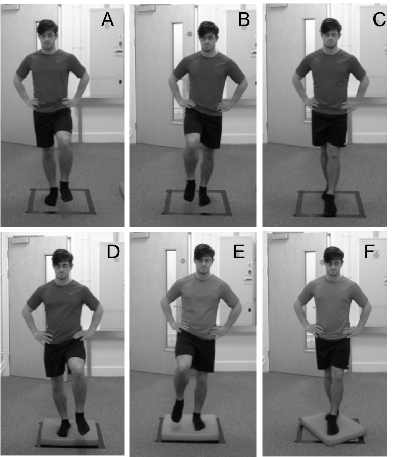
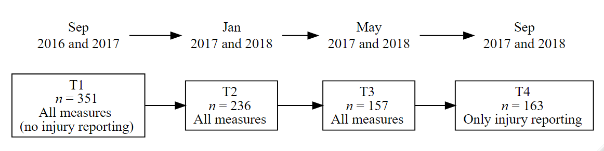
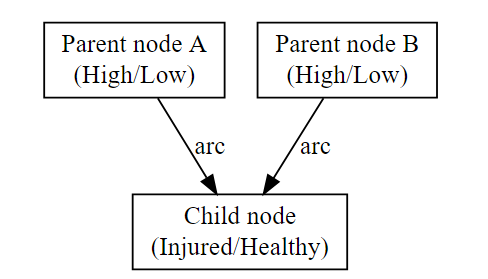

```{r setup, include = FALSE, warning=FALSE, message=FALSE}
options(todor_rmd=TRUE)
library("papaja")
```


# Study 1: An interdisciplinary examination of stress-related markers and injury occurrence in athletes.

Over the last four decades sport related injuries have received increased research attention [@Ivarsson2017].
This attention is unsurprising given the high incidence [@Rosa2014; @Sheu2016],
and numerous undesirable physical and psychological effects of sports injuries [@Leddy1994; @Brewer2012].
In an attempt to address this and mitigate against both the increasing incidence and undesirable consequences of injury, research that has focused on identifying factors related to injury occurrence
has identified several psychological [@Slimani2018],
anatomical [@Murphy2003],
biomechanical [@Neely1998; @Hughes2014]
and environmental [@Meeuwisse2007]
factors associated with sports injury.
Indeed, several models of injury causation have been proposed that highlight the multifactorial nature of injury occurrence [@Kumar2001; @Meeuwisse2007; @Wiese-Bjornstal2009],
of which one of the most widely cited and influential models was developed by Williams and Anderson [@Andersen1988; @Williams1998].

Williams and Andersen's (1998) model proposed that when faced with a potentially stressful athletic situation, an athlete’s personality traits (e.g., hardiness, locus of control, sense of coherence, competitive trait anxiety, achievement motivation and sensation seeking), history of stressors (e.g., daily hassles, major life events, previous injuries) and coping resources (e.g., general coping behaviours, social support, psychological skills) will contribute to their response, either interactively or in isolation.
Central to the model is the stress response, which reflects the bi-directional relationship between athletes’ appraisal of, and response to, a stressful athletic situation. The model predicts that athletes who have a history of many stressors, personality traits that intensify the stress response and few coping resources to deal with the situation, will exhibit greater attentional (e.g., peripheral narrowing) and/or physiological (e.g., increased muscle tension) responses that put these individuals at greater risk of injury.

Within Williams and Andersen’s (1998) model, although the stress response is the mechanism through which injuries are thought to occur, personality traits, history of stressors and coping resources have received the most research attention [@Johnson2014].
Of these variables the major life events component of an athlete’s history of stressors appears to most consistently predict injury occurrence [@Williams2007].
Specifically, major life events with a negative, as opposed to positive, valence have been found to be most related to injury occurrence [@Passer1983a; @Maddison2005].
However, personality traits and coping resources have also been found to predict injury, with athletes more likely to sustain an injury if they have low social support, low psychological coping skills, high trait anxiety and elevated competitive state anxiety; compared to athletes with the opposite profile [@Smith1990; @Lavallee1996; @Ivarsson2010].
The evidence for a relationship between other personality traits and injury has been less conclusive, with some research finding no support or even contradictory results [@Junge2000].
Furthermore, the amount of variance explained by the psychosocial factors proposed by the model has been modest, typically between 5 - 30% [@Galambos2005; @Ivarsson2010]; suggesting other factors are also likely to contribute to injury occurrence.

Although the majority of injury prediction research has examined the effect of the psychosocial factors in Williams and Andersen's (1998) model, other research has attempted to examine the mechanisms through which these factors are proposed to exert their effect.
To elaborate, the  model suggests that injuries are likely to occur through either increased physiological arousal resulting in increased muscle tension and reduced flexibility or attentional deficits caused by increased distractibility and peripheral narrowing. However, to date, the research exploring the mechanisms has largely focused on attentional deficits [@Andersen1999; @Rogers2005; @Wilkerson2012a; @Swanik2007].
For example, Andersen and Williams (1999)
measured peripheral and central vision during high and low stress conditions and found athletes with high life event stress coupled with low social support had greater peripheral narrowing under stressful conditions compared to athletes with the opposite profile; these athletes went on to sustain an increased number of injuries during the following season.
@Rogers2005 supported Andersen and Williams's (1999) earlier findings reporting that peripheral narrowing under stress mediated 8.1% of the relationship between negative life events and injury.
However, few attempts have been made to explain the remaining variance between negative life events and athletic injury through the other proposed mechanisms in Williams and Andersen's (1998) model, such as increased muscle tension and reduced motor control.

One possible reason for this is the multifactorial nature of injury and the possible contribution of other non-psychological factors to the stress response
[@Meeuwisse2007; @Wiese-Bjornstal2009].
For example, a large body of research indicates that training-related stress is also likely to be related to the stress response and injury occurrence [@Lee2017; @Djaoui2017],
and may account for the unexplained variance from the psychological predictors of injury.
Considering these limitations, @Appaneal2014
proposed the bio-psychosocial model of stress athletic injury and health (BMSAIH) to serve as an extension to Williams and Andersen’s (1998) model.
To elaborate, the BMSAIH aimed to clarify the mediating pathways between the stress response and injury, 
consider other health outcomes and behavioural factors that impact sports participation,
and integrate the impact of exercise training on athletes’ health [@Appaneal2014].
The central tenet of the BMSAIH is that psychosocial distress (e.g., negative life events) may act synergistically with training-related stress as a result of high-intensity and high-volume sports training, and “widen the window of susceptibility” [@Appaneal2014, p. 74] to a range of undesirable health outcomes including illness and injury.
Consequently, the BMSAIH provides a framework for future research to build upon  research that supports the relationship between psychosocial factors and injury occurrence proposed in Williams and Andersen's (1998) model, by including other physiological markers of training-related stress, which together may provide greater insight into the injury process.

Although research supporting the BMSAIH has mainly focused on the relationship between hormonal responses to training and injury occurrence [@Perna1995; @Perna1997; @Perna2003], other research has identified other markers of training-related stress that are associated with an increased risk of injury; for example,
heart rate variability [@Bellenger2016; @Williams2017],
postural stability [@Romero-Franco2014]
and muscle stiffness [@Pruyn2015].
Unfortunately, these markers are often studied in isolation and without an assessment of the psychosocial factors that are known to contribute to injury, limiting our understanding of how psychosocially and physiologically derived stress may contribute synergistically to injury occurrence.
Recently, @Bittencourt2016
proposed that to better understand the multifactorial nature of sports injuries, research needs to move away from studying risk factors in isolation and instead adopt a complex systems approach to injury.
Such an approach posits that injury may arise from a complex “web of determinants” [@Bittencourt2016, p. 3],
where different factors interact in unpredictable and unplanned ways, but result in a global outcome pattern of either adaptation or injury.
Complex systems approaches have been used in health care to model the large number of risk factors  associated with different types of diseases [@Plsek2001];
however, very few studies have attempted to address sport injury occurrence using such an approach [@Hulme2018].

Despite offering a possible framework to build on the research stemming from Williams and Andersen's (1998) model, researchers have largely overlooked the potential to explore other physiological stress-related markers proposed by the BMSAIH, in addition to the already well-established psychological characteristics known to be related to injury [@Appaneal2014].
Furthermore, research has typically only recorded one wave of measurements, assuming that the time interval between measurement and actual injury occurrence does not influence subsequent injuries [@Johnson2014].
Such an approach fails to capture changes in both psychosocial factors and stress-related physiological markers that may occur preceding an injury.
Assessing how these variables change with respect to time is essential if we are to understand what effect repeated exposure to major life events and other stress-related factors, such as high intensity training, has on injury occurrence.
Viewed through the lens of a complex systems approach the interaction between psychosocial sources of stress, stress-related physiological markers and injury occurrence may provide new insight into the injury process.
Therefore, the purpose of the current study was to examine the relationship between psychosocial factors, physiological stress-related markers and occurrence of injury in athletes. 
Furthermore, as these variables are likely to change over time a repeated measures design was employed. 

\newpage

## Method

```{r methodssetup, include=FALSE}
knitr::opts_chunk$set(echo = FALSE)
pacman::p_load(tidyverse, knitr, papaja, kableExtra, qwraps2, DiagrammeR)
load("datavars/parchar.Rdata")
load("datavars/balanceicc.rds")
library(qwraps2)

```

### Participants

The participants were 351 athletes (male: _n_ = 231, female: _n_ = 120), with an average age of (`r mean_sd(parchar$age, digits = 1)`) years who represented a range of team (football, rugby, netball, cricket, lacrosse, basketball and field hockey) and individual sports (athletics, tennis, weightlifting, gymnastics, judo, swimming  and golf) from a British university and local sports clubs (see table \@ref(tab:parchar) for full participant information).
Participants self-rated competitive level ranged from recreational to international standard. 
A total of `r n_perc(parchar$pic == "1")` participants had sustained an injury in the 12 months prior to the start of the study (male: _n_ = 114 [49%], female; _n_ = 48 [40%]).
At the start of the study, all participants were injury free (no modifications to their usual training routine due to a sport related medical problem for a minimum of four weeks).
Participants were engaged in training for their respective sports for at least five hours per week.
Ethical approval was obtained from Cardiff Metropolitan University ethics committee prior to the start of the study and all participants provided informed consent.

```{r parchar, results='asis'}

parchartab <- npars %>% 
  mutate(name = ifelse(name == "Hours per week", "Hours per week training", name)) %>% 
  slice(c(1:4, 9:11)) %>% 
  mutate(name = case_when(name == "Age" ~ "Age (yrs)",
                          name == "Height" ~ "Height (cm)",
                          name == "Weight" ~ "Body mass (kg)",
                          TRUE ~ name))

apa_table(parchartab,
          caption = "Participant demographics.",
          stub_indents = list("Demographics M (SD)" = c(1:4),
                              "Current competitive level \\textit{n} (\\%)" = c(5:7)),
          placement = "H",
          col.names = c(" ", "Male (\\textit{n} = 231)", "Female (\\textit{n} = 120)"),
          align = c('lcc'),
          midrules = 5,
          escape = F)
```

\newpage

### Measures

#### Major life events (Appendix  A)

A modified version of the Life Events Survey for Collegiate Athletes (LESCA) was used to measure participants history of life event stress [@Petrie1992]. 
The LESCA comprises 69 items that reflect possible life events that participants may have experienced. 
Example items include, "Major change in the frequency (increased or decreased) of social activities due to participation in sport", "Major change in the amount (more or less) of academic activity (homework, class time, etc)" and "Major change in level of athletic performance in actual competition (better or worse)".
Participants were asked to rate the perceived impact of each life event they had experienced within the last 12 months on an 8-point Likert scale anchored at -4 ($extremely\;negative$) and +4 ($extremely\;positive$). 
Negative and positive life event scores were calculated by summing the negative and positive scores respectively. 
A score for total life events was calculated by summing the absolute values for both negative and positive events.
@Petrie1992 reported test-retest reliabilities at 1-week and 8-weeks with values ranging from 0.76 to 0.84 (\emph{p} < .001) and 0.48 to 0.72 (\emph{p} < .001) respectively. 
@Petrie1992 also provided evidence of discriminant, convergent and predictive validity. 
The LESCA is the most widely used measure of major life events for athletes in the sports injury literature. 
For this study, reliability was assessed using composite reliability [@Fornell1981], rather than the more widely used Cronbach’s alpha. 
Composite reliability is preferred because it does not assume parallelity (i.e., all factor loadings are constrained to be equal, and all error variances are constrained to be equal) and instead takes into consideration the varying factor loadings of the items in the questionnaire.
Composite reliability for the LESCA was 0.84.

#### The Reinforcement Sensitivity Theory Personality Questionnaire (RST-PQ; Appendix B)

```{r rstreliability}
load("datavars/rstreliability.rds")
slxx <- slx %>% 
  mutate(final = round(final, digits = 2),
         nnames = ifelse(nnames == "IMP", "I", nnames)) 

```

The RST-PQ was used to measure motivation, emotion, personality and their relevance to psychopathology (Corr & Cooper, 2016). 
The revised version of the RST-PQ presented in Chapter 2 comprises 51 statements that measure three major systems: 
1) Fight-Flight-Freeze System (FFFS; e.g., "I am the sort of person who easily freezes-up when scared"), 
2) Behavioural Inhibition System (BIS; e.g., "When trying to make a decision, I find myself constantly chewing it over"), and, 
3) Behavioural Approach System (BAS) factors; 
1) Reward Interest (RI; e.g., “I regularly try new activities just to see if I enjoy them”), 
2) Goal Drive Persistence (GDP; e.g., “I am very persistent in achieving my goals”), 
3) Reward Reactivity (RR; e.g., “I get a special thrill when I am praised for something I've done well”) and 
4) Impulsivity (I; e.g., “I find myself doing things on the spur of the moment”).
Participants rated each item on a scale from 1 ($not\; at\; all$) to 4 ($highly$) to reflect how well each statement described their personality in general. 
The responses to items associated with each subscale (FFFS, BIS, RI, GDP, RR and I) were summed to give a total score that was subsequently used for further analysis.
The composite reliabilities for each subscale were; BIS = `r slxx$final[1]`, FFFS = `r slxx$final[2]`, GDP = `r slxx$final[3]`, I = `r slxx$final[4]`, RI = `r slxx$final[5]`, RR = `r slxx$final[6]`.

#### Heart rate variability (HRV)

A Polar V800 heart rate monitor (HRM) and Polar H7 Bluetooth chest strap (Polar OY, Finland) was used to collect inter-beat interval (IBI) data.
IBI recordings using the Polar V800 are highly comparable (ICC = >0.99) with ECG recordings [@Giles2016], which are considered the gold standard for assessing HRV.
In addition, HRV indices calculated from IBI and ECG data have shown a strong correlation (\emph{r} = 0.99) in athletes [@Caminal2018] and under spontaneous breathing conditions [@Plews2017].

#### Musculoskeletal properties

A handheld myometer (MyotonPRO, Myoton AS, Tallinn, Estonia) was used to measure muscle stiffness.
The MyotonPRO is a non-invasive, handheld device that applies a mechanical impulse of 0.40N for 0.15ms perpendicular to the surface of the skin.
The impulse causes natural damped oscillations in the tissue, which are recorded by a three-axis digital accelerometer sensor in the device.
The raw oscillation signal is then processed, and the stiffness parameter is calculated [@Agyapong-Badu2016]. 
The MyotonPRO has previously been reported to be a reliable and valid tool for the measurement of in-vivo tissue stiffness properties [@Chuang2013; @Pruyn2016; @Nair2014], and has demonstrated good internal consistency (coefficient of variation < 1.4%) over sets of 10 repetitions [@Aird2012].

#### Postural stability

Postural stability was assessed with a modified version of the balance error scoring system (mBESS) based on the protocol recommended by @Hunt2009. 
In total, each trial of the mBESS was performed without shoes [@McCrory2013] and included six stances in the following order; dominant leg (DL; standing on the dominant foot with the non-dominant foot at approximately 30-degrees of hip flexion and 45-degrees of knee flexion),
non-dominant leg (NDL; standing on the non-dominant foot with the dominant foot at approximately 30-degrees of hip flexion and 45-degrees of knee flexion) 
and tandem leg stance (TS; standing heel-to-toe with the non-dominant foot behind the dominant) on firm and foam (Alcan airex AG, Sins, Switzerland) surfaces respectively (Figure \@ref(fig:bess-protocol)). 
To determine leg dominance, participants were asked their preferred leg to kick a ball to a target, and the chosen limb was labelled as dominant [cf. @VanCingel2017]. 
Participants were asked to maintain each stance for a total of 20 seconds.
Participants hands were placed on hips at the level of the iliac crests. 
A Sony DSC-RX10 video camera (Sony Europe Limited, Surrey, United Kingdom) was used to record each participants performance during the mBESS.

```{r bess-protocol, fig.cap="mBESS positions (A-F). Top row, firm surface. Bottom row, foam surface. Left column, dominant leg stance. Middle column, non-dominant leg stance. Right column, Tandem leg stance.", out.width = "\\textwidth", fig.align='center',fig.pos = "!h", dpi=105}

```

The error identification criteria from the original BESS protocol was used by the lead researcher who scored all the BESS trials. 
One error was recorded if any of the following movements were observed during each trial: a) lifting hands off iliac crests; 
b) opening eyes; 
c) stepping, stumbling, or falling; 
d) moving the thigh into more than 30 degrees of flexion or abduction; 
e) lifting the forefoot or heel; and 
f) remaining out of the testing position for more than five seconds [@Riemann1999d].
A maximum score of 10 errors was possible for each stance. Multiple errors occurring simultaneously were recorded as one error.
A participant was given the maximum score of 10 if they remained out of the stance position for more than five seconds.
To calculate limb asymmetry, the DL and NDL leg score was calculated by summing the DL and NDL errors respectively.
A total score was calculated by summing the total number of errors recorded on all stances (DL, NLD and TS, on foam and firm surfaces). 
To assess the intra-rater reliability, a single measurement, absolute agreement, two-way mixed effects model for the intraclass correlation [ICC; @Koo2016] was used on a sample of 40 participants from the first time point.
The test-retest scoring of BESS resulted in a "good" to "excellent" ICC score (ICC = `r round(icc[["value"]], digits = 2)`, 95% confidence interval = `r paste(round(icc[["lbound"]], digits = 2), "-", round(icc[["ubound"]], digits = 2)) `), indicating the scoring was reliable [@Koo2016].

#### Injury 

Participants self-reported any injuries they sustained at each data collection during the study period.
An injury was defined as any sports related medical problem causing the athlete to miss or modify their usual training routine. 
Minor scrapes and bruises that may require certain modifications (e.g., strapping or taping) but did not limit continued participation were not considered injuries [cf. @Appaneal2009].
Injury status (did / did not sustain an injury) served as the main outcome measure.

### Procedure

At the start of the academic year (September 2016 and 2017), coaches of sports teams at a British university and local sports clubs were contacted and informed about the study. 
With the coaches' permission, the lead researcher attended training sessions to inform the athletes about the overall aim of the study and the requirements of participation.
To be eligible for the study athletes had to be injury free (no modifications to their usual training routine due to a sport related medical problem for a minimum of four weeks) and training a minimum of five hours per week.
Athletes who met the criteria and volunteered to take part in the study were invited to attend scheduled testing sessions.

A repeated measures prospective cohort design was used to assess athletes' major life events, stress-related physiological markers and injury status over a twelve-month period between September 2016 and September 2018. 
Each participant was asked to attend a total of four data collections during the twelve-month period, with each data collection separated by a four-month interval (figure \@ref(fig:study-design)). 
Participants provided informed consent before data collection commenced.
A maximum of 12 participants were scheduled to attend each data collection session, which lasted approximately one hour. 
Participants were asked to avoid wearing any tight-fitting shorts or leggings to the data collection session.

```{r study-design, fig.cap = 'Study design. For each time point (T), each box contains the number of participants who completed the data collection (\\textit{n}), the measures used for data collection and the approximate date of the data collection.', out.width="100%"}
load("datavars/figures.Rdata")

```

All data were collected in a dedicated laboratory space at the university.
For the first three data collections (T1, T2 and T3), participants followed the same protocol in a specific order (Figure \@ref(fig:session-protocol)). 
To ensure all measures could be collected within an hour, participants were separated into two groups. 
The first group completed all computer-based measures followed by all physical measurements, whereas the second group completed all physical measurements followed by computer-based measures. 
Participants were randomly assigned to one of the two groups and remained in those groups across all time points.

```{r session-protocol, fig.cap = 'Outline of the protocol for each data collection.', out.width="100%", fig.align='center'}
include_graphics("figs/study1/sessionprotocol.png")
```

#### Questionnaires

The questionnaires, which included demographic information, the LESCA, RST-PQ (T1, T2, T3) and injury status (T2, T3, T4) were completed via an on-line survey (SurveyMonkey Inc., USA, www.surveymonkey.com).
The instructions for the LESCA were modified at T2 and T3 and asked participants to report major life events that had occurred since the previous testing session.
For injury reporting, participants were asked to record any injuries they had sustained since the last data collection.
The data were downloaded from surverymonkey.com and imported into R [@RCoreTeam2019] for analysis purposes.

#### HRV 

To minimise potential distractions, participants were directed to a designated quiet area in the laboratory where IBI data were recorded.
A total of seven heart rate monitors were used which allowed IBI recordings for up to seven participants simultaneously. 
Participants were instructed to turn off their mobile devices to avoid any interference with the Bluetooth sensor.
Each chest strap was dampened with water and adjusted so it fitted tightly but comfortably, as outlined by Polar's guidelines.
Participants were seated and asked to remain as still as possible for the duration of the recording. 
No attempt was made to control participants respiratory frequency or tidal volume [@Denver2007]. 
Inter-beat interval (IBI) data was collected for 10 min at a sampling frequency of 1000 Hz. 

Raw, unfiltered IBI recordings were exported from the Polar Flow web service as a space delimited .txt file and imported into R [@RCoreTeam2019] where a custom script using the _RHRV_ package [@Rodriguez-Linares2017] was used to calculate HRV indices. 
Raw IBI data was filtered using an adaptive threshold filter, and the first 3 min and last 2 min of each recording were discarded, leaving a 5 min window that was used to calculate the root mean square of successive differences (RMSSD) in RR intervals following the recommendations for short term IBI recordings [@Laborde2017; @Malik1996]. RMSSD was calculated as: 

\begin{equation} 
  \overline{RR} = \frac{1}{N} \sum_{i=1}^{n} RR_i
  (\#eq:rmssd)
\end{equation} 

Where N is the length of the time series, and $RR_i$ the RR interval between beats $i$ and $i-1$, where each beat position corresponds to the beat detection instant. 
The R script used in the current study for the HRV analysis is available in Appendix C.

#### Muscle stiffness

To assess muscle stiffness, participants lay horizontally on a massage plinth and four testing sites were identified on each lower limb. 
The muscle belly of the rectus femoris (RF), biceps femoris (BF), medial gastrocnemius (MG) and lateral gastrocnemius (LG) sites were identified using a visual-palpatory technique  to determine the exact location of each site [@Chuang2012].
The visual-palpatory technique required the participant to contract the target muscle to aid the lead researcher to visually identify the muscle. 
The participant was then asked to relax the muscle and the muscle was palpated to locate the muscle belly.
A skin safe pen (Viscot all skin marker pen, Viscot Medical LLC, NJ) was then used to mark the testing site in the centre of the muscle belly. 

After the eight testing sites had been identified, the testing end of the MyotonPRO (diameter = 3 mm) was positioned perpendicular to the skin on the testing site. 
A constant pre-load of 0.18 N was applied for initial compression of subcutaneous tissues. The device was programmed to deliver five consecutive impulses, separated by a one second interval [@Morgan2018]. 
For each impulse, the device computed stiffness values, with the median of the five values being saved by the device for further analysis. 
In accordance with the recommendation of Myoton.com, a set of five measurements with a coefficient of variation (CV) of less than 3% was accepted. 
Sets of measurements above 3% were measured again to ensure the reliability of the data. 
The CV was calculated in real time by the device after each set of measurements. 
Measurements saved on the device were uploaded to a computer using MyotonPRO software and imported in R for further analysis. 
For each participant, the sum of all eight testing sites was calculated to provide a total lower extremity stiffness score and was used for further analysis. 

#### Postural stability 

Participants entered a private office located in the dedicated laboratory where a research assistant who had received training in delivering the mBESS protocol conducted the postural stability assessment.
Instructions for the mBESS were read to each participant and a demonstration of the positions was provided by the research assistant.
For each position, participants were instructed to close their eyes, rest their hands on their iliac crests and remain as still as possible for 20 s. 
Participants were instructed to get back into the testing position as quickly as possible if they lost their balance.
The research assistant started the video recording prior to the first stance position and stopped the recording after all stances had been completed.
Each completed mBESS protocol took approximately 4 min.
Only one trial was performed to avoid familiarisation effects across the repeated measurement occasions [cf. @Valovich2003]. 
The video recordings for each participant were imported from the recording equipment (Sony DSC-RX10) and the lead researcher scored each trial using the error identification criteria. 

### Data analysis 

```{r files}
load("datavars/dataprepro.rds")
#load("datavars/fulldataanalysis.rds")
source("rfiles/queries.R")

```

A Bayesian Network (BN) was used to explore the relationships between the psychological measures, physical markers of stress and sports injury. 
A BN is a graphical representation of a joint probability distribution among a set of random variables, and provides a statistical model describing the dependencies and conditional independences from empirical data in a visually appealing way [@Scutari2014]. 
A BN consists of arcs and nodes that together are formally known as a directed acyclic graph (DAG), where a node is termed a parent of a child if there is an arc directed from the former to the latter [Figure \@ref(fig:examplenetwork); @Pearl1988]. 
However, the direction of the arc does not necessarily imply causation, and the relationship between variables are often described as probabilistic instead of casual [@Scutari2014].
The information within a node can be either continuous or discrete, and a complete network can contain both continuous and discrete nodes; however, discrete networks are the most commonly used form of BN [@Chen2012]. 
In discrete networks, conditional probabilities for each child node are allocated for each combination of the possible states in their parent nodes and can be used to assess the strength of a dependency in the network. 

Learning the structure of the network is an important step in BN modelling. The structure of a network can be constructed using expert knowledge and/or data-driven algorithm techniques (e.g., search and score, such as hill climbing and gradient descent algorithms; Scutari & Denis, 2014).
The learned structure can then be used for inference by querying the network[^1] and obtaining the posterior probabilities of a particular node for a given query.
The posterior distribution can be obtained by $Pr(X|E,B) = Pr(X|E,G,\Theta)$, where the learned network $B$ with structure $G$ and parameters $\Theta$, are investigated with new evidence $E$ using the information in $B$ [@Scutari2014]. 
In the example network presented in Figure \@ref(fig:examplenetwork), new values assigned to each of the parent nodes (e.g., both set to "Low") could be used to investigate what effect the new information has on the state of the child node (conditional probability of a particular state of the child node).
In a more complex network containing many nodes, the outcome of a particular node can be assessed conditional on the states of any subset of nodes in the network. 
BNs therefore provide a unique and versatile approach to modelling a set of variables to uncover dependency structures within the data.

```{r examplenetwork, fig.cap="A simple discrete Bayesian network contain nodes, possible states of the nodes and the arcs connecting nodes.", fig.pos="H", out.width="50%", fig.align='center'}



```


[^1]: The term "query" in relation to Bayesian Networks stems from Pearl's (1988) expert systems theory. A query can be submitted to an expert (in this case, the network is the expert) to get an opinion, the expert then updates the querier's beliefs accordingly. Widely used texts on Bayesian Network analysis [@Koller2009] have adopted the terminology in favour of that used in traditional statistics.

BNs have recently been used in the sport psychology literature [@Olmedilla2018; @Fuster-Parra2017] and offer several benefits over traditional statistical analysis. 
For example, predictions can be made about any variable in the network, rather than there being a distinction between dependent and independent variables in the data, such as in linear regression models that are often used within the sport psychology literature [@Olmedilla2018; @Bittencourt2016].
Furthermore, the structure of a network can be obtained from both empirical data _and_ prior knowledge about the area of study; the latter being particularly useful when there are a large number of variables in the network, or only a small number of observations are available in the data [@Xiao-xuan2007].
In such instances, a purely data driven approach to learning the network would be time-consuming due to the large parameter space, and inefficient at identifying an approximation of the true network structure. 
Prior knowledge about dependencies between variables can therefore be included in the network structure, while still allowing a data driven approach for unknown dependencies, to improve the overall computation of the network structure [@Heckerman1995; @Xu2015].
The following sections detail the steps taken in the current study to firstly prepare the data for the network, and then obtain the structure of the network that was used for inference. 

#### Data preparation

To prepare the data for the BN, missing values in the dataset were imputed. 
Out of the 668 total measurements across all time points in the current study, there were `r n_perc(missingtot$stiffness == 0)` missing Myoton files and `r n_perc(missingtot$rmssd == 0)` missing heart rate recordings. The missing data were due to technical faults in the data collection equipment and were considered to be missing completely at random. 
A missing rate of 15-20% has been reported to be common in psychological studies, and several techniques are available to handle missing values [@Enders2003; @Lang2014].
In the current study, the _caret_ package [@Kuhn2008] was used to impute the missing values. 
A bagged tree model using all of the non-missing data was first generated and then was used to predict each missing value in the dataset. 
The bagged tree method is a reliable and accurate method for imputing missing values in data and is superior to other commonly used methods such a median imputation [@Kuhn2008]. 

Preliminary correlation analysis of the data revealed no strong linear dependencies in the data, and therefore the data were binarised to create "Low" and "High" levels within each variable.
Binarising variables is a common procedure for BN modelling and can help improve the fit of the model by reducing the number of possible states for each node [@Beuzen2018].
All variables were approximately normally distributed; therefore, the median of each variable was used as the cut-off point to create the "Low" and "High" levels. 

For the LESCA, a cumulative total of the current, and previous time points was calculated at each time point to account for the potential continuing effect of the life events experienced by athletes over time. 
Given the weak support for a relationship between positive life events and injury, only negative and total life events were included in the network [@Williams2007].
Cumulative negative and cumulative total life event scores were first log scaled and then binarised based on the median at each time point (nlelg and tlelg respectively).
In addition to the log scaled cumulative values, an untransformed NLE score from the first time point was included as an additional variable based on previous literature that indicates this variable should have a strong relationship with injury outcome [@Ivarsson2017]. 
The complete table of variables that were included in the initial network structure is provided in Appendix D, table D1.

#### Network structure
 
To obtain the network structure, several steps were taken to ensure that both a theoretically realistic network, and a network that was an appropriate fit to the collected data, was used for inference. 
Prior knowledge about the network structure was included by providing a list of arcs that are always _restricted_ from being in the network (blacklist), and a list of arcs that are always _included_ in the network (whitelist). 
Additionally, there are several scoring functions such as Bayesian Information Criteria (BIC) and Bayesian Dirichlet equivalent uniform (BDeu) that can be used to compare network structures with certain nodes and arcs included or excluded [@Scutari2014]. 

In order to account for the repeated measures design in the current study, and to maximise the use of the data, pairs of complete cases (e.g., participants who completed T1 + T2, and T2 + T3) were used in a two-time Bayesian network (2TBN) structure [@Murphy2002].
In the 2TBN, variables measured T2 could depend on variables measured at T1 (e.g., T1 $\rightarrow$ T2) and variables measured at T3 could depend on variables measured at T2 (e.g., T2 $\rightarrow$ T3).
However, arcs were blacklisted between T2 $\rightarrow$ T1 and T3 $\rightarrow$ T2 to preserve the order in which data was collected. 
Variables were separated into two groups; "explanatory", for variables that did not change during the study (e.g., gender), or "independent", for variables that were measured at each time point and could vary during the study.
Independent variable names were suffixed with _1 for time point T, and _2 for time point T+1 (e.g., T1_1 $\rightarrow$ T2_2 and T2_1 $\rightarrow$ T3_2).
Formatting the data in this way meant participants who completed T1 and T2, but did not complete T3, could still be included in the analysis. 
Table \@ref(tab:exampledata) provides an example of the formatted data frame. 
Participants 1 and 3 have complete data, and therefore have two rows of data each representing variables from T1 $\rightarrow$ T2 and T2 $\rightarrow$ T3, respectively. 
Participant 2 did not complete the final data collection at T3 and therefore only has one row of data representing the variables collected at T1 and T2.
In addition to the blacklisted arcs between T2 $\rightarrow$ T1 and T3 $\rightarrow$ T2, the direction of arcs was restricted between independent variables and explanatory variables (e.g., independent $\rightarrow$ explanatory), however arcs were not restricted between explanatory $\rightarrow$ independent variables.
Finally, arc direction was restricted between specific nodes within the explanatory variables. 
Arcs from clevel $\rightarrow$ gender, nlebase $\rightarrow$ gender and nlebase $\rightarrow$ ind_team were included in the blacklist, as arcs in these directions did not make logical sense. 
All subsequent models used the same blacklist.

```{r exampledata, results='asis'}
exampledata <- tibble(Participant = c("1","1","2","3","3"),
       "X_1" = c("T1", "T2", "T1", "T1", "T2"),
       " " = "->",
       "X_2" = c("T2", "T3", "T2", "T2", "T3")) 

  apa_table(exampledata,
            align = "cccc",
            caption = "Example of the data arrangement used for the network.")
```


#### Preliminary network structures

Prior to the final network structure presented in the results section, several structures were investigated.
Networks were learned using a Tabu search algorithm [@Norvig2009] and BIC was used to score and compare different models. 
A higher BIC value indicates the structure of a network is a better fit to the observed data. 
BIC values for each combination of variables of interest are reported as the combination of variables with the highest BIC value, followed by the relative scores of the other variables in the model.


Initially, both negative life events and total life events were included in the network structure, however the network score was improved when only nlelg or tlelg was included (highest BIC value = nleleg, BIC values relative to nlelg; tlelg only = `r le[2,2]-le[1,2]`, tlelg and nlelg = `r le[3,2]-le[1,2]`). 
Additionally, despite strong evidence in the literature that both negative and total life event stress are related to injury occurrence [@Williams2007], network structures learned using the Tabu search algorithm failed to identify a relationship between NLE and injury or TLE and injury in the data. 
Given that nlelg provided the highest network score, and there is a stronger relationship between negative life events and injury in the literature, an arc was whitelisted between nlelg_1 and injured_1 and nlelg_2 and injured_2 in the final network structure.
Total life event score was not included in the final structure.

The subscales representing the BAS system (RR, RI, GDP and I) showed limited connection to other variables in the network. 
Therefore, several models were run with each scale individually to find the scale that resulted in the highest BIC value (values are shown relative to the highest value).
RI provided the highest BIC value, compared to RR (`r rstmodel[2,2]- rstmodel[1,2]`), GDP (`r rstmodel[4,2]-  rstmodel[1,2]`) and I (`r rstmodel[5,2] - rstmodel[1,2]`).
Including all the variables (RR, RI, GDP and I) resulted in a significantly lower score `r rstmodel[6,2] - rstmodel[1,2]`) indicating that including all the variables was not beneficial to the model structure and did not offset the cost of the additional parameters. Therefore, only RI was included in the final structure.

Finally, both total score and asymmetry were included in the initial network. However, visual inspection of the network revealed no arcs between bal_asym_1 or bal_asym_2 and any other node in the network.
Therefore, balance asymmetry was dropped from the final network structure.
To summarise, Table \@ref(tab:finalvars) includes the variables that were included in the final network structure.

```{r finalvars, results='asis'}
library(knitr)
library(kableExtra)
varcutoffs %>% 
  filter(!var %in% c("sdnn", "RR", "I", "GDP", "tlelg", "tlelg_1", "tlelg_2", "tlelg_3", "bal_asym")
) %>% 
  kable("latex",
       booktabs = T,
       align = c("llcc"),
       caption = "Variables included in the final Bayesian network structure.",
       col.names = c("Variable", "Definition", "State 1", "State 2")) %>%
  kable_styling(latex_options = "HOLD_position") %>% 
  column_spec(2, width = c("5.2cm")) 
```

Preliminary network structures also revealed strong dependencies between the same variables at subsequent time points. 
For example, the probability that stiffness_1 and stiffness_2 were both "High", or both "Low" was approximately 80%. 
Including the arcs between the same variables from X_1 $\rightarrow$ X_2 did not provide any theoretically meaningful information to the network structure as the majority of participants would either be in a "Low" or "High" state for each pair of variables in the network. 
To more appropriately assess changes _within_ variables over time, a second BN was investigated by modelling the differences between variables at different time points.
The use of differential equations to model changes in variables over time is a common procedure in Bayesian network analysis when there are repeated measurements in the data [@Scutari2017].
To obtain the structure, variables suffixed with _1 were subtracted from variables suffixed with _2 to calculate the difference between variables measured at time points T1 $\rightarrow$ T2 and T2 $\rightarrow$ T3. 
Independent variables were then standardized to allow relative changes between variables to be compared. 
The "injured" variable was also modified to represent whether a participant had sustained an injury at any point over the duration of the study or were healthy for the duration of the study.
The result was a network that explicitly modelled the _amount_ of change within variables between time points, as opposed to the first network that would only have captured changes when the median threshold was crossed from "Low" to "High". 
Identical blacklists to the first network were used for arcs between independent and explanatory variables. 
The nlebase variable was also dropped from the list of explanatory variables to allow the _changes_ in negative life events to be the only life event variable in the network. 
Table \@ref(tab:secondnetwork) shows the pre-standardised variables that were included in the network, all explanatory variables were identical to Table \@ref(tab:finalvars).

```{r secondnetwork, results='asis'}
diffgtable %>% 
  apa_table(.,
            caption = "Mean and SD of the change between time points for independent variables.",
            placement = "H",
            col.names = c("Variable", "\\textit{M}", "\\textit{SD}"),
            align = c("lcc"),
            escape = FALSE)

```

To obtain the final networks, the appropriate blacklist and whitelists were provided and a Tabu search algorithm identified the remaining structure of the network. 
The final network structured was obtained by averaging 1000 bootstrapped models [@Efron1993] to reduce the impact of locally optimal, but globally suboptimal network learning, and to obtain a more robust model [@Olmedilla2018].
Arcs that were present in at least 30% of the models were included in the averaged model.
The strength of each arc was determined by the percentage of models that the arc was included in, independent of the arc's direction.
An arc strength of 1 indicates that the arc is always present in the network, with the value decreasing as arcs are found in fewer networks. 
In the current study arcs above 0.5 were considered "significant" with arcs below 0.5 and above 0.3 "non-significant" [@Scutari2013]. 
Arcs below 0.3 were not included in the model.
Appendix D (Table D2) provides a table of arc strengths for each network. 

#### Network inference

Conditional probability queries (CPQ) were used to perform inference on both network structures.
To conduct a CPQ, the joint probability distribution of the nodes was modified to include a new piece of evidence.
The query allows the odds of a particular node state (e.g., injured_1 = "injured") to be calculated based on the new evidence. 
CPQs were performed using a likelihood weighting approach; a form of importance sampling where random observations are generated from the probability distribution in such a way that all observations match the evidence given in the query. 
The algorithm then re-weights each observation based on the evidence when computing the conditional probability for the query [@Scutari2014].
Inference was first performed on arcs that had a strength greater than 0.50 between the explanatory variables and independent variables and between different independent variables in the network. 
Of particular interest in the current study were the variables that were connected to "injured" nodes.
To examine the variables that were associated with injured nodes in the network, the Markov blanket of "injured_1" and "injured_2" were examined. 
A Markov blanket contains all the nodes that make the node of interest conditionally independent from the rest of the network [@Fuster-Parra2017].
CPQs were used to determine what effect the variables in the Markov blanket of injured nodes had on the probability of the injured node being in the "injured" state.

The second network contained both continuous and discrete data. 
To examine dependencies between continuous variables with arc strengths above 0.5 in the second network random samples were generated based on the conditional distribution of the nodes included as evidence in the query.
The samples were then extracted and examined with Bayesian linear regression models using the _brms_ package [@Burkner2017a] to determine the relationship between nodes in the network.
Similar to the first network, the Markov blanket of the "injured" node was also investigated by determining the highest probability of injury with combinations of variables in the Markov blanket below the mean change, at the mean change and above the mean change.

\newpage

## Results

```{r}
load("datavars/study1results.rds")
```

During the study, 26% of participants reported at least one injury with an average severity of `r mean_sd(datanet$days_missed, digits = 1)`, days (range = `r min(datanet$days_missed[datanet$days_missed > 1])` - `r max(datanet$days_missed)`).
Both male and female participants reported a greater number of acute compared to chronic injuries (male, acute = `r inj_mechanism[1,3]`, chronic = `r inj_mechanism[2,3]`; female, acute = `r inj_mechanism[1,2]` chronic = `r inj_mechanism[2,2]`), and non-contact injuries were more common than contact injuries (male, non-contact = `r inj_mechanism[4,3]`, contact = `r inj_mechanism[2,3]`; female, non-contact = `r inj_mechanism[4,2]` contact = `r inj_mechanism[3,2]`).
Table \@ref(tab:injurychars) shows the number and percentage of injury types sustained by both male and female participants. 

```{r injurychars, results='asis'}

cbind(inj_summary[c(1:3),c(2:4)], inj_summary[c(4:6),c(3:4)]) %>% 
  apa_table(.,
            col_spanners = list(Female = c(2:3),
                                Male = c(4:5)),
            placement = "H",
            caption = "The number and percentage (\\%) of types of injuries sustained by male and female participants.",
            note = "Other included bone, skin and brain injuries.",
            col.names = c("", "Lower body", "Upper body", "Lower body", "Upper body"),
            escape = FALSE)

```

```{r}
strengthfinder <- function(var1, var2){
  str %>% 
    filter(from == var1 & to == var2)
}

#map2_dfr("nlebase", "nlelg_2", ~strengthfinder(.x, .y))%>% 
#  mutate(strength = round(strength, digits = 2))

from <- c("nlebase", "ind_team", "ind_team", "gender", "gender", "clevel", "pi")
to <- c("RI_1", "hours", "nlebase", "stiffness_1", "stiffness_2", "balance_1", "stiffness_1")
x <- pmap_dfr(.l = list(from = rep(from, 2),
     to = rep(to, 2),
     state = rep(c("High", "Low"), each = length(from))),
         ~newprobtable(tallc, vars = ..1, outcome = ..2, state = ..3, avg30)) %>% 
  gather(var, state, -prob, -outcome) %>% 
  drop_na(state) %>% 
  mutate(prob = round(prob, digits = 2))

```

### First network structure 

The final network structure obtained from the data is shown in Figure \@ref(fig:networkstructure). Several of the explanatory variables showed strong connections with independent variables in the network.
The arc from nlebase $\rightarrow$ RI_1 had a strength of 0.84, and the probability of RI_1 being in the "High" state increased from `r x[1,1]` to `r x[2,1]` when nlebase increased from "Low" to "High".
The ind_team node had strong arcs to hours (0.90) and nlebase (0.84). 
Individual athletes were more likely to have "High" hours per week (`r x[5,1]`) compared to team-based athletes (`r x[6,1]`). 
Individual athletes were also more likely to have "High" negative life events in the 12 months preceding the start of the study compared to team based athletes (individual athletes = `r x[7,1]`, team-based athletes = `r x[8,1]`).
The arcs from gender $\rightarrow$ stiffness_1 and gender $\rightarrow$ stiffness_2 were 0.76, and 0.65 respectively, with males more likely to have "High" stiffness compared to females (males = `r x[14,1]`, females = `r x[13,1]`).
The arc from pi $\rightarrow$ stiffness_1 was 0.55 with athletes who reported an injury in the preceding 12 months more likely to have "High" (`r x[26,1]`) compared to "Low" (`r x[28,1]`) stiffness. 
The arc from clevel $\rightarrow$ balance_1 had a strength of 0.51, with lower level performers more likely to have decreased balance ability (`r x[21,1]`), compared to national level athletes (`r x[22,1]`). 

```{r}
from <- c("BIS_1", "BIS_2", "FFFS_1", "nlelg_1", "nlelg_2")
to <- c("FFFS_1", "FFFS_2", "BIS_2", "BIS_1", "BIS_2")

#map2_dfr(from, to, ~strengthfinder(.x, .y)) %>% 
#  mutate(strength = round(strength, digits = 2))

y <- pmap_dfr(.l = list(from = rep(from, 2),
     to = rep(to, 2),
     state = rep(c("High", "Low"), each = length(from))),
         ~newprobtable(tallc, vars = ..1, outcome = ..2, state = ..3, avg30)) %>% 
  gather(var, state, -prob, -outcome) %>% 
  drop_na(state) %>% 
  mutate(prob = round(prob, digits = 2))
```

Arcs were also present between independent variables in the network. Strong arcs were present between BIS_1 $\rightarrow$ FFFS_1 (0.98) and BIS_2 $\rightarrow$ FFFS_2 (0.68). 
In both instances, "High" FFFS was more likely when BIS was "High" (`r y[2,1]` for _1, `r y[6,1]` for _2) compared to "Low" (`r y[1,1]` for _1, `r y[5,1]` for _2).
The arc between nlelg $\rightarrow$  BIS had a strength of 0.62 for nlelg_1  $\rightarrow$ BIS_1, however no arc was present between nlelg_2 and BIS_2.
For nlelg_1 $\rightarrow$ BIS_1, "Low" negative life events increased the probability of BIS being in the "High" state from `r y[13,1]` to `r y[14,1]`.

\newpage
\blandscape

```{r networkstructure, fig.align='default', fig.height=8, fig.width=12, fig.cap='The full Bayesian network structure was plotted using the _strength.plot_ function in bnlearn. The strength of each arc is shown graphically by the style of the arc. Thin, dashed arcs indicate the weakest arcs (arc strength below 0.50), whereas thick solid arcs indicate the strongest arcs (arc strength of 1). White nodes in the network indicate the explanatory variables, blue nodes indicate T1_1 and T2_1 variables, and red nodes indicated T2_2 and T3_2 variables. The injured_X nodes have been coloured gold as they are the main nodes of interest within the network.'}
renderGraph(gR)
```

\elandscape

#### Markov blanket for injured_1

The Markov blanket for injured_1, which contained hours spent training per week (hours), negative life events (nlelg_1), muscle stiffness (stiffness_1), current competitive level (clevel) and balance (balance_1), is shown in Figure \@ref(fig:node1).
The arc between nlelg_1 and injured_1 was fixed in the network, so has the maximum strength of 1. 

```{r node1, fig.cap='Markov blanket of injured_1. Arc strengths are included as arc labels.', fig.pos='H'}

plotsg1 <- model2network('[hours][stiffness_1][nlelg_1][clevel][injured_1|hours:nlelg_1:stiffness_1][balance_1|clevel:injured_1]')

q1p <- graphviz.plot(plotsg1,
              shape = "rectangle",
              render = F,
              groups = list(c("clevel", "hours"), "injured_1", c("stiffness_1", "nlelg_1", "balance_1")))

strq1 <- str %>% 
  filter(from %in% c("clevel", "hours", "nlelg_1", "stiffness_1", "injured_1") & 
           to %in% c("balance_1", "injured_1")) %>% 
  filter(strength > 0.30) %>% 
  mutate(strength = format(round(strength, digits = 2), nsmall = 2))

labels <- as.character(strq1$strength)
labels[4] <- str_pad(labels[4], side = "left", width = 2)

edgenames <- edgeNames(q1p)
names(labels) <- edgenames
nodeRenderInfo(q1p)$fill[c("injured_1", "nlelg_1")] = "gold"
edgeRenderInfo(q1p) <- list(lwd = c("nlelg_1~injured_1" = 6, 
                                    "stiffness_1~injured_1" = 3,
                                    "clevel~balance_1" = 3),
                            lty = c("injured_1~balance_1" = "dashed",
                                    "hours~injured_1" = "dashed"))

q1p <- layoutGraph(q1p, edgeAttrs=list(label = labels))
graph.par(list(edges=list(fontsize = 13)))
nodeRenderInfo(q1p)$fill[c("nlelg_1", "stiffness_1", "balance_1")] = "deepskyblue"
nodeRenderInfo(q1p)$fill["injured_1"] = "gold"
#renderGraph(q1p)

```

\begin{figure}
\centering
\includegraphics{figs/study1figs/node1-1.pdf}
\caption{\label{fig:node1}Markov blanket of injured\_1. Arc strengths are included as arc labels.}
\end{figure}

The CPQ for injured_1 in the "injured" state for all variables that were directly linked to injured_1 (parents and children) is shown in Table \@ref(tab:query1). 
The probability of injured_1 = "injured" rose from `r query1[4,2]` to `r query1[4,3]` when stiffness was "High" compared to "Low".
Negative life events had a negligible effect on the probability of injury when moving from the "Low" (Pr = `r query1[3,2]`) to "High" (Pr = `r query1[3,3]`) state.

```{r query1, results='asis'}
library(knitr)
query1 %>% 
  select(c(1,2,3)) %>% 
  apa_table(.,
            caption = "Probability of injured_1 being in the ``injured'' state, conditional on each variable.",
            placement = "H",
            col.names = c("Variable", "Low", "High"))
```

The second CPQ investigated the outcome of injured_1 being "injured" conditional on all variables in the Markov blanket.
The Markov blanket contained five nodes, each with two possible states resulting in $2^5$ combinations of variables, therefore only the three lowest and highest probabilities are shown in Table \@ref(tab:query2) (full Table in Appendix D, table D3).
The combination of lower competitive level, "High" hours per week, "Low" negative life events, "High" balance and "High" stiffness resulted in a probability of `r max(query2$prob)` for injured_1 being in the "injured" state.
When all variables were in the "Low" state the probability of "injured" was approximately `r min(query2$prob)`.
Negative life events only had a substantial effect on injured_1 when all other variable were fixed to "Low". 
In this instance the probability of injured_1 being "injured" rose from 0.04 to 0.19, when negative life events was in the "Low" and "High" states respectively. 

```{r query2, results='asis'}
query2 %>% 
  select(7,2:6) %>% 
  rename(Probability = "prob") %>% 
  apa_table(.,
            caption = "Highest and lowest probability of injured_1 being in the ``injured'' state, conditional on all variables in the Markov blanket for injured_1.",
            stub_indents = list("Highest" = c(1:3),
                                "Lowest" = c(4:6)),
            placement = "H",
            align = c("cccccc"))
load("datavars/largequeries.rds")
```


Table \@ref(tab:fullnetworkquery1) shows the states of all explanatory and independent variables suffixed with _1 that resulted in the highest and lowest probability of injured_1 being in the "injured" state. 
The probability of injured_1 being "injured" rose from `r injured1comp[2,3]` to `r injured1comp[2,2]` with the combination of variable states in Table \@ref(tab:fullnetworkquery1).  Notably, hours per week, stiffness_1 and balance_1 had the greatest effect on raising the probability of injured_1 being in the "injured" state.


```{r fullnetworkquery1, results="asis"}

injured1comp %>% 
  filter(variable != "outcome") %>% 
  mutate(variable = ifelse(variable == "prob", "Probability", as.character(variable)))%>% 
  apa_table(.,
            stub_indents = list("Variable" = c(2:15)),
            caption = "Probability of injured_1 being in the ``injured'' state conditional on explanatory variables and independent variables suffixed with _1.",
            placement = "H",
            align = "lcc",
            col.names = c("", "High risk", "Low risk"))
```

#### Markov blanket of injured_2

The Markov blanket for injured_2 is shown in Figure \@ref(fig:mb2) and contained gender, previous injury, FFFS_1, stiffness_2, balance_2 and rmssd_2. 
The arc between stiffness_2 and injured_2 was comparable to the arc between stiffness_1 $\rightarrow$ injured_2. 
Very weak arcs (0.30) between injured_2 $\rightarrow$ balance_2 and injured_2 $\rightarrow$ rmssd_2 were also present in the Markov blanket for injured_2. 
Results of the first query for injured_2 in the "injured" state are presented in Table \@ref(tab:query3).
Similar to injured_1, stiffness_2 doubled the probability of injured_2 being "injured" from `r query3[5,2]` in the "Low" state to `r query3[5,3]` in the "High" state.
FFFS_1 in the "Low" state increased probability of injured_2 being "injured" by `r query3[2,2]-query3[2,3]` compared to the "High" state. 
"High" negative life events decreased the probability of injury from `r query3[3,2]` to `r query3[3,3]`. 

```{r mb2, fig.cap = "Markov blanket for injured_2", fig.pos='H'}

plotsg2 <- model2network('[nlelg_2][gender][pi][FFFS_1][injured_2|FFFS_1:nlelg_2][stiffness_2|pi:gender:injured_2][balance_2|injured_2][rmssd_2|injured_2]')
q2p <- graphviz.plot(plotsg2,
                     render = F,
                     shape = "rectangle",
                     groups = list(c("gender", "pi"), "injured_2", c("stiffness_2", "nlelg_2", "balance_2", "rmssd_2")))

strq2 <- str %>% 
  filter(from %in% c("pi", "FFFS_1", "nlelg_2", "stiffness_1", "injured_2", "gender") & to %in% c("balance_2", "injured_2", "nlelg_2", "stiffness_2", "rmssd_2")) %>% 
  filter(strength > 0.30) %>% 
  filter(direction != 0) %>% 
  slice(2:8) %>% 
  mutate(strength = format(round(strength, digits = 2), nsmall = 2))

labels <- as.character(strq2$strength)
labels[7] <- str_pad(labels[7], side = "left", width = 2)
edgenames <- c("pi~stiffness_2", "gender~stiffness_2", "FFFS_1~injured_2",
               "injured_2~stiffness_2", "injured_2~balance_2", "injured_2~rmssd_2", "nlelg_2~injured_2")
names(labels) <- edgenames
nodeRenderInfo(q2p)$fill[c("injured_2", "nlelg_2")] = "gold"
edgeRenderInfo(q2p) <- list(lwd = c("injured_2~stiffness_2" = 3, 
                                    "nlelg_2~injured_2" = 6,
                                    "clevel~balance_1" = 3,
                                    "gender~stiffness_2" = 4),
                            lty = c("FFFS_1~injured_2" = "dashed",
                                    "injured_2~balance_2" = "dashed",
                                    "pi~stiffness_2" = "dashed",
                                    "injured_2~rmssd_2" = "dashed"))

q2p <- layoutGraph(q2p, edgeAttrs=list(label = labels))
graph.par(list(edges=list(fontsize = 13)))
nodeRenderInfo(q2p)$fill[c("nlelg_2", "stiffness_2", "balance_2", "FFFS_1", "rmssd_2")] = "tomato"
nodeRenderInfo(q2p)$fill["injured_2"] = "gold"
#renderGraph(q2p)

rm(plotsg2, strq2, labels)

```

\begin{figure}[H]
\centering
\includegraphics{figs/study1figs/mb2-1.pdf}
\caption{\label{fig:mb2}Markov blanket for injured\_2.}
\end{figure}


```{r query3, results="asis"}
query3 %>% 
  apa_table(.,
            placement = "H",
            caption = "Probability of injured_2 being in the ``injured' state, conditional on each variable in the Markov blanket for injured_2.",
            col.names = c("Variable", "Low", "High"))
```

The conditional probabilities based on all the variables in injured_2 Markov blanket are presented in Table \@ref(tab:query4).
Again, only the three lowest and highest probabilities are shown.
The combination "Low" FFFS_1, "High" stiffness_2, "High" balance resulted in the greatest  probability of injured_2 being "injured", with the highest probability of injury being `r max(query4$prob)`.
With all other variables held in the "High" state, the probability of injured_2 being "injured" rose from 0.14 to 0.34 when FFFS_1 was in the "Low" compared to "High" state.
The combination of "Low" stiffness, "Low" balance and "High" FFFS resulted in the lowest probability of injured_2 being "injured".

```{r query4, results="asis" }
query4 %>% 
  select(7,2:6) %>% 
  rename(Probability = "prob") %>% 
    apa_table(.,
              caption = "Highest and lowest probability of injured_2 being in the 'injured' state, conditional on all variables in the Markov blanket for injured_2.",
            stub_indents = list("Highest" = c(1:3),
                                "Lowest" = c(4:6)),
            placement = "H",
            align = "cccccc")

```


### Second network structure - changes within variables


```{r include=FALSE, warning=FALSE}
#strengthfinder <- function(var1, var2){
#  strchange %>% 
#    filter(from == var1 & to == var2)
#}
#from <- c("rmssd", "BIS", "clevel", "gender")
#to <- c("FFFS", "FFFS", "BIS", "stiffness")
#
#map2_dfr(from, to, ~strengthfinder(.x, .y))%>% 
#  mutate(strength = round(strength, digits = 2))


#testdataa <- cpdist(fittedcont, nodes = c("FFFS", "rmssd", "BIS"), evidence = TRUE, n = 1000) 
#get_prior(FFFS~   rmssd*BIS, data = testdataa)

#bm1 <- brm(FFFS~   BIS*rmssd, data = testdataa)

#save(bm1, file ="datavars/bm1.rds")
library(brms)
load("datavars/bm1.rds")

library(broom.mixed)

bmtable <- tidy(bm1, effects = "fixed") %>% 
  select(term:conf.high) %>% 
  dendroTools::round_df(2) %>% 
  mutate_at(vars(conf.low, conf.high), list(~format(round(., 2), nsmall = 2))) %>%
  mutate(conf.low = str_c("[", conf.low, sep = ""),
         conf.high = str_c(conf.high, "]", sep = "")) %>% 
  unite(., "95% CI", c("conf.low", "conf.high"), sep = ", ") %>% 
  mutate("95% CI" = str_replace_all(`95% CI`, " ", ""),
         "95% CI" = str_replace_all(`95% CI`, ",", ", ")) %>% 
  slice(1:4) %>% 
  mutate(term = c("Intercept", "RMSSD", "BIS", "RMSSD:BIS"))

```

The network for changes within variables is presented in Figure \@ref(fig:changenetwork).
An arc between BIS $\rightarrow$ FFFS with strength 1 was present in the network. 
Arcs between clevel $\rightarrow$ BIS and gender $\rightarrow$ stiffness had a strength of 0.60. 
The arc between RMSSD $\rightarrow$ FFFS was 0.56.
The arcs between BIS $\rightarrow$ FFFS and RMSSD $\rightarrow$ FFFS were examined further by drawing random observations from the conditional probability distribution and examining the relationship in a Bayesian linear regression model. 
The use of a separate Bayesian linear regression enabled the both the main effects and interaction between FFFS, BIS and RMSSD to be examined. 

Results from the Bayesian linear regression model are presented in table \@ref(tab:bm1) and include 95% credible intervals (CrI).
Increases in BIS were associated with increases in FFFS ($b$ = `r bmtable[3,2]`, 95% CrI = `r bmtable[3,4]`), whereas positive changes in RMSSD where associated with decreased changes in FFFS ($b$ = `r bmtable[2,2]`, 95% CrI = `r bmtable[2,4]`).
There was no clear interaction between RMSSD and BIS ($b$ = `r bmtable[4,2]`, 95% CrI = `r bmtable[4,4]`).

```{r changenetwork, fig.cap="Network structure of the changes within variables between time points.", fig.pos="H"}
nodeRenderInfo(changenetwork)$fill[c("BIS", "balance", "nlec", "rmssd", "FFFS", "stiffness", "RI")] = "tomato"
nodeRenderInfo(changenetwork)$fill["injured"] = "gold"
renderGraph(changenetwork)
```

```{r bm1, results="asis"}

bmtable %>% 
  apa_table(.,
            placement = "H",
            caption = "Estimate, error and 95% credible intervals for the fixed effects in the linear model containing FFFS, BIS and RMSSD.",
            col.names = c("Term", "Estimate", "Error", "95\\% CrI"),
            align = c("lccc"))
          

query6a <- query6 %>% 
  dendroTools::round_df(2)
```

The Markov blanket for the "injured" node contained previous injury, gender, hours, stiffness and nlec (Figure \@ref(fig:mb3)). 
For stiffness and nlec the values in the nodes represent the standardised change between time point.
Combinations of nlec and stiffness at one SD below the mean change, at the mean change, and 1SD above the mean change are presented in Table \@ref(tab:query6).
Changes in both nlec and stiffness 1SD above the mean change resulted in a probability of being injured of `r round(query6a[9,1], digits = 2)` over the duration of the study.
With stiffness held at the mean change, the probability of "injured" rose from `r query6a[4,1]` to `r query6a[6,1]` with nlec at 1SD below an 1SD above respectively.

```{r mb3, fig.cap="Markov blanket for the injured node in the network reflecting changes within variables between time points.", fig.pos='H', out.width="90%"}

plotsg3 <- model2network('[gender][pi][hours][injured|pi:hours][stiffness|gender:injured][nlec|injured]')
q3p <- graphviz.plot(plotsg3,
                     render = F,
                     shape = "rectangle",
                     groups = list(c("gender", "pi", "hours"), "injured", c("stiffness", "nlec")))
strq3 <- strchange %>% 
  filter(from %in% c("pi", "hours", "injured", "gender") & 
           to %in% c("stiffness", "nlec", "injured")) %>% 
  filter(strength > 0.30) %>% 
  mutate(strength = format(round(strength, digits = 2), nsmall = 2))

labels <- as.character(strq3$strength)
edgenames <- c("pi~injured", "gender~stiffness", "hours~injured",
               "injured~stiffness", "injured~nlec")
names(labels) <- edgenames
nodeRenderInfo(q3p)$fill[c("injured")] = "gold"
edgeRenderInfo(q3p) <- list(lwd = c("injured~stiffness" = 4, 
                                    "hours~injured" = 5,
                                    "gender~stiffness" = 4),
                            lty = c("pi~injured" = "dashed"))

q3p <- layoutGraph(q3p, edgeAttrs=list(label = labels))
graph.par(list(edges=list(fontsize = 13)))
nodeRenderInfo(q3p)$fill[c("nlec", "stiffness")] = "tomato"
nodeRenderInfo(q3p)$fill["injured"] = "gold"
renderGraph(q3p)
rm(plotsg3, strq3, labels)

```

```{r query6, results="asis" }
query6 %>% 
  select(nle, stiffness, prob) %>% 
  mutate_at(vars(nle, stiffness), ~case_when(. == 1 ~ "+1SD",
                                             . == 0 ~ "mean",
                                             . == -1 ~ "-1SD")) %>% 
  arrange(-prob) %>% 
  mutate(prob = round(prob, digits = 2)) %>% 
  select(c(3,1,2)) %>% 
  apa_table(.,
            align = c("ccc"),
            col.names = c("Probability of injury","nlec", "Stiffness"),
            placement = "H",
            caption = "The probability of injury with values of stiffness and nlec held at 1SD below the mean change, at the mean change and 1SD above the mean change.")

```

Table \@ref(tab:query7) shows the three highest and lowest probabilities for injury for all variables in the Markov blanket. 
The combination of 1SD above the mean change for nlec and stiffness and "High" hours per week and previous injury resulted in the highest probability that an injury would be sustained during the study (0.77). 
In contrast, below average changes in nlec and stiffness combined with "Low" hours per week and no previous injury resulted in the lowest probability of an injury (0.12).

```{r query7, results="asis"}
query7 %>% 
  mutate_at(vars(nle, stiffness), ~case_when(. == 1 ~ "+1SD",
                                             . == 0 ~ "mean",
                                             . == -1 ~ "-1SD")) %>%
  select(prob, hours,pi, nle, stiffness) %>% 
  rename(Probability = "prob") %>% 
  apa_table(.,
            caption = "Highest and lowest probability of injury, conditional on all variables in the Markov blanket for ''injured''.",
            stub_indents = list("Highest" = c(1:3),
                                "Lowest" = c(4:6)),
            placement = "H", 
            align = "lcccc")
```


## Discussion

This study investigated the relationships between psychosocial factors, stress-related physiological markers and injury occurrence.
The relationships were investigated using two BN structures; the first was a two-time Bayesian Network that investigated the relationships between variables _across_ time points in the study (Figure \@ref(fig:networkstructure)), and the second network used differential equations to model the changes in variables _between_ time points (Figure \@ref(fig:changenetwork)).
Informed by Appaneal and Perna’s (2014) extension to the widely cited Williams and Anderson's (1998) stress-injury model, the study aimed to address several of the criticisms in the sport injury literature [@Johnson2014], and apply the concepts from Appaneal and Perna's (2014) extension to Williams and Anderson's (1998) model.
Specifically, it examined how measures of psychological stress and physiological stress-related markers may interact and act synergistically to increase the risk of injury.

The first network revealed several links between the injured nodes and other variables in the network. 
For example, Figure \@ref(fig:node1) and Figure \@ref(fig:mb2) show the Markov blankets for the injured_1 and injured_2 nodes in the first network and include all the variables that had a direct effect on the probability of injury.
The combination of high stiffness and poor balance resulted in the highest probability of injury in the Markov blankets for injured_1 and injured_2.
The presence of these variables at both injured nodes indicates that the combined action of these variables is important for determining an athlete's risk of injury. 
In the second network, the highest probability of injury was observed when changes in stiffness _and_ negative life events were both greater than average (table \@ref(tab:query6)), indicating that the combination of changes in psychological and physiological measures of stress may combine additively to increase the risk of injury [@Appaneal2014]. 
Table \@ref(tab:query4) shows the combinations of variables that resulted in the highest and lowest probabilities of injury conditional on all explanatory variables and variables suffixed with _1. 
Although only the highest and lowest values are shown, there were over 16000 possible combinations of variable states that could influence the probability of injury.
The adopted approach attempts to take the complex systems view of injury recommended by @Bittencourt2016, where injury is an emergent property from a web of determinants that interact in different ways. 

Of all the variables measured in the study, muscle stiffness appeared to be most strongly related to injury. 
Both "High" levels of stiffness in the first network, and greater than average increases in stiffness in the second network were found to increase the risk of injury.
In the current research, a novel hand-held device (MyotonPRO) was used to measure muscle stiffness. 
To date, one of only a small number of studies that have used the MyotonPRO to explore the relationship between muscle stiffness and sports injury, has found that increased muscle stiffness in the soleus and Achilles tendon was related to increased injury incidence in elite level netball players [@PickeringRodriguez2017]. 
The findings from the current study build upon these findings, with a larger sample of athletes from a range of different sports, strengthening the evidence for a relationship between higher levels of muscle stiffness and injury. 
However, high levels of muscle stiffness, as measured by the MyotonPRO, have also been found to be related to improved performance, with elite level athletes having increased lower extremity stiffness [@Pruyn2015; @Kalkhoven2018]. 
Collectively, these findings suggest that while muscle stiffness plays a vital role in performance, increased levels of stiffness also increase the probability of injury, and each athlete is likely to have an optimum level of stiffness that maximises performance while minimising the risk of injury [@Butler2003]. 
Additionally, high levels of stiffness may only increase the risk of injury if other factors are also present.
To elaborate, the combination of high stiffness _and_ poor balance was found to result in the greatest probability of injury.
In contrast, athletes with high stiffness and good balance were less likely to be injured, suggesting that improved postural stability may counteract the potential harmful effects of high levels of muscle stiffness.
Several studies have identified how balance [@Romero-Franco2014; @Trojian2006] and muscle stiffness [@Butler2003; @PickeringRodriguez2017] are related to injury individually, however the current study has demonstrated how these two factors may interact in relation to injury occurrence.

In addition to stiffness, balance is also linked to injury at both injured nodes in the first network, however the strength of the arc was only 0.35 and 0.30 from balance $\rightarrow$ injured_1 and balance $\rightarrow$  injured_2 respectively. 
Despite the weak arc strength, a "High" balance score, indicating impaired postural stability, was found to increase the probability of injury. 
This finding is consistent with previous research that has reported a relationship between decrements in postural stability and increased injury risk [@Riemann1999d; @Romero-Franco2014; @Trojian2006].
Postural stability is often used as an indicator of athlete performance level, with higher level athletes demonstrating better postural stability over their lower level counterparts [@Paillard2006].
In the current study, athletes who competed at a higher level were also more likely to have good balance ("Low" balance), compared to their lower level counterparts. 
These findings suggest that better postural stability is associated with both a higher level of performance and a lower probability of sustaining an injury, reinforcing the importance of postural stability as a feature of athletic training programmes designed to prepare athletes for the demands of high intensity training and competition [@Hrysomallis2011]. 

Of the psychological variables in the study, negative life events have previously been reported to be most strongly associated with injury [@Williams2007; @Ivarsson2017].
In the current study, the second network revealed that greater than average increases in negative life event stress increased the probability of being injured during the study period.
However, negative life event stress had almost no effect on the probability of injury in the first network.
This finding suggests that the _relative change_ in life events may be more important than the _absolute score_ for life events, despite the latter being commonly used in sports injury research to date.
For example, an athlete who reports a negative life event score of one during the first time point, but then a score of five at the second time point will have a 400% increase in their life event score. 
Although the absolute score would be "Low", the relative increase could have been caused by a significant event in the athlete's life, that could have considerable psychological and physiological effect [@Appaneal2014]. 
Future research should therefore consider study designs and appropriate analysis methods that enable relative changes in an individual athlete's life events to be assessed [cf. @Ivarsson2014].

The finding that negative life events had almost no impact on the probability of injury in the first network was surprising given that the majority of research has consistently identified major life events, particularly those events with a _negative_ valence, as the strongest predictor of injury in Williams and Andersen's (1998) model [@Ivarsson2017].
During the initial network structure development, no arcs between the negative life event nodes and injured nodes were found by the Tabu search algorithm.
However, given the strength of the literature indicating that negative life events are related to injury, an arc was fixed between nlelg_1 $\rightarrow$ injured_1 and nlelg_2 $\rightarrow$ injured_2 to allow this relationship to be examined more closely.
When negative life events were "High" the probability of injury showed a negligible change at the injured_1 node and decreased by `r query3[3,3] - query3[3,2]` at the injured_2 node. 
One possible explanation for these findings may be due to the use of the LESCA questionnaire in a repeated measures design.
In the original LESCA instructions, participants are asked to report major life events that have occurred over the previous 12 months [@Petrie1992]. 
However, in the current study, participants completed the LESCA at approximately 4-month intervals after baseline and were therefore asked to report any events which had occurred _since the previous data collection session_, to avoid inflated scores caused by reporting the same event on multiple occasions. 
The reduced four-month time interval between data collections may have reduced the likelihood for life events listed in the LESCA to have taken place. 
For example, at the second and third time points, 26% of participants reported zero negative life events for the preceding four-month period.
Simply, it may be that the items on the LESCA are less suitable for repeated measurements with durations shorter than the original 12 months than a measure that captures minor life events [cf. @Fawkner1999].

Another possible explanation for the findings for major/negative life events is that participants in the study may have had access to the necessary coping resources to mitigate against the effects of any negative life event stress they experienced. 
Williams and Andersen's (1998) model proposed a number of coping resources that were either directly related to injury or moderated the relationship between life stress and injury occurrence; for example, general coping strategies (e.g., good sleeping habits and self-care), social support systems and stress management skills. 
Although coping was not measured in the current study, several studies have found high levels of social support can reduce the risk of injury [@Petrie1993; @Petrie2014; @Johnson2014].
Therefore, future research should consider including a measure of coping alongside that of life event stress to help explain the possible moderating effect. 

Of the remaining variables, both FFFS and RMSSD were also linked to injury. 
A weak arc was observed between RMSSD_2 $\rightarrow$ injured_2 (arc strength = 0.30), however no arc was present between RMSSD_1 and injured_1, suggesting the link between RMSSD and injury was weaker than muscle stiffness and balance, where stronger arcs were observed at both of the injured nodes. 
Despite the uncertainty regarding the relationship between injury and RMSSD in the first network, "Low" RMSSD increased the probability of injury from 0.17 (RMSSD = "High'') to 0.27 (RMSSD = "Low'').
This finding is consistent with previous research that has found reduced RMSSD to be indicative of illness or maladaptation to training due to decreased parasymapthic activity, which often precedes injury [@Williams2017; @Bellenger2016; @Gisselman2016]. 
An arc between FFFS_1 and injured_2 (arc strength = 0.40) was also observed in the first network, where the probability of injury was increased from 0.13 to 0.29 with FFFS in the "High" and "Low" states respectively. 
Interestingly, the "Low" FFFS score was also related to injuries at subsequent time points; for example, the "Low" FFFS recorded at the first time point was related to injuries recorded at the second time point in the study. 
One possible explanation for this finding could be that those athletes who reported "Low" FFFS scores were less fearful, and may therefore engage in more risk taking behaviours, increasing the probability of injury.
The RST theory proposes that higher levels of FFFS increase avoidance motivation (Corr et al., 2016), and therefore "High" FFFS may have acted as a deterrent from taking risks while training and competing, reducing exposure to situations that could have resulted in injury.

Although not directly related to injury, the first network revealed an interesting relationship between BIS and FFFS, and the second network revealed arcs between BIS, FFFS and RMSSD.
In the first network, "High" BIS was associated with "High" FFFS, while in the second network, increases in BIS were associated with increases in FFFS.
RST proposes that the combination of high BIS and high FFFS is likely to result in a more anxious disposition due to high levels of avoidance and high goal conflict characterised by high levels of FFFS and BIS [@Corr2013].
High levels of anxiety and anticipation of stressful situations have been associated with reductions in HRV indices including RMSSD [@Chalmers2014; @Pulopulos2018], which is supported by the negative relationship between FFFS and RMSSD in the second network (Table \@ref(tab:bm1)). 
These findings agree with the proposed actions of the RST theory (Corr et al., 2016). 
For example, high levels of BIS are proposed to be the result of goal conflict between the FFFS (avoidance) and BAS (approach) systems. 
The goal conflict is likely to elicit a physiological response (e.g., decreased HRV) in preparation to engage in the required behaviour to resolve the goal conflict (Corr et al., 2016).
To extend these findings, the BAS should also be considered. 
Specifically, to establish how the BAS and FFFS interact, and how these two systems affect the BIS.
However, in the current study, initial network structures revealed the BAS sub-scales to have limited connectivity with other measures in the network, therefore only one of the BAS sub-scales (RI) was included in the final network structure.
In the first network, RI_1 was connected to both BIS_1 and BIS_2, and in both instances, the probability of "High" BIS was increased when RI was also "High". 
However, the arcs between RI_1 and BIS were weak (< 0.50), and RI represents only one component of the BAS system. 
Other BAS factors such as impulsivity may be more closely related to risk-taking behaviours and may reveal additional links to sports injury. 
Therefore, a more detailed examination of the different elements of RST, and specifically the BAS in relation to injury occurrence is warranted.
 
The current research had several strengths, including the repeated measures design and modelling approach.
A major critique of the sport injury literature has been the use of only one wave of measurement that may not be reflective of and capture the dynamic nature of the variables that are associated with injury [@Johnson2014].
The repeated measures design of the current study allowed _changes_ between time points to be explored.
Another significant strength of the current research was the interdisciplinary approach that enabled an examination of the complex interplay between psychological and physiological markers of stress. 
Although there are unique and significant challenges with research employing a repeated measures design, the level of detail obtained is needed to further understand the dynamic relationships between stress-related factors and injury occurrence in athletes.
Sport injury research has been criticised for adopting analytic approaches that are reductionist in nature [@Bittencourt2016] and fail to account for the complex, emergent behaviour that is characteristic of injury occurrence.
To address this issue, Bayesian networks (BN) were used in the current study to utilise an analytical approach more closely aligned with the complex, multifactorial nature of injury.
The networks allowed several markers of stress that were free to interact with each other, as well as injury, to be explored.
Consequently, BNs provided a contemporary approach that improved upon traditional methods such as logistic regression [@Olmedilla2018].  

As with all research, there were limitations with the present study.
Firstly, the choice was made to binarise variables in the first network so only "Low" and "High" states were observed. 
Although binarising variables is a common procedure in Bayesian network analysis and has several advantages, @Qian2015 highlighted that both a loss of statistical accuracy and potential difficulty in subsequent interpretation of the model may arise when following a binarising procedure. 
For example, the meaning of a "Low" and "High" value in the current study is only meaningful for the population that was studied, and there could be additional levels within each category that were not investigated. 
A second limitation was the nature of the physiological measures used in the current study. 
In order to collect data on a large sample of participants, relatively simple measures were required to ensure the viability of the data collection; however, some of these measures may not have been sensitive enough to detect more subtle variation in athletes. 
For example, postural stability could have been assessed with the use of a force plate, which is considered the gold standard, to provide detailed data and enable a more fine-grained analysis [@Ross2011].

In addition to the future directions already outlined, the findings from the current study offer several avenues for future research.
Although the current study used a range of measures to capture "stress" from both a psychological and physiological perspective, there may be additional measures available that could provide further insight into the relationship between stress-related factors and sports injury. 
For example, stress hormones such as cortisol have been found to be a marker of both psychological and training-related stress [@Appaneal2014; @Perna1995], and could help elucidate the relationship between stress and injury. 
Additionally, although the LESCA is the most widely used measures of major life events in sports injury research, the current study found several limitations with using the LESCA in a repeated measures design, including how the items were scored. 
For example, there is no way to differentiate between an athlete who has answered four items as moderately negative, and one item as extremely negative. 
Both responses would be scored a "-4"; however, there could be vastly different psychological and physiological effects between moderately negative and extremely negative events. Therefore, future research could develop a modified version of the LESCA that could distinguish between these types of responses and their effects.
