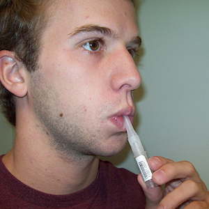
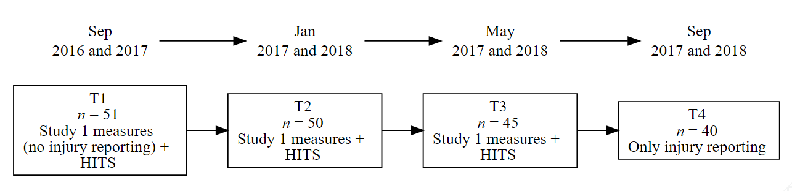
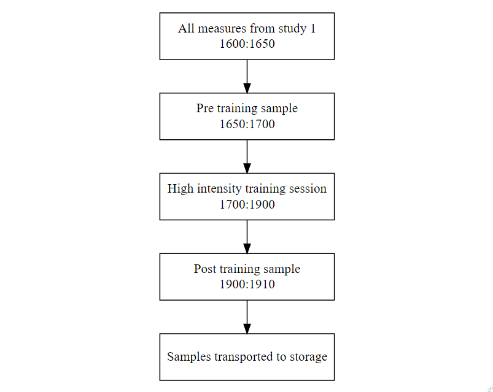
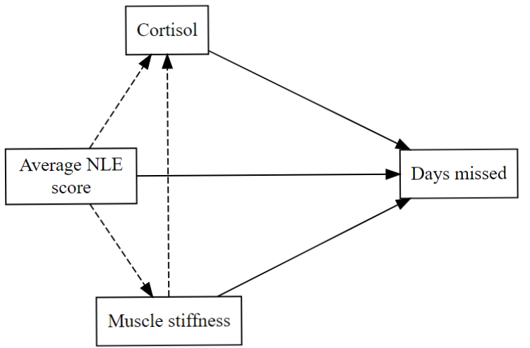

```{r}
knitr::opts_chunk$set(echo = FALSE, warning = FALSE)

```

\section{Study 2: The relationship between negative life events, muscle stiffness, cortisol and injury occurrence in team sport athletes.}

The findings from the first study raised some important questions about the role of different physiological and psychological markers of stress in the prediction of injury. Firstly, given the widespread support in the research literature for negative life events being a predictor of athletic injury, the at best weak relationship between negative and major life events and injury was very surprising (cf. @Passer1983a; @Maddison2005; @Gunnoe2001; @Ivarsson2010; @Ivarsson2017; @Williams2007).
Although the Life Event Survey for Collegiate Athletes (LESCA) is a widely used measure of life event stress in the sports injury literature, the way the questionnaire is scored may disguise some important information about the nature of the life events experienced.
Specifically, the _number_ of events that make up the score are not considered. 
To elaborate, an athlete who answers four events with a -1 (moderately negative) would get the same score as someone who answers one event as a -4 (extremely negative). 
The psychological and physiological responses to four moderately negative events compared to one extremely negative event are unlikely to be equivalent [@Ganzel2010], so a distinction between the nature of the life events that athletes’ report may provide a more nuanced understanding of the role of life events and the predictive ability of the LESCA.

Secondly, in addition to the markers of "stress" used in the first study, there is evidence to suggest that stress hormones including testosterone, cortisol, adrenaline and norepinephrine may also be linked to athletic injury [@Perna1995; @Cormack2008; @Mangine2018; @Appaneal2014]. 
Of these hormones, cortisol has been mostly widely studied as a marker of stress and athletic activity [@VanParidon2017]. 
Cortisol is released in response to both psychological stress, such as to major life events and the attendant emotional distress that follows [@Roos2018], and high intensity and high volume training, in which athletes regularly engage [@Brownlee2005].
Although cortisol plays a vital role in response to stress by increasing substrate mobilisation [@Anderson2016], prolonged exposure to increased levels of cortisol can have several negative effects. 
For example, elevated evening cortisol has been associated with a suppressed immune system, poor sleep and lessened growth hormone release, all of which can inhibit recovery following intense exercise, and increase the risk of athletic injury [@Brownlee2005; @ODonnell2018a; @McEwen2008]. 
However, the link between cortisol and injury has not been well established within the literature.
@Perna1995 provided promising evidence in a study that examined life event stress and cortisol response in athletes following an exhaustive graded exercise test.
Participants were split into high and low life event stress (LES) groups, and the high LES group were found to have both higher cortisol in response to the graded exercise test, and increased symptomatology (e.g., muscle complaints and viral illness) over the subsequent 30 days following the graded exercise test. 
@Perna1995 did not, however, explicitly examine the relationship between cortisol response to high intensity training and sports injury.

Finally, in terms of how stress-related factors relate to injury _severity_, in the first study, injury was treated as a binary variable, as is often common in sports injury research [@Bittencourt2016]. 
However, treating injury as a binary variable may result in important information being lost regarding the stress-related markers of an athlete who sustains more severe injuries. 
For example, there may be differences in the psychological and physiological profile of an athlete who sustains a minor hamstring strain that results in a week of missed training, compared to an athlete that suffers a full ACL tear needing surgery and six months rehabilitation. 
Examining not only the difference between healthy and injured athletes, but also the severity of the subsequent injury, may therefore provide greater insight into the stress-injury relationship.

The purpose of this study was twofold; first, to establish whether an alternative approach to scoring the LESCA questionnaire might elucidate additional insight into the relationships between life event stress and injury, and secondly, to examine the possible relationships between life event stress, the cortisol response to high intensity training and injury severity.
In addition, given the strength of the relationship between muscle stiffness and injury in the first study, muscle stiffness was included as an additional factor that may also be related to injury severity.
In line with the relevant literature and findings from the first study, the following hypotheses were established with regard to injury occurrence and severity:
a) higher average negative life event scores would have a positive relationship with both injury occurrence and severity;
b) greater increases in cortisol following high intensity exercise would be associated with injury occurrence; and
c) high levels of muscle stiffness would increase the risk of injury occurrence and result in greater days lost to injury.
With regard to how the predictor variables may interact, the following hypotheses were established:
a) higher average negative life event score would be associated with greater cortisol response following high intensity exercise;
b) there would be a positive relationship between average negative life event score and muscle stiffness; and
c) muscle stiffness would have a positive relationship with cortisol response following high intensity exercise.

## Method

### Participants

Participants, who were a sub-sample from Study 1 (chapter 4), comprised 51 male members of the football and rugby teams based at a British University (Table \@ref(tab:parchar2)). Both teams played in a national level league and regularly performed high intensity training throughout the season.
All participants were injury free at the start of the study.

```{r parchar2, results='asis'}

pacman::p_load(tidyverse, papaja, brms, knitr, broom)
load("datavars/parchar.Rdata")
load("datavars/figures.Rdata")
# apa_table(parchar2,
#           caption = "Participant demographics",
#           stub_indents = list("Demographics M (SD)" = c(1:4),
#                               "Previous injury \\textit{n} (\\%)" = c(5:6),
#                               "Student status \\textit{n} (\\%)" = c(7:8)),
#           col.names = c( " ", "Football ( N = 22)", "Rugby (N = 29)"),
#           align = c('lcc'),
#           placement = "H",
#           midrules = 5,
#           escape = T)

parchar2 %>% 
  mutate(name = ifelse(name == "Hours per week", "Hours per week spent training", name)) %>% 
    slice(1:4) %>% 
  separate(football, c("mean", "sd"), " ") %>% 
  mutate(sd = str_remove_all(sd, "\\(|\\)")) %>% 
  separate(rugby, c("meann", "sdd"), " ") %>% 
  mutate(sdd = str_remove_all(sdd, "\\(|\\)")) %>% 
    mutate(name = case_when(name == "Age" ~ "Age (yrs)",
                          name == "Height" ~ "Height (cm)",
                          name == "Weight" ~ "Body mass (kg)",
                          TRUE ~ name)) %>% 
  apa_table(.,
            col_spanners = list("Football (\\emph{n} = 22)" = 2:3,
                                "Rugby (\\emph{n} = 29)" = 4:5),
            caption = "Participant demographics.",
            align = c('lcc'),
            col.names = c(" ", "$M$", "$SD$", "$M$", "$SD$"),
            placement = "H",
            escape = F)

```

### Measures

#### Cortisol

In addition to the LESCA and the muscle stiffness measure outlined in Study 1, salivary cortisol concentrations pre-and post-high intensity training sessions were collected.
Salivary cortisol is reported to be a better measure of dynamic hypothalamic–pituitary–adrenal (HPA) activity than serum cortisol and provides a non-invasive method that can be conducted in a field-based setting [@Gozansky2005]. 
Saliva collection aids and polypropylene cryovials (Salimetrics LLC, California, USA) were used to collect samples of whole saliva via the passive drool method (Figure \@ref(fig:passivedrool)). 

```{r passivedrool, fig.cap= "Example of the passive drool method using saliva collection aid and polypropylene cryovial.", out.width='100%', fig.align='center'}


```

#### Injury

The number of days lost due to injury was the main outcome measure. 
Injury was defined as any sports related medical problem causing the athlete to miss or modify their usual training routine. 
Participants were asked estimate how long they missed or modified their usual training routine when they reported injuries.

### Procedure

The study followed the same design as Study 1 with the addition of a saliva sample pre-and post-a high intensity training session (Figure \@ref(fig:studytwodesign)). 
In the month preceding each data collection the lead researcher communicated with the head coach for each team to establish when high intensity training sessions were planned. 
Data collection was then scheduled to coincide with each team's identified sessions. 
The content of each training session was decided by each team's head coach and no attempt was made by the researcher to influence the content of the session.
Each session lasted approximately 120 min and included a warm-up, technical drills (e.g., passing, shooting and tackling), high intensity interval training (e.g., shuttle runs and circuit training) and match specific practice (e.g., small sided games lasting between 20 - 30 min of high intensity). 
Table \@ref(tab:hrdata) shows the mean for each team for both the maximum and average heart rates achieved, in addition to the percentage of time spent above 85 % of each players maximum heart rate, during the first high intensity training session. 
Work above 85% of maximum heart rate is often used as a marker of high intensity in athletes [@Birkett2019].
Training sessions at time points two and three were similar to the first session and the details of each training session are provided in Appendix E.

```{r hrdata, results='asis'}

load("datavars/hr_data.rds")
hr_data <- hr_data[c(1:3),]

hr_data %>% 
  mutate(var = c("max hr (bpm)", "avg hr (bpm)", "\\% above 85")) %>% 
  apa_table(.,
            col_spanners = list("Football" = 2:3,
                                "Rugby" = 4:5),
            col.names = c("Variable", "$M$", "$SD$", "$M$", "$SD$"),
            caption = "Maximum and average heart rate, and percentage of time spent above 85 \\% of maximum heart rate during the first high intensity session for each team.",
            placement = "H",
            escape = F)

```


```{r studytwodesign, fig.cap = 'For each time point (T), the number of participants who took part in the data collection (\\emph{n}) and the measures recorded. HITS = High intensity training session.', fig.pos="H", out.width='100%'}


```

On the day identified by the coach, participants first completed the standard data collection procedure outlined in the main study.
Participants then provided 2 ml of saliva via the unstimulated passive drool technique pre-and post-training. 
Pre-training samples were collected between 1650 - 1700 hours prior to the warm-up beginning. 
Post-training samples were collected between 1900 - 1910 hours after the session had finished (Figure \@ref(fig:studytwoprotocol)).

```{r studytwoprotocol, fig.cap="Order and timing of the data collection protocol.", fig.pos="H", out.width='100%'}

```


```{r}
load(file = "datavars/cortreliability.rds")
```

Prior to the data collection, participants were asked to avoid eating a large meal (60 mins prior) and drinking alcohol (12 hours prior) to reduce contamination of the samples. 
Additionally, following the recommendations provided by Salimetrics for salivary cortisol collection, participants were instructed to rinse their mouths with water for 10 minutes prior to providing each sample. 
Once both pre-and post-training samples had been obtained, the samples were immediately frozen at -80°C. After the completion of all data collection, cortisol concentrations (µg/dL) were determined in duplicate by enzyme-linked immunoassay (Appendx G; Salimetrics, USA) using a micro plate reader (SpectraMax 190, Molecular Devices, CA, USA). 
The micro plate reader was calibrating by a laboratory technition using an absorbance test plate prior to the analysis. 
In addition, a new standard curve was calculated from the control samples provided in the Salimetrics assay kits for each of the seven plates used in the analysis, as recommended in the Salimetrics instruction manual [@Salimetrics2018].
The inter-assay coefficient of variation ($n$ = 7) was 13.31% (±2.85). The intra-assay coefficient of variation ($n$ = 248) was 5.17%. 
Salimetrics recommend that inter-assay values below 15% and intra-assay values below 10% are acceptable. 

### Data analysis

```{r}
load(file = "datavars/study2_results.rds")
```

Several steps were taken to prepare the independent variables prior to the analysis.
The LESCA scoring was modified to represent the average response for negative life events at each time point.
The modified score was calculated by dividing the negative life event score (calculated with the standard LESCA scoring instruction) by the number of negative life events reported.
The average score ranged from 0 (no life events) to 4 (all events answered as extremely negative). 
This approach was employed to ensure that the LESCA scores captured and more accurately reflected the perceived severity of life events and differentiated between athletes who may have high scores based on several minor events compared to a smaller number of major events.

Equation \@ref(eq:delta) was used to calculate the change in cortisol (C) concentration following high-intensity training.

\begin{equation} 
  \Delta C = \frac{Post}{Post + Pre}
  (\#eq:delta)
\end{equation} 

\noindent Equation \@ref(eq:delta). Delta values for cortisol. $\Delta C$ = Change in cortisol; $Pre$ = Pre-trainng values; $Post$ = Post-training values.

$\Delta C$ is a dimensionless ratio between 0 and 1. Values above 0.5 represent an increase in cortisol levels and numbers below 0.5 a decrease in cortisol levels between pre-and post-training [@Siart2017]. 
Finally, muscle stiffness was calculated as the sum of all eight testing locations as outlined in the first study. 
Summary statistics of the predictor variables, and days lost to injury are in presented in Table \@ref(tab:descriptivevars).
All independent variables were mean centred and standardised to one standard deviation prior to the analysis.

```{r descriptivevars, results='asis'}
library(papaja)
sem %>%
  select(sportg, time, stiffness, delta_new, negsev, days_missed) %>%
  rename(ave_nle = "negsev") %>%
  gather(var, val, -time, -sportg) %>%
  filter(sportg == "rugby") %>%
  group_by(var) %>%
  summarise(
    mean = mean(val),
    sd = sd(val)
  ) %>%
  dendroTools::round_df(2) %>%
  mutate(var = case_when(
    var == "delta_new" ~ "$\\Delta C$",
    var == "stiffness" ~ "Stiffness (N m)",
    var == "days_missed" ~ "Days missed",
    var == "ave_nle" ~ "Average NLE score"
  )) %>%
  mutate(mean = ifelse(var == "Stiffness (N m -1)" | var == "Days missed", format(round(mean, digits = 0), nsmall = 0), mean)) %>%
  mutate(sd = ifelse(var == "Stiffness (N m)" | var == "Days missed", format(round(sd, digits = 0), nsmall = 0), sd)) %>%
  cbind(
    .,
    sem %>%
      select(sportg, time, stiffness, delta_new, negsev, days_missed) %>%
      rename(ave_nle = "negsev") %>%
      gather(var, val, -time, -sportg) %>%
      filter(sportg == "football") %>%
      group_by(var) %>%
      summarise(
        mean2 = mean(val),
        sd2 = sd(val)
      ) %>%
      dendroTools::round_df(2) %>%
      select(mean2, sd2)
  ) %>%
  mutate(mean2 = ifelse(var == "Stiffness (N m)" | var == "Days missed", format(round(mean2, digits = 0), nsmall = 0), mean2)) %>%
  mutate(sd2 = ifelse(var == "Stiffness (N m)" | var == "Days missed", format(round(sd2, digits = 0), nsmall = 0), sd2)) %>%
  mutate(mean = ifelse(var == "Stiffness (N m)" | var == "Days missed", format(round(as.numeric(mean), digits = 0), nsmall = 0), mean)) %>%
  mutate(var = ifelse(var == "Stiffness (N m)", "Stiffness ($\\si{N \\cdot m^{-1}}$)", var)) %>%
  apa_table(
    .,
    col_spanners = list(
      "Football" = c(2, 3),
      "Rugby" = c(4, 5)
    ),
    col.names = c("Variable", "$M$", "$SD$", "$M$", "$SD$"),
    placement = "H",
    align = c("lcccc"),
    escape = F,
    caption = "Summary statistics (mean and SD) of the variables included in the analysis."
  )

```

A Bayesian hurdle regression model was used to explore the relationships between the negative life events, muscle stiffness, change in cortisol and number of days lost due to injury.
A hurdle model contains two parts. 
The first part is a logistic regression that provides an estimate for whether days missed was 0 (healthy) or greater than 0 (sustained an injury). 
The second part is a zero-truncated negative binomial regression that predicts the number of days lost due to injury. 
A score of zero is ignored in this instance as the model assumes the counting process (e.g., sustaining an injury) has not taken place [@Hu2011].
Each part of the model can have different independent variables; however, in the current study all predictors were present in all parts of the model.
To account for the potentially different hormonal responses in the two teams due to different high intensity training sessions, an interaction between $\Delta C$ and sport was included in the model.
In addition, a varying intercept was included to account for the repeated measurements on the same individuals [@Raudenbush2002].

Two further Bayesian linear regression models were used to investigate the relationship between the average NLE score, ($\Delta C$) and muscle stiffness. 
In the first model, ($\Delta C$) was the dependent variable and both muscle stiffness and average NLE score were the independent variables. 
In the second model, muscle stiffness was the dependent variable and average NLE score was the independent variable.
Figure \@ref(fig:pathdiag) shows a path diagram that outlines the relationships investigated. 


```{r pathdiag, fig.cap="Path diagram of the structural relationships modelled. Solid lines represent relationships modelled within the hurdle model, and dashed lines represent relationships modelled in the multiple regression models.", fig.pos="H", out.width="85%", fig.align='center'}



```

All Bayesian models were created using Stan computational framework [@Carpenter2017], accessed via the _brms_ package [@Burkner2017a] in R [@RCoreTeam2019]. 
The full R code for all models is available in Appendix F, and in the thesis repository on Github (https://github.com/HarryFisher1/phd-thesis).
In order to ensure the analysis was performed with rigour, the WAMBS checklist (Depaoli & van der Schoot, 2017) was used as guidance for each stage of the analysis. 
The checklist outlines three main areas to consider when conducting Bayesian analysis; the choice of priors and their influence on the model, model convergence, and the estimates generated by the model.
Each of these points were considered with regards to the current analysis, and the steps taken are outlined in the following sections.

#### Priors

To improve convergence and guard against over-fitting, weakly informative priors were specified for the model parameters. 
All predictor variables were standardised so a one-unit change represented a change in one standard deviation. 
Therefore, priors with a normal distribution, centred at 0, with a standard deviation of 2.5 were used for each predictor. 
For the intercepts in each model, non-informative priors were used with a normal distribution centred at 0 with a standard deviation of 10.
A half-Cauchy prior with mode of 0 and scale of 1 was used as a prior distribution for the variance parameter of the varying intercepts as recommended by @Gelman2006a. 
As the priors used were only weakly regularizing, no sensitivity analysis was conducted (Depaoli & van der Schoot, 2017).

#### Convergence

For each model, a total of four chains containing 2000 samples were initially used to generate posterior estimates. 
Convergence was checked via Rhat values and visual inspection of the trace plots of the MCMC chains [@Gelman2013a].
The number of iterations were then doubled to 4000, and convergence was checked again (Depaoli & van der Schoot, 2017). 
In both instances, the models showed convergence (Rhat values < 1.01; similar trace plots for each chain for all parameters). 
The ShinyStan interface [@Gabry2018] was used to visualise the trace plots, and can be accessed by running the "launch_shinystan" function with each model object (Appendix F).

#### Output

To ensure the estimates were reasonable, and were a close fit to the observed data, posterior predictive checks were carried out to assess the model predicted values [@Heino2018]. 
Several functions are available in the _brms_ package to perform posterior predictive checks [@Burkner2017a]. 
For example, Figure \@ref(fig:ppcheck) shows the observed (dark blue) and predicted estimates for muscle stiffness. Major discrepancies between the observed and predictor values can indicate that the model has not converged well, however in this instance, the estimates are reasonably relative to the observed data.

```{r ppcheck, fig.cap="Observed (y) and predicted values (y\\textsubscript{rep}) of muscle stiffness in the second model.", fig.align='center'}
pp
```

#### Credible intervals

Throughout the results section, 95% credible intervals (CrI) are obtained for the posterior distributions of coefficiants generated by the model.
Credible intervals differ from frequentist confidence intervals in that they can be interpreted as having 95% probability (although not limited to 95%, any justifiable interval can be used) of containing the true population value [@Morey2016].
In contrast, a 95% confidence interval implies that over long run frequencies, 95% of the intervals obtained in the same manner (e.g., with the same sample size) would contain the true population value [@Depaoli2017]. 
@Morey2016 provide a detailed review of the implications of using confidence intervals, and why credible intervals should be preferred when conducting Bayesian inference.


## Results

A total of 42 injuries were sustained by 28 participants (football = 12 [0.55%], rugby = 16 [0.55%]). 
Ten participants sustained two injuries and one participant sustained four injuries in the study period. On average, each injury resulted in `r qwraps2::mean_sd(sem$days_missed, digits = 0)` days lost (range = `r min(sem$days_missed[sem$days_missed > 0])` - `r max(sem$days_missed)`) training and participation.
The $\Delta C$ values for each team at each time point are presented in Table \@ref(tab:cortchange).
There was large variation in athletes' cortisol response between the different teams and each time point in the study.   

```{r cortchange, results='asis'}
data %>% 
  mutate(delta_new = post / (post + pre)) %>% 
  group_by(time, sportg) %>% 
  summarise(pre = qwraps2::mean_sd(pre),
            post = qwraps2::mean_sd(post),
            delta = qwraps2::mean_sd(delta_new)) %>% 
  arrange(sportg) %>% 
  select(-sportg) %>% 
  apa_table(.,
            stub_indents = list("Football" = c(1:3),
                                "Rugby" = c(4:6)),
            align = c("lccc"),
            placement = "H",
            escape = F,
            col.names = c("Time", "Pre-training (µg/dL)", "Post-training (µg/dL)", "$\\Delta C$"),
            caption = "Pre-, post- and change in cortisol ($\\Delta C$) following high intensity training ($M$ ±$SD$).")
```


Estimates for the hurdle model are presented in Table \@ref(tab:hurdlemodel).
For the logistic regression part of the model, higher values of both average NLE score and stiffness decreased the probability of days missed being 0, indicating a greater probability of being injured. However, the 95% credible interval for both predictors is large and crosses 0 (average NLE score = `r datatab[2,4]`, muscle stiffness = `r datatab[3,4]`) indicating a high level of variability in the data. 
Conversely, greater $\Delta C$ concentrations were found to increase the probability of days missed being equal to 0 for both teams.
However, again the 95% credible intervals were large, and the estimates should be interpreted with caution.
The negative binomial part of the model revealed a similar trend, with higher values of both average NLE score and stiffness associated with a greater number of days lost due to injury (average NLE score = `r datatab[7,2]`, 95% CrI = `r datatab[7,4]`, muscle stiffness = `r format(datatab[8,2], nsmall = 2)`, 95% CrI = `r datatab[8,4]`). 
However, similar to the logistic regression part of the model, the estimates are small and should be interpreted with caution. 
The relationship between $\Delta C$ concentration for the rugby team indicated a positive relationship with increases in cortisol associated with increased number of days lost, however the relationship was not clear for the football team. 
Additionally, the 95% CrI for estimates for both teams were large indicating uncertainty around the estimate (Table \@ref(tab:hurdlemodel)). 
Figure \@ref(fig:hufigs) shows the conditional effects for each predictor, with other predictors held at their mean value for both the logistic regression and negative binomial parts of the hurdle model.

```{r  hurdlemodel, results='asis'}
datatab %>%
 apa_table(.,
           stub_indents = list("\\textit{Logistic parameters}" = c(1:5),
                               "\\textit{Negative binomial parameters}" = c(6:10)),
           caption = "Parameter estimates for the hurdle model.",
           placement = "H",
           col.names = c("Term", "Estimate", "Error", "95\\% CrI"),
           align = c("lccc"),
           escape = FALSE)
```


```{r hufigs, fig.cap="Conditional effects for each predictor with other predictors held at their mean value (0). Top row is the logistic regression estimates, bottom row is the negative binomial estimates.", fig.pos = 'H', out.extra = ''}
library(patchwork)
library(latex2exp)
graphmaker(x, "negsev_z") + xlab(" ") + ylab("Probability of 0 days missed") + ylim(c(0,1)) +
  graphmaker(x, "stiffness_z") + ylab(" ") + xlab(" ") + ylim(c(0,1)) +
  graphmaker(x, "delta_new_z:sportg") +  ylab(" ") + xlab(" ") + labs(fill = "Sport")+ theme(legend.position = "top") +
  guides(fill = guide_legend(title.position = "top", 
                             title.hjust = 0.5)) +
  graphmaker(y, "negsev_z") + ylab("Days missed") +xlab("Average NLE score") + ylim(c(0,50))+
  graphmaker(y, "stiffness_z") + ylab(" ") +  xlab("Stiffness") + ylim(c(0,50))+
  graphmaker(y, "delta_new_z:sportg") +  ylab(" ") + ylim(0,50) + xlab(TeX("$\\Delta C$")) + 
  theme(legend.position = "none") +
  plot_layout(ncol = 3) &
  theme(panel.background = element_blank()) &
  theme(axis.line.x = element_line(color="black", size = 0.5),
        axis.line.y = element_line(color="black", size = 0.5))


```


The estimates from the multiple regression between $\Delta C$, muscle stiffness and average NLE score are presented in Table \@ref(tab:datatab2).
No relationship was found between average NLE score and change in cortisol ($\beta$ = `r datatab2[2,2]`, 95% CrI = `r datatab2[2,4]`).
Weak positive relationships were found between increases in cortisol and muscle stiffness($\beta$ = `r datatab2[3,2]`, 95% CrI = `r datatab2[3,4]`, and between stiffness and average NLE score was unclear ($\beta$ = `r datatab2[5,2]`, 95% CrI = `r datatab2[5,4]`).
However, these estimates were again small with credible intervals that crossed zero meaning there is uncertainity around the true estimate. 

```{r datatab2, results='asis'}
datatab2 %>% 
  apa_table(.,
            stub_indents = list("$\\Delta C$" = c(1:3),
                                "\\textit{Stiffness}" = c(4:5)),
            placement = "H",
            caption = "Parameter estimates for the relationships between delta, average NLE score and muscle stiffness.",
            col.names = c("Term", "Estimate", "Error", "95\\% CrI"),
            align = c("lccc"),
            escape = FALSE)
```


## Discussion

This study investigated the relationships between psychological and physiological markers of stress, and injury severity in a sample of national level athletes.
In this regard, the purpose of the study was twofold. 
First, to determine whether a modified method of scoring the LESCA that accounted for perceived severity of the life event experienced was related to injury. 
Secondly, to investigate the relationships between negative life event stress, muscle stiffness and changes in cortisol ($\Delta C$) following high intensity training in relation to injury occurence.

Individuals who perceived life events as more severe (had a higher average NLE score) were both more likely to sustain an injury, and also have more severe injuries (Figure \@ref(fig:hufigs)). 
However, estimates had wide credible intervals that crossed zero highlighing the uncertainty within the estimate (Table \@ref(tab:hurdlemodel)).
This finding suggests there may be a need to distinguish between those athletes that experience multiple low severity events from those that have fewer events which are perceived as more stressful.
To elaborate, more major events that hold greater significance are likely to contribute more towards increased stress levels than multiple minor life events that the individual may be able to adequately deal with.
The relationship between more major events and injury may be explained by the concurrent heightened physiological response that is likely to accompany the perceived major event stress.
Several studies have shown how the _perception_ of stressful events plays an important role in the physiological stress response [@McEwen2005; @Edwards2018; @Dishman2000; @Otter2015].
Indeed, when coupled with the physiological distress experienced during high intensity training, the heightened responsivity to major life events may act synergistically with other sources of physiological stress to increase the risk of injury [cf. @Appaneal2014].

To add further support to the relationship between perceived psychological stress and physiological activation, the current study also found a weak positive relationship between muscle stiffness and average NLE score (Table \@ref(tab:datatab2)). 
Williams and Andersen's (1998) model proposed increased muscle stiffness, as a result of the stress response, as one of the potential mechanisms through which injury may occur.
While the cause of the increased muscle stiffness cannot be ascertained in the current study, the existence of both major life events and high muscle stiffness is likely to increase the risk of injury. 
Although the weak relationship between muscle stiffness and average NLE score was not conclusive (reflected by large 95% credible intervals), the current findings offer initial support for both Williams and Andersen's (1998) stress-injury model and Appaneal and Perna's (2014) BMSAIH.

With regard to the findings for cortisol, no conclusive evidence for a relationship between $\Delta C$ and injury occurrence or severity was found. 
This finding was in contrast to the predicted role of cortisol in the injury process outlined in Appaneal and Perna's (2014) BMSAIH model.
There are several possible explanations for this finding, including the large variation in pre, post and delta values for cortisol for each team at different time points in the study (Table \@ref(tab:cortchange)).
Although each session was denoted as "high intensity" by the respective team coach, the content of each session varied between time points and the two sports.
In addition, there was no measure of "intensity" for individual players for all sessions, and some players may have potentially performed at a lower intensity than others.
Indeed, @Hill2008 found that lower exercise intensities may actually reduce the concentration of cortisol post exercise.
Given the varied content of each session, and potential individual differences in effort in each session, the uncertainty (wide credible intervals in Table \@ref(tab:hurdlemodel)) in the estimates for $\Delta C$ is to be expected. 
Although the field-based nature of the current study provides for high ecological validity, greater control for potential confounding variables is needed to establish the relationship between $\Delta C$ and injury. 
The results for the relationship between average NLE score and $\Delta C$ were unclear, with wide credible intervals ($\beta$ = `r datatab2[2,2]`, 95% CrI = `r datatab2[2,4]`), implying the effect was not well supported by the data.
Of note was a weak positive relationship between muscle stiffness and $\Delta C$, with higher levels of muscle stiffness associated with greater $\Delta C$ concentrations ($\beta$ = `r datatab2[3,2]`, 95% CrI = `r datatab2[3,4]`). 
One possible explanation could be that the higher-level performers within each team may have been training at a higher intensity compared to their lower level counterparts, resulting in a greater change in cortisol post training. 
This suggestion would be consistent with the notion that higher levels of stiffness are associated with a higher level of performance (cf. Kalkhoven & Watsford, 2017; Pruyn, Watsford, & Murphy, 2015).

Consistent with the findings from the first study, muscle stiffness was again found to be related to injury, and there was also a positive relationship between muscle stiffness and injury severity. 
The relationship between muscle stiffness and injury is complex, as high levels of muscle stiffness are associated with both a greater risk of injury [@PickeringRodriguez2017], but also high levels of performance [@Kalkhoven2018; @Pruyn2015]. 
This complexity may have been reflected in the wide credible intervals associated with the esimate for muscle stiffness in the hurdle model (Table \@ref(tab:hurdlemodel)), implying variability with the data regarding the relationship between stiffness and injury.
The higher levels of muscle stiffness observed in the current study could be attributable to a higher number of exposure hours likely experienced by certain players.
One of the effects of high expsoure is likely to be in an increase muscle stiffness due to the repeated contraction of skeletal muscle, potentially increasing the risk of injury [@Hedayatpour2015].
Addintionally, high levels of exposure are also known to increase the risk of injury [@Williams2017b], and therefore these factors together may amplify the risk of injury further.
As such, increased muscle stiffness may provide an early indication of physiological maladaptation caused by high level of exposure to training.
There is however, a contrasting viewpoint regarding the effect of increased exposure to training.
Increased exposure to high intensity training has been found to reduce the risk of injury in certain instances [@Gabbett2016]. 
For example, low training volume and intensity may not provide the necessary physiological adaptations needed to tolerate the higher loads that are likely to occur over the course of a season [@Gabbett2016]. 
Evidently, training loads that are excessive will still likely result in injury, however there is likely to be an optimum level of load needed to elicit the required adaptations to perform optimally, while still remaining healthy [@Gabbett2016].
Taken together, both exposure levels and muscle stiffness highlight the need for methodologies that account for individual differences, and an interdisciplinary approach to understand the complex relationships between different sources of stress and injury.

The present study had a number of strengths and limitations. 
One strength was the use of a hurdle regression model that can account for both injury occurrence and injury severity. 
Traditionally, logistic regression models have been used within sport injury research [@Bittencourt2016]; however, hurdle regression extends the logistic model by also including a negative binomial model to predict the number of days lost due to injury.
As such, greater detail can be obtained from the predictors in the model by examining both their influence on injury occurrence _and_ severity.
The study also used a hurdle model within a Bayesian framework, which has several advantages over a frequentist method, most notably the ability to account for small samples sizes such as the one used within the current study. Of the study limitations, the sample was restricted to only two male team sports, and therefore findings may not be generalisable across other individual based sports or for female athletes.
The study also suffered from a high dropout rate, with only 19 out of 51 participants completing all three time points in the study.
Given the high drop out rate, the sample size was relatively small compared to the first study. 
A large sample would help to combat the large credible intervals present in the model estimates that made drawing conclusive conclusions regarding the different releationships difficult.
Additionally, the field-based nature of the data collection meant there was an absence of control over training intensity. 

Future research should aim to clarify the relationship between negative life event stress, cortisol and injury as proposed by @Appaneal2014.
While the current study was unable to find a clear relationship, there were several confounding variables that may have impacted upon the results. 
In addition, a stronger positive relationship was observed between cortisol and muscle stiffness, which could provide an interesting avenue for research to explore further. 
Future research could also further investigate the novel scoring approach outlined in the current research. 
The scoring is easily implemented and can be included as an additional variable in research that uses the LESCA to assess life event stress in athletes. 
Establishing whether events that are perceived as more severe have a stronger relationship with injury may lead to a more fine-grained understanding of the relationship between life event stress and injury.


