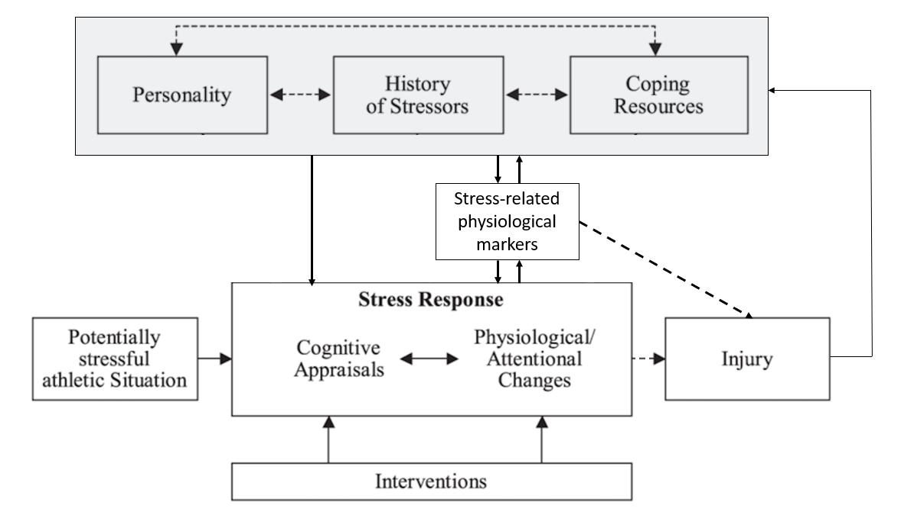
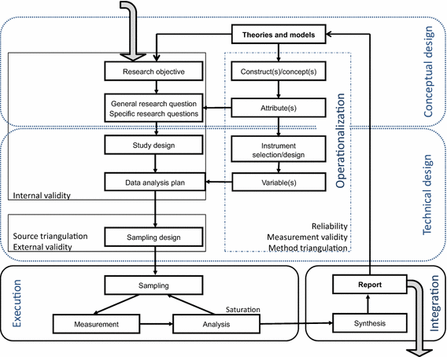

```{r setup_final, include = FALSE}

library("papaja")
library(knitr)

```

# General discussion and conclusions

The purpose of the final chapter is to draw together the findings and highlight the implications of this programme of research. 
The chapter is organised into six sections that provide: (a) a summary of the two studies, including key aims and findings; (b) a discussion of the conceptual and measurement issues that have emerged from this thesis; (c) the practical implications of the results of the research; (d) directions for future research; e) the strengths and limitations of the current research; and (f) conclusions that synthesizes the central aspects of the thesis.

## Summary of studies

Despite acknowledging that sport injury is a complex, multifaceted process, research that has examined factors associated with the prediction of sports injury has generally been mono-disciplinary in nature, and has not addressed the potential interaction between the sports science disciplines.
Therefore, the central purpose of this thesis was to adopt a novel approach to explore the multifaceted nature of the relationships between stress and athletic injury. 
Specifically, how psychological and physiological markers of stress may act synergistically to increase the risk of sustaining an injury. 
As such, the current programme of research adopted an interdisciplinary approach using a range of markers from across the sports science disciplines to examine their combined and interactive influence on sports injury occurrence. The thesis comprised two empirical studies:

_Study 1: Interdisciplinary examination of stress-related markers of sports injury_. 

The purpose of the first study was to explore the relationships between psychological sources of stress, stress-related physiological markers and injury occurrence in athletes. 
Specifically, the study aimed to address several limitations outlined in previous research, including the need for; (a) an interdisciplinary approach using both psychological and physiological stress-related markers; (b) the use of a repeated measures design; (c) the inclusion of both male and female participants from a range of different individual and team-based sports; and (d) the use of an appropriate analysis method that addresses the complex nature of the interactions between different markers of stress and injury occurrence. To address these limitations, 351 non-injured athletes were recruited from the university where the study was conducted, and from sports clubs in the local area. 
In a repeated measures design, data collection occurred at four time points over a 12-month period, and comprised measures of; major life event stress, personality, muscle stiffness, heart rate variability and postural stability. In addition, injury status was assessed at each time point. 
Bayesian networks were used to examine the relationships between variables, and to model the changes between time points across the 12-month period. Two Bayesian networks were used for the analysis; the first network examined the relationships between variables, and the second network modelled the changes between time points in the study. 
Findings from the first network revealed muscle stiffness to have the strongest relationship with injury occurrence, with "High" levels of stiffness increasing the probability of sustaining an injury compared to "Low" stiffness ("Low" = 0.16, "High" = Pr = 0.31). 
In addition, poor balance, low heart rate variability and low scores on the fight-flight-freeze subcomponent of the Reinforcement Sensitivity Theory Personality Questionnaire (RST-PQ) were all found to increase the probability of injury (Table \@ref(tab:query1)). 
Surprisingly, negative life events (NLE) was not found to only marginally increase the probability of injury ("Low" Pr = 0.24, "High" Pr = 0.26) despite strong evidence from previous research to the contrary [@Williams2007; @Ivarsson2017].
In the second network that modelled changes between time points, muscle stiffness was again found to be related to injury, with increases resulting in a higher probability of injury.
In contrast to the first network, _increases_ in NLE were found to increase the probability of injury.
To clarify, those athletes who had the greatest increases in NLE between time points in the study were more likely to sustain an injury than those who had minor increases or no changes to their NLE scores.
This finding reflected the dynamic nature of life event stress and further emphasised the need for repeated measurements.
The second network also revealed that the combination of increases in muscle stiffness and NLE resulted in the greatest probability of injury, supporting the need for an interdisciplinary approach.

_Study 2: The relationship between major life events, muscle stiffness, cortisol and injury occurrence and severity in team sport athletes. _ 

The purpose of the second study was to build on the findings of the first study and explore the role of additional markers of stress in the stress-injury relationship. 
Specifically, Study 2 examined:
(a) whether the stress hormone cortisol was also associated with negative major life events and injury; 
(b) whether an alternative approach to evaluating negative major life events would be related to injury; and 
(c) how these measures related to both injury occurrence and severity.
Participants, who were a sub-sample (\emph{n} = 51) from the first study, were members of the university men's football and men's rugby teams where the research took place. 
In addition to the measures outlined in Study 1, participants also provided saliva samples pre-and post-high intensity training sessions at the first three time points in the study.
The change in concentration of cortisol in the samples pre-and post-training session was used as a marker of the stress response to the training session [cf. @Perna1995].
In contrast to the first study where the original method of scoring NLE was used [cf. @Petrie1992], a modified method was used in Study 2 where each participant's total NLE score was divided by the number of events they had experienced, resulting in an average NLE response. 
This method enabled the distinction between athletes who experienced several minor events, from those that experienced fewer, but more major events. 
Under the original scoring method these athletes would receive the same life event score despite the potential for very different stress responses. 
For the analysis, a Bayesian hurdle regression model was used to explore the relationships between the predictors and injury, and Bayesian linear regression models were used to explore the relationships between the predictors. 
Results revealed that higher levels of both average NLE score and muscle stiffness increased the probability of injury occurrence and increased the number of days lost due to injury; however, the estimates had large credible intervals implying uncertainty regarding the observed relationships (Table \@ref(tab:hurdlemodel)). 
With regards to changes in cortisol, a positive relationship between increases in cortisol and number of days lost due to injury was found for the rugby team; however, the relationship was not clear for the football team (football, estimate = 0.10, 95% CrI = [-0.43, 0.62]; rugby, estimate = 0.54, 95% CrI = [0.05, 1.05]). 
The results from the study complement the findings from the first study, and offer several avenues for further research to explore, including the application of the modified scoring of major life events to other cohorts, and further clarification regarding the relationship between cortisol and injury.

## Conceptual and measurement issues

This section highlights the key conceptual and measurement issues related to the current programme of research. 
Conceptual issues are discussed in relation to interdisciplinary research in sport injury research, and how the current research programme fits within the theoretical frameworks that underpin the thesis.
Measurement issues and challenges faced by the researcher are discussed in relation to the implications of the choice of measures when using an interdisciplinary approach, and the additional complexities that arose with the repeated measures design.

### Conceptual issues

#### Interdisciplinary approach to sports injury

Interdisciplinary research can be defined as an integrative approach that involves the interaction of specialists across sub-disciplines working together to combine methods and ideas to generate new knowledge [@Freedson2009]. 
It differs from mono- and multi-disciplinary approaches due to the holistic nature of the approach to research.
Since being advocated in the early 1990's by @Burwitz1994, interdisciplinary research within sport and exercise science has been relatively scarce, despite repeated calls for researchers to embrace it [@Buekers2017].
Recently, @Piggott2018 identified only 25 studies since 1994 that had used an interdisciplinary approach to address sport performance-related research questions.
The current research therefore adds to a small body of research that has adopted an interdisciplinary approach and extends it to the stress-injury relationship. 
Specifically, negative life event stress and personality characteristics were examined alongside stress-related physiological markers that have previously been found to be related to both psychological stress and injury occurrence.
Such an approach is in line with Appaneal and Perna's (2014) Biopsychosocial Model of Stress, Athletic Injury and Health (BMSAIH), which extends the widely cited Williams and Andersen (1998) model to include other behavioural and physiological markers of stress that will act synergistically with psychological sources of stress to exacerbate the risk of injury. 
Typically, however, these markers have been studied in isolation, thus the current study provides a contemporary, interdisciplinary approach to the research problem.

Recently, @Bittencourt2016 echoed the need for an interdisciplinary approach to the sport injury problem and advocated concepts from complex systems to further advance our understanding of the multifaceted nature of injury occurrence.
Indeed, complex systems theory provides a useful framework for interdisciplinary research, as it has several characteristics that can help bring together different areas of the sport injury literature. 
A central tenet of complex systems theory is that injury will arise from an interrelated 'web of determinants' [@Bittencourt2016, p. 1] that may be linked in a non-linear manner, with small changes in one area potentially leading to large and unexpected consequences.
This view differs from the traditional monodisciplinary approach that sport injury research has adopted, typically using reductionist analysis techniques for linear combinations of isolated predictive factors [@Vacek2016; @Galambos2005; @Devantier2011] 
The current research has attempted to address this issue by using analytical techniques that are more closely aligned with the complex system approach and reflect the uncertain nature of injury occurrence.
The first study adopted a Bayesian network model that was inspired by the 'web of determinants' outlined by Bittencourt et al. (2016; p. 1). 
In the network, the relationship between variables as well their effect on injury was examined, and relationships were uncovered and explored using both prior knowledge and data driven approaches.
In the second study, Bayesian regression models where used to investigate the relationships between predictor variables and both injury occurrence and severity. 
Although these models were linear in nature, using a Bayesian approach allows for the uncertainty to be estimated, and improves upon the maximal likelihood methods commonly used within the frequentist paradigm [@Heino2018].
Such methods are particularly useful for sport injury research which typically suffers from small samples sizes, and small effects that can be problematic when using frequentist techniques [@Mengersen2016].

#### Theoretical links

The current body of research was underpinned by Williams and Andersen’s (1998) model of injury prediction and Appaneal and Perna’s (2014) extension of Williams and Andersen (1998) model. 
The stress-injury model proposed by Williams and Andersen (1998) is one of the most widely cited models of injury within the sport injury literature, and there has been considerable support for the role of several of the psychological variables proposed in the model in the stress-injury literature, including; negative life events [@Maddison2005; @Gunnoe2001; @Ivarsson2010; @Rogers2005], 
personality characteristics [@Junge2000; @Petrie1993; @Lavallee1996] and 
coping resources [@Hardy1992; @Petrie1993]. 
A major criticism of Williams and Andersen’s (1998) model, however, is the focus on the cognitive stress response and the absence of additional sources of stress, such as environmental and physiological factors, that are also likely to influence injury occurrence [@Ivarsson2017].
To address this issue, @Appaneal2014 proposed the BMSAIH, which extended the original model to include other behavioural, environmental and physiological factors that are also likely to contribute to the occurrence of injury. 
In particular, the BMSAIH proposed that the synergistic action of both psychological stress and physiological stress, such as that sustained in response to training, will exacerbate the stress response and increase the risk of injury. 
However, despite providing a framework for research to extend the findings of Williams and Andersen (1998) the BMSAIH has received relatively little attention within the sport injury literature, potentially because of the insufficient detail offered regarding additional predictive variables that could be included alongside the psychosocial characteristics proposed in the original model.
While the BMSAIH alludes to autonomic nervous systems (ANS) and hypothalamic pituitary adrenal (HPA) axis activity being responsible for the physiological response to stress, as well as hormonal markers including cortisol and testosterone as potential mediating pathways for the stress-injury relationship, few specific predictive variables are offered beyond this.

Based on Williams and Andersen’s (1998) and Appaneal and Perna’s (2014) models, and the wider sport injury literature, the current research identified several related markers that were in line with the ideas proposed in both frameworks and provided an interdisciplinary perspective that united the psychological characteristics with the stress-related physiological markers alluded to in the BMSAIH. 
To help visualise how these markers fit within the original model, Figure \@ref(fig:wanew) provides an updated version of Williams and Andersen’s (1998) model to demonstrate how the ideas presented in the BMSAIH can be integrated.
In Figure \@ref(fig:wanew), the stress-related physiological markers are proposed to act between the psychosocial factors and the stress response from the original model.
In addition to the direct effect of psychosocial characteristics on the stress response, stress-related physiological markers are proposed to provide a pathway between the psychosocial sources of stress and the stress response. 
Depending on the severity of the stress response, the physiological activation may also have longer lasting effects and consequently influence the state of the stress-related physiological markers.
In particular, the arrows from the stress response, through the stress-related markers and to the psychosocial characteristics demonstrate how the stress response is likely to contribute to an athlete's "history of stressors" and play a role in their perception of similar stressful events in the future.
The dashed arrow from stress-related physiological markers to injury indicates how the accumulation of stress and fatigue can contribute to injury occurrence through overuse or burnout mechanisms, which the proposed mechanisms in the original model does not adequately explain. 
The arrows towards injury are dashed to indicate that injury is not always a certainty, and that an athlete can face a stressful situation and recover, improving their tolerance for future similar stressful situations. 
@Meeuwisse2007 identified the linear approach to most injury models as unrealistic and Figure \@ref(fig:wanew) attempts to integrate the dynamic, recursive nature of injury occurrence highlighted by @Meeuwisse2007. 

```{r wanew, fig.cap="Modified version of Williams and Andersen (1998) model of stress and injury.", out.width="100%"}
library(knitr)

```

With regards to the physiological markers themselves, HRV, muscle stiffness, postural stability and cortisol were selected on the basis that they have been examined in a variety of different stress-related disciplines including psychopathology, lifestyle and geriatric research, as well as the sport injury literature [@VanOckenburg2015a; @Gervasi2017; @Bailey2013; @Rath2017]. 
Consequently, they provided markers of stress alongside the psychosocial characteristics proposed by Williams and Andersen (1998) to provide additional insights into the stress-injury relationship.
In the current research, many of the markers were associated with injury occurrence to varying degrees, with both muscle stiffness and HRV also showing connections with NLE and personality characteristics respectively.
Specifically, high levels of muscles stiffness were found to be the strongest predictor of injury across both studies in the thesis. 
This finding is consistent with a small body of research that has investigated the link between stiffness, as measured with the MyotonPRO, and injury [@PickeringRodriguez2017; @Morgan2018].
In the second network in Study 1, the combined effect of increases in both muscle stiffness _and_ NLE resulted in the highest probability of injury, supporting Appaneal and Perna's (2014) proposed synergistic action of both psychological and physiological markers of stress interacting to exacerbate the risk of injury.
A weaker relationship was observed for both poor balance and low HRV, which were found to increase the probability of injury.
Despite the weak relationships with injury, the findings were in agreement with the relevant literature for both HRV [@Williams2017; @Lima-Borges2018] and postural stability [@Romero-Franco2014; @Trojian2006], and further demonstrate the importance of using a range of stress-related markers.
In the second study, a weak positive relationship between the change in cortisol following high intensity training and the number of days lost to injury was observed for the rugby team (estimate = 0.54, 95% CrI = [0.05, 1.05]), however the relationship was less clear for the football team (estimate = 0.10, 95% CrI = [-0.43, 0.62]) making the results inconclusive. 
There was also a weak positive relationship between the change in cortisol and muscle stiffness (estimate = 0.07, 95% CrI = [-0.25, 0.40]), highlighting an interesting relationship for future research to explore further.  

One characteristic that all the markers share is their relationship with the autonomic nervous system (ANS) and hypothalamic-pituitary-adrenal (HPA) axis.
@Appaneal2014 proposed the ANS, and subsequent HPA activity, as one of the mediating pathways through which psychological stress will combine with other physiological effects of training-related stress to exacerbate the overall stress response. 
Indeed, both the ANS and HPA axis are extremely sensitive to all forms of "stress" and, either directly or indirectly, will cause the modification of many systems within the body to prepare, react, or cope with, increasing levels of stress [@Bellenger2016; @Chrousos2009; @Yaribeygi2017].
These notions are central to the concept of allostasis, or stability through change, which has surprisingly received little attention in the sports injury literature despite a large body of research linking the psychological and physiological effects of stress that would be of value to the stress-injury relationship [@Sterling1988; @Galambos2005; @McEwen2007; @Ganzel2010]. 
Of particular relevance to sport injury is the concept of allostatic load, which has been defined as the "long-term carry-forward of the sequelae of stress and adversity" [@Rutter1994, pp. 373]. 
A healthy athlete may experience negligible allostatic load, resulting in a symptom-free health profile reflected by adequate recovery and positive responses to training.
However, allostatic load can accumulate as a result of daily low levels of stress in the environment and discrete major life events, both of which are proposed to be related to increased risk of injury [@Appaneal2014].
Furthermore, excessive increases in training volumes or intensity can further contribute to the allostatic load, leading to a more symptomatic profile with a greater risk of athletic injury.
This global view of stress helps to demonstrate how the effects of both psychological and physiological sources of stress are related and highlights the need for stress-related injury research to continue to be addressed from an interdisciplinary perspective. 
The current programme of research has therefore provided the sport injury literature with an initial basis to move toward a more inclusive, holistic approach to injury prediction research that brings together disparate disciplines to address the sport injury problem.  

In addition to the inclusion of stress-related physiological markers, the current research has also provided novel contributions to our understanding of the role of well-established psychosocial variables included in the original Williams and Andersen (1998) model, particularly with regard to the measures used to assess them. 
For example, the current research sought to integrate Reinforcement Sensitivity Theory (RST; Corr, 2008), which attempts to explain the multidimensional nature of personality.
Initially proposed by @Gray1982a, the RST was revised by @Gray2000 to include three systems that are proposed to govern an individual's behaviour, specifically the behavioural activation system (BAS), behavioural inhibition system (BIS) and fight-flight-freeze system (FFFS).
According to the RST, the FFFS and BAS are responsive to all punishing and threatening stimuli (e.g., physical pain from training or competition) and all rewarding and appetitive stimuli (e.g., prize money from winning a major competition) respectively. 
When there is conflict between these two systems, BIS is activated and engages in risk assessment and threat identification that may inhibit or result in a more cautious approach or avoidance behaviour initially considered by the BAS or FFFS systems.
Excessive BIS activation can elicit the emotional state of anxiety, which provides a link to the original Williams and Andersen (1998) model where high levels of anxiety have previously been found to be related to injury occurrence [@Petrie1993; @Lavallee1996; @Ivarsson2010]

Several measures of the revised theory have been developed [cf. @Walker2017], and a recent version proposed by Corr and Cooper (2016) was validated by @Young2019 using a sample of athletes from Study 1. 
The newly validated questionnaire was used within Study 1 and the analysis revealed the FFFS to be the only factor that was directly linked to injury. 
Specifically, low levels of FFFS were associated with a greater probability of injury occurrence. RST states that FFFS reflects the emotion of fear, and these findings suggest that those athletes who were less fearful potentially engaged in more risk-taking behaviours and consequently were exposed to a greater risk of injury. Indeed, when coupled with high BAS and low BIS activation, low FFFS is thought to result in “reckless” or “striving” behaviours (Corr et al., 2016), which could be considered "high risk, high reward" behaviours in a sporting environment. 
For example, a 1500 m runner may have this particular combination of characteristics (high BAS, low BIS and low FFFS) and begin their sprint finish with 600 m still left to run. 
Their lack of fear (low FFFS) and anxiety (low BIS) coupled with a strong motivation to succeed (high BAS) mean they are feeling positive about making the move from a reasonably long way still left to run, and may contrast to an athlete who has opposing characteristics (e.g., low BAS, high BIS and high FFFS). 
If they are able to sustain their effort, they may end up winning the race (high reward), however if they time their effort poorly and begin to fatigue too early, they may end up being caught and finish outside of the medals, or potentially sustain an injury due to the increased physical demand from sprinting so far out (high risk).
Such an example, derived from principles outlined by Corr et al. (2016), demonstrates how the components of RST may interact and apply to a sporting context, and the current research provides the first support for the relationship between RST and sports injury.

Although not related to injury prediction, the second Bayesian network in Study 1 revealed a relationship between changes in BIS, FFFS and heart rate variability (HRV). 
In this instance, increases in BIS were related to both increases in FFFS and decreases in HRV. 
The positive relationship between BIS and FFFS is supported by RST and is likely to result in moving from “apathetic” to “cautious” behaviour when BAS is low or from “reckless” to “volatile” behaviour when BAS is high (Corr et al., 2016).
Each of the latter behaviours is related to higher anxiety, and the relationship with HRV provides physiological evidence supporting this association. For example, high levels of anxiety and anticipation of stressful situations are known to result in decreased high frequency HRV, as measured by the root mean square successive difference (RMSSD) between heart beats [@Chalmers2014; @Pulopulos2018].
As such, the findings demonstrate a link between the constructs and associated behaviours proposed in RST and physiological response expected with such behaviours.
Further research should continue to explore how the RST can expand this area of the sports injury literature. 
To summarise, the current body of research has both integrated elements from Appaneal and Perna's (2014) BMSAIH by including stress-related physiological markers, and also made new contributions regarding the psychosocial factors proposed in @Williams1998 model.
The effect of these individual psychological factors and stress-related markers, in addition to interactions _between_ the different variables were explored to investigate how they act in a synergistic fashion to exacerbate the stress response.
The analysis drew inspiration from Bayesian principles and complex systems theory to provide an approach that offers an alternative to the commonly used frequentist multivariate regression-based techniques and captures the holistic nature of the research. 
The result is a novel coalescence of traditional theories and contemporary ideas, supported by an innovative analysis, that together answer the calls for an interdisciplinary perspective within sports injury research.  

#### Analysis

Throughout this thesis Bayesian statistics have been used in favour of traditional frequentist methods of analysis in an attempt to address several issues associated with the frequentist approach. 
Indeed, a shift towards Bayesian statistics has occurred across the academic landscape, due in part to greater recognition of the issues surrounding the \emph{p}-value and null hypothesis testing paradigms [@Wasserstein2019], and also an improvement in the accessibility to both hardware and software which can enable effective Bayesian analysis [@Carpenter2017]. 
While other fields such as clinical psychology [@Heino2018] and medicine [@Bittl2017] have started to embrace Bayesian statistics, their use within the sports science literature remains sparse, despite several characteristics which make Bayesian analysis particularly suited to sport science [@Bernards2017]. 
For example, a Bayesian approach can help overcome issues when small sample sizes are present, and provide a solution to some of the difficulties of evaluating small effects, both of which are common issues within sport science research [@Mengersen2016].

Despite the advantages offered by Bayesian statistics, there are a number of concerns with using Bayesian methods. 
Indeed, Gelman -@Gelman2008a provides a comprehensive list of issues that are commonly raised against Bayesian analysis[^2].
One issue in particular that may raise concern is the use of subjective prior information within a model. 
While the idea of including subjective information in a model that is supposed to be concerned with objective knowledge may initially seem surprising, there are justifiable reasons for doing so. 
For example, the prior allows information from previous experiments, historical data or expert opinion to be included in the model, which can improve both the sampling and inference. 
However, if no information is available, non-informative priors can be used, allowing inferences to be driven by the data alone [@Mengersen2016].
Even if no information is available, it is almost always possible to determine a range of values which are plausible, compared to using a completely non-informative prior [@Bernards2017].
While it is possible to use strong informative priors to influence results (akin to \emph{p}-hacking), authors should be able to justify the use of any particular prior.
Indeed, transparency in the decisions made when conducting Bayesian analysis is vital for both validity of findings and reproducibility of results.

A second common issue that is the idea that Bayesian methods are presented as an "automatic inference engine" [Gelman -@Gelman2008a, p. 2]. 
However, inference is only one part of the process for conducting a Bayesian analysis. 
Before inference can occur, a model must first be formulated. 
This step requires careful thought about what model is most realistic to the data.
After the model is is fit, several steps must be taken to check and evaluate the model fit.
Model convergence metrics and posterior predictive checks are examples of necessary steps to ensure a robust model has been fit, and can help identify when there may be issues with the model [@Heino2018]. 
These steps are far from automatic, requiring careful thought and consideration, and are equally important to the model building process as a whole [Gelman -@Gelman2008].
Similarly to the choice of prior, it is vital that the checks performed, and any adjustments to the model are recorded, to help provide a transparent model building process.

To aid the necessary transparency in Bayesian analysis, Depaoli & van de Schoot -@Depaoli2017 provided the WAMBS-checklist (When to worry and how to Avoid the Misuse of Bayesian Statistics).
By following the checklist, authors can ensure that each decision made is defensible, and the Bayesian model that is used for analysis is robust and justified.
In this thesis, Study 2 implemented a number of checks recommended by the Depaoli & van de Schoot -@Depaoli2017, and the full analysis script is openly available for other researchers to access (Appendix F).
By adhering to a clear and transparent approach to Bayesian analysis, the thesis aimed to address many of the potential issues cited by Gelman -@Gelman2008a, and add to the small, but growing, number of studies using a fully Bayesian approach within the sports science literature and benefit from the numerous strengths a Bayesian approach has to offer.

[^2]: Gelman also provides a comprehensive counter arguments to these issues in his follow up paper [Gelman -@Gelman2008].

### Measurement issues

The additional complexity of interdisciplinary research presents researchers with several challenges in terms of measurement. 
To help researchers with these challenges, @Tobi2018a have recently proposed the Methodology for Interdisciplinary Research (MIR) framework (Figure \@ref(fig:mir-framework)) that highlights several issues that were present in the current research, particularly when choosing variables of interest, and how they should be measured. 
Specifically, @Tobi2018a discuss the impact that instrument selection and associated reliability have on the execution of a data collection plan and the quality of data that can be collected. 
While the data collection was planned and executed prior to the publication of Tobi and Kampen's (2018) framework, the points discussed are particularly salient in the current research, which combined questionnaire-based data collection with measurement of stress-related physiological markers in an interdisciplinary setting. 
A clear difference between these types of data was that questionnaires could be completed with relatively low input from the researcher, as participants were simply given a set of instructions to follow and were able to complete the questionnaire at their own pace during the data collection session. 
In contrast, each of the physiological measures required the researcher to prepare and/or manually perform each measurement. Due to the large-scale of the study, measures that had a high time cost were therefore not suitable for the data collection procedure. 
Ease of administration of the measures was favoured over the respective “gold standard” for each measure, which would have been more time consuming and impractical for such a large scale data collection.
In line with Tobi and Kampen's (2018) framework, a considerable amount of time was spent during the variable identification, instrument selection and pilot testing stages (Chapter 2), to ensure the measures that were chosen were robust and reliable, and that the quality of the data was not compromised by the chosen procedures and measures.

```{r mir-framework, fig.cap="Methodology for Interdisciplinary Research (MIR) framework (Tobi \\& Kampen, 2018).", out.width="100%"}

```

During the execution of the data collection, the identified measures and instruments generally performed as expected, and no _major_ challenges were faced. 
Occasionally, however, there were particular challenges with both the muscle stiffness measurement, where results occasionally did not save and measurements had to be repeated; and heart rate variability, where chest strap sensors failed to pick up heart rate signals and time was spent adjusting or reconnecting chest straps. 
Given the rigorous planning prior to data collection, these issues were quickly resolved and did not significantly impact the overall execution of the data collection.

While the selection of variables of interest and choice of measurement instruments from an interdisciplinary perspective presented considerable challenges, the complexities of measurement were further confounded due to the repeated measures design of the current research.
Specifically, the chosen measures also needed consideration with regard their suitability over repeated measurement occasions.
While efforts were made to ensure the choice of measures were appropriate for a repeated measures design (Chapter 2), one issue that became apparent was the use of the LESCA questionnaire over a shortened time interval.
The instructions in the original LESCA questionnaire ask participants to report major life events that have occurred over the previous 12 months [@Petrie1992], 
however in the current study, participants completed the LESCA at approximately 4-monthly intervals after the first data collection.
To avoid inflated scores caused by reporting the same event on multiple occasions, 
they were asked to report any events which had occurred _since the previous data collection session_.
An unintended consequence of this approach was particularly low scores in the second and third data collection sessions, with 26% of participants reporting 0 negative life events for the preceding four-month period.
This result suggests that the items on the LESCA may be less suitable for repeated measurements with durations shorter than the original 12-months, and a measure that captures more minor life events in addition to major events may be more appropriate [cf. @Fawkner1999].

A further consideration that was made regarding the repeated measures design was how demanding and time consuming each measure would be for each participant.
While obtaining reliable and valid data across all variables was important, using arduous or uncomfortable measures may have exacerbated participant drop-out which is a known limitation of longitudinal, repeated measures research designs [@Abshire2017].
Therefore, a goal of the current study was to establish the feasibility of valid and reliable measures that would capture the variables of interest but also safeguard retention of participants in a repeated measures design.
Indeed, the field-based nature of the chosen measures meant that it was possible to collect data in different locations, which was highly convenient for completing testing with the local sports teams who were not based at the university. 
In this instance, the choice of measures had a positive impact on participant retention, and the measures chosen achieved the goal of being both valid and reliable, yet feasible within the large scale, longitudinal, repeated measures design adopted in the current research. 

With regard to the specific measures used in the research, there are several points that warrant discussion, including:

- The scoring of the LESCA. 
- The novelty of the MyotonPRO in sports injury research.
- The combined strength of the measures in an interdisciplinary study.

The LESCA has been widely used as the measure of life event stress for collegiate athlete, with a preponderance of findings supporting the link between negative life events and injury. 
[@Williams2007; @Maddison2005; @Gunnoe2001; @Ivarsson2017].
However, the current research did not support this relationship [@Rider1995].
Instead, it was the first study to highlight a potential issue with the original scoring method. 
The original scoring method of the LESCA does not differentiate between athletes who may experience few minor events and several major events. To clarify, an athlete who reports one major event receives the score of -4, which is the same as an athlete who reports four minor events (scored at -1 each). These two profiles, and the associated responses are unlikely to be equivalent given their potential impact, and medium to longer term consequences [@Tosevski2006].
By using the average life event response, it was possible to distinguish between these two profiles, which revealed some promising findings. 
In Study 2, higher average NLE response was found to both increase the risk of injury and was also associated with greater injury severity; a finding that offers several possible avenues for future research.

The use of the MyotonPRO within sports science research has recently started to gain traction, with several studies using the device to assess musculoskeletal characteristics such as stiffness in athletes [@Kalkhoven2018; @Pruyn2015; @Gervasi2017]. 
However, these studies have typically focused on performance, and relatively few studies have used the MyotonPRO to investigate the relationships between musculoskeletal characteristics and sports injury [@PickeringRodriguez2017]. 
The current research found muscle stiffness to have the strongest relationship to injury, with high levels of stiffness increasing the probability of sustaining an injury.
Given the ease with which the data could be collected when using the device, the MyotonPRO could be included in a variety of study designs to further investigate the relationship between stiffness and injury. 
Indeed, in contrast to other measures available to assess muscle stiffness, the MyotonPRO presents an objective, non-invasive, cost effective method to obtain muscle stiffness measurements that would be particularly useful for coaches and sports practitioners to obtain data in a field-based environment.
Data of this type would enable them to make more informed decisions about an athlete's muscle characteristics. 
As such, using a device such as the MyotonPRO could become a vital part of a holistic assessment of an athletes readiness to train and compete. 

A major point of contention for interdisciplinary researchers is how to integrate measures from different disciplines into a coherent data collection plan that addresses the research question [@Tobi2018a]. 
In the current study, considerable time was spent identifying, evaluating and pilot testing different measures to decide which ones would be suitable for the planned data collection. 
Specifically, measures for the stress-related physiological markers presented the most challenges, as these required the most amount of time from the researcher.
For example, postural stability was initially planned to be assessed with a balance task using a force plate, however, this more complex mode of data collection would have had a negative impacted on the other measures given the additional time needed to complete the balance task. 
Instead, the Balance Error Scoring System [BESS; @Riemann1999d] was identified as a reliable alternative that required significantly less time to complete.
Similarly, a specialised Bluetooth sensor was initially planned to collect both heart rate and breathing rate data. 
While the data collected using this sensor could have been used for a more sensitive analysis in the frequency domain, participants would have needed to complete the collection individually, requiring almost 100 hours to record the necessary data, which was beyond the scope of the present research programme. 
Instead, the PolarV800 was identified as a reliable and valid alternative that did not measure breathing rate but was significantly lower in cost, enabling multiple units to be used to collect heart rate data. 
This significantly reduced the time cost of collecting heart rate data and allowed groups of participants to be tested at the same time. 
Combined with the psychological questionnaires, benefits of using the MyotonPRO for muscle stiffness assessment and ease of collecting saliva using field based sampling kits, the measures adopted in the current study enabled a truly interdisciplinary approach that captures the combined strengths of multiple disciplines in a holistic data collection procedure that outweighs the strengths of any one of the measures in isolation. 

## Practical implications

Several practical implications have emerged from the current research, with relevance for athletes, coaches, practitioners and researchers interested in sports injury. 
For athletes and coaches, awareness regarding the additive and interactive effects of multiple sources of stress needs to be emphasised. 
Study 1 demonstrated how the combined effect of psychological and physiological characteristics can increase the probability of injury to a greater extent than any characteristic in isolation. 
As such, multiple related risk factors for injury need to be considered when assessing an athlete’s training plan, readiness to engage in, and recovery from, training. 
For example, in addition to monitoring training loads and using tools to determine an athlete’s physiological status, coaches need to also consider an athlete’s psychological state. 
In particular, when an athlete is facing significant life event stress, training intensity and volume may need to be adjusted to help the athlete cope with the additional duress they are experiencing. 
This holistic approach centred around the athlete has recently been emphasised by @Dijkstra2014, who advocate an integrated model regarding athlete's performance, health and coaching. 
Such an approach prioritises a balanced approach to training and competition, incorporating information from several sources (i.e., psychological and physiological markers of stress) to ensure the optimal health and well-being of the athlete.
These recommendations are supported and echoed by the current research that found when an athlete is experiencing psychological stress due to exposure to negative life events in conjunction with physiological characteristics that are associated with an increased risk of injurious events, injury risk may be exacerbated further.
Specifically, the identification of a "high risk" profile may help to reduce the risk of injury for athletes.
For example, while high muscle stiffness is important for optimal performance, the risk of injury also increases with high muscle stiffness. 
This risk is likely to be exacerbated when there are also increases in the negative life events experienced by an athlete. 
In addition, findings from the current study also revealed poor balance, low HRV and low levels of fear to all be associated with increased risk of injury.
It is therefore important to acknowledge the breadth of these characteristics and be receptive to changes in both the training and life experiences of an athlete to understand how the risk of injury may increase over time. 

For sport injury researchers, both studies in this programme of research have highlighted the importance of taking an interdisciplinary approach to further advance the understanding of the complex and multifaceted stress-injury relationship. 
Furthermore, capturing how markers of stress change over time in response to prolonged exposure to training, and changes in major events that may occur in athletes’ lives, is vital for the development of the sport injury literature. 
For example, in the second network in Study 1, the combination of increases in negative life events and muscle stiffness resulted in the highest probability of injury occurrence.
Given that stress is a dynamic, contextual phenomenon, repeated measures designs are required to adequately understand how fluctuating levels of stress, whether psychological or physiological, will impact injury risk.
As such, the author echoes the recommendations made by @Johnson2014 and @Ivarsson2017 with regards to how future sport injury research should be designed to further advance the field.
In particular, an interdisciplinary approach combining related factors from different areas of sports science combined with multiple measurements over a period of time will yield the most productive and insightful findings. 

In addition to adopting an interdisciplinary approach, there is also scope to explore the implications of the individual markers in greater detail.
Specifically, through more regular monitoring of muscle stiffness it may be possible to determine what types of training are likely to increase stiffness, compared to those sessions that have less of an effect. 
This knowledge would be valuable for coaches who could use such information to help plan training and competition cycles, with an objective indicator of an athlete's muscle health. 
In addition to muscle stiffness, researchers may also find further development of the RST in a sports injury setting useful in the identification of "at risk" psychological profiles in athletes. 
In doing so, it may be possible to develop interventions that address the undesirable characteristics and address injury prevention from a psychological perspective alongside the physical preventative measures that are often used by coaches and athletes.
This would provide a more holistic approach to injury prevention in line with the recommendations and benefits of interdisciplinary research discussed in the sports injury literature.


## Future research directions

In addition to the points already alluded to regarding future research directions, there are several key lines of enquiry that would be beneficial;

- Further development of the LESCA questionnaire based on the issues raised in both Study 1 and Study 2.
- Examination of other factors within the Williams and Andersen (1998) and Appaneal and Perna (2014) models of injury.
- Examination of additional markers of stress.
- Continued development of the analytical techniques used to examine the complex relationship between stress and injury.

While the LESCA remains the most widely used measure of life event stress with collegiate level athletes, both Study 1 and Study 2 raised some potential issues with the measure.
Specifically, (a) the suitability of the LESCA for repeated measures designs where the time interval between collections may be shorter than the original 12-month period proposed by @Petrie1992;
(b) many of the events listed on the original LESCA are unlikely to occur repeatedly over relative short periods of time, thus a way of quantifying more minor events is necessary.
While previous research has used the daily hassles scale to capture more minor life events [@Fawkner1999; @Ivarsson2010], the scale is not designed with athletes in mind and therefore lacks the construct validity of the LESCA. 
Consequently, the development of a scale that can capture the impact of more minor events in athletes would therefore be desirable. 
In addition, the issues around the original scoring of the LESCA that similarly weights multiple minor events and a single or smaller number of major events is potentially problematic in relation to the stress response that might be elicited.
Study 2 addressed the issue by calculating an average response and found that there was a weak relationship between higher average responses and increase risk of injury. 
Future studies could examine this relationship in greater detail or develop a scale that is better able to distinguish between and account for both minor and major life events.

A second line of enquiry advocated is for researchers to explore other factors that have been proposed by both the Williams and Andersen's (1998) and Appaneal and Perna's (2014) models, particularly in relation to an interdisciplinary perspective.
For example, @Williams1998 proposed coping resources (e.g., coping behaviours, social support systems and stress management) and @Appaneal2014 proposed behavioural mechanisms (e.g., impaired self-care and poor sleep quality) as factors that are likely to be related to injury occurrence.
However, comparatively few studies have investigated these factors in comparison to other psychosocial factors such as major life events and personality characteristics [@Ivarsson2017]. 
Indeed, how these coping and behavioural factors contribute alongside the physiological markers of stress, such as those used in the current research, may provide a more holistic understanding of the stress-injury relationship.

To extend the proposed variables in both @Williams1998 and @Appaneal2014, future research should also continue to explore other factors that may be related to injury occurrence. 
While the variables proposed by @Williams1998 and @Appaneal2014 provide a suitable starting point, there are many other possibilities that may provide additional insight into the stress-injury relationship.
Indeed, allostatis may provide sports injury researches with several new avenues to examine in addition to variables that have not yet been widely used in the sports injury literature. 
For example the Allostaic Load Index has been proposed as a basis for assessing the wear and tear on the body caused by chronic stress and combines 10 variables including;  cortisol, epinephrine, norepinephrine and dehydroepiandrosterone sulphate (DHEAS), systolic and diastolic blood pressure, waist-hip ratio, high-density lipoprotein (HDL) and total cholesterol ratio and glycosylated haemoglobin [@Seeman1997].
A score is calculated based on the number of markers an individual has in the highest risk quartile [@Seeman1997]. While other combinations of markers have also been used, and there is not yet consensus regarding the best combination of markers to measure allostatic load [@Mauss2014], researchers could use these examples to generate new ideas for how to integrate different markers of stress alongside commonly used measures in sports injury research to extend our understanding of the stress-injury relationship.

Finally, the continued development of appropriate analysis techniques that address the complex nature of the stress-injury relationship is required to increase our understanding of the contributory factors and their interactions.
Typically, multivariate regression-based techniques have been widely used within the sports injury literature, however in line with Bittencourt et al. (2016) recommendations regarding complex systems theory, research now needs to explore the interactions _between_ different variables and not just variables studied in isolation. 
The current study addressed this issue by using Bayesian networks which offer several advantages, including the ability to incorporate both expert knowledge and empirical data, and the ability to investigate probabilistic dependences between any combination of variables in the network.
However, there are several other techniques that may also be of use for researchers.
For example, @Johnson2014 recently proposed latent growth curve modelling as an appropriate method to capture how psychosocial stress change over time, and how changes in psychosocial stress are related to injury occurrence. 
@Johnson2014 also highlighted the need for intra-individual based analysis, given the highly individualised responses to stress and complex nature of injury occurrence.
A further possibility is to explore machine learning (ML) based techniques that concentrate on prediction by finding patterns in often large and unwieldy data sets [@Bzdok2018].
As greater quantities of data become available, traditional statistical methods can become intractable as the number of variables per participant increases and suffer from issues such as multicollinearity and over-fitting [@Iniesta2016]. 
In contrast, ML techniques such as Classification and Regression Trees (CART), random forests and gradient boosted trees greatly benefit from a large number of variables and may be used alongside traditional statistical methods [@Bittencourt2016].
Indeed, @Rossi2018 recently used a decision tree method to forecast injury occurrence in soccer players using GPS data from training session with promising results.
The predictive ability of ML techniques may therefore have important implications for sports injury researchers and help greatly in the identification of athletes who are at risk of injury, allowing timely interventions to be put in place and injury to be averted.   

## Strengths 

The current programme of research had several strengths that have been discussed in earlier chapters. 
The points below provide a summary of the main strengths of the programme of research.

- The interdisciplinary approach to the research and examination of both psychological and physiological markers of stress and their relationship to injury [@Ivarsson2017].

- The prospective, longitudinal, repeated measures design of the research [@Johnson2014] .

- The use of an analytical approach that captures the complex nature of injury occurrence [@Bittencourt2016], including:

   - A novel application of Bayesian networks to sports injury data in Study 1. 
   - The use of Bayesian hurdle regression and linear regression models in Study 2, offering several advantages over traditional frequentist methods [@Kruschke2013].

- Inclusion of a wide range of athletes from different sports, including both males and females from individual and team-based sports [@Johnson2014]

- Use of a novel device to measure muscle stiffness which added to the body of literature linking muscle stiffness to injury [@PickeringRodriguez2017]

- The identification and proposed solution to a potential issue with the original LESCA scoring system.

- The use of contemporary personality measure that has yet to be used within sports injury literature (RST-PQ; Corr & Cooper, 2016)

- The field-based nature of the measures used in the research means that coaches and practitioners can easily replicate the data collection procedure. 

## Limitations

Many of the research limitations of this research programme have also been identified in the discussions of each individual study, and within earlier sections of this chapter.
These have been addressed in some detail and will only be listed here.

- Participant drop-out rate during the study [@Abshire2017].

- Use of the LESCA questionnaire in a repeated measures design. 

- The field-based nature of the cortisol collection and lack of control over the session intensity.

- The field-based measures may have lacked sensitivity compared to the "gold-standard" measures available.

## Conclusions

The purpose of this thesis was to explore the multifaceted nature of the stress-injury relationship. 
Findings from this programme of research have demonstrated that several psychological and physiological factors combine and interact to exacerbate the risk of injury. 
Specifically, muscle stiffness and _increases_ in negative life event stress were identified as strong predictors of injury, while other factors including personality characteristics and postural stability were also found to contribute to the probability of injury occurrence. 
Taken together, the interdisciplinary approach coupled with a complex systems framework has provided a novel examination of the stress-injury relationship that has addressed many of the limitations identified in previous research. 
Furthermore, the analytical techniques used have reflected the complex and uncertain nature of injury occurrence and provide a contemporary approach to the research. 
As such, it is believed that this thesis has achieved its purpose, as it presents athletes, coaches, practitioners and researchers with valuable insights into the risk factors associated with the stress-injury relationship, along with the importance of adopting an holistic approach to training and competition to mitigate against the risk of injury.


